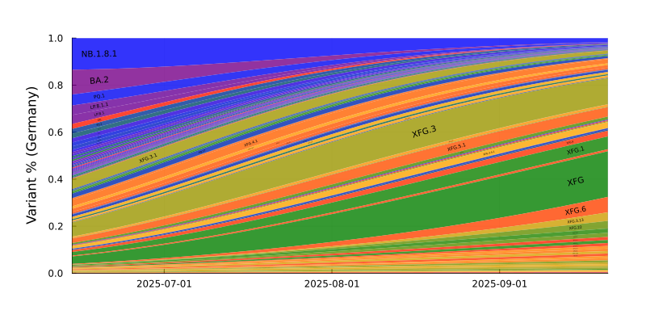
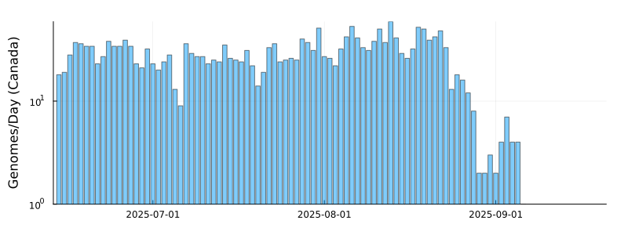
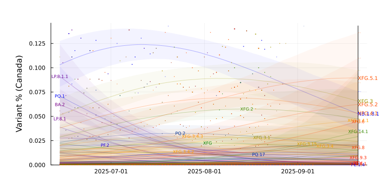
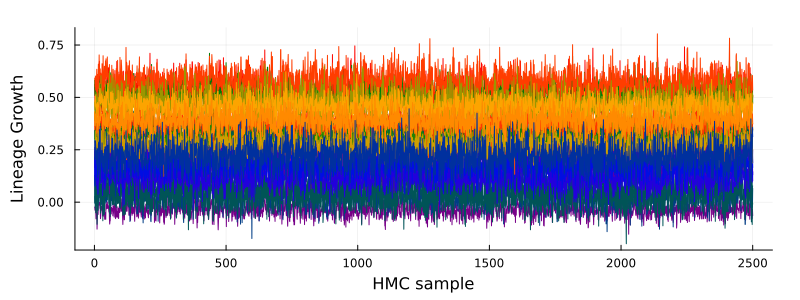
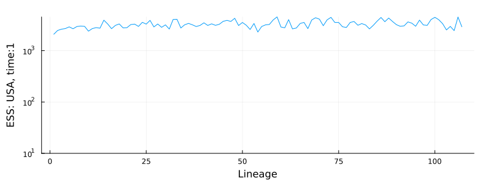

# SARS-CoV-2 Lineage Competition
Results from a model of global SARS-CoV-2 lineage competition
## Advantage Estimates

## Variant trajectories
### Germany

### Japan

### Canada

### England

### Denmark

### USA

## HMC Diagnostics

