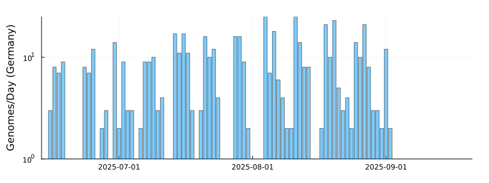

# SARS-CoV-2 Lineage Competition (2023-05-22)

Results from a model of global SARS-CoV-2 lineage competition

Estimates of multiplicative growth advantage (per week) for lineages are provided, both relative to the basal BA.2, and to the recently-dominant XBB.1.5.

## Advantage Estimates

Inferred growth advantage mapped upon the Nextclade-curated phylogeny:

## Variant trajectories

For countries with more than 1500 genomes deposited in the last 50 days, we plot the model trajectory estimates and forecasts. Forecasts for variants where the sampled genomes fall off prior to variant emergence are driven by global pooled estimates and should be treated with caution.

Bayesian 95% Credible Intervals are shown for: BQ.1.1, CH.1.1, CH.1.1.1, EG.1, FD.2, FL.4, XBB.1.16, XBB.1.5, XBB.1.5.1, XBB.1.5.13, XBB.1.5.15, XBB.1.5.49, XBB.1.5.7, XBB.1.9.1, XBB.1.9.2, XBF

Variants are colored (from blue to red) in order of the number (low to high) of convergent mutations they exhibit (ie. those in mutation plot above).

### Germany

### India

### Sweden

### Japan

### England

### Spain

### France

### Australia

### Canada

### USA

### Sweden

SARS-CoV-2 sequence data from GISAID EpiCov (bulk .fasta download, 2023-05-22). We gratefully acknowledge all data contributors, i.e. the Authors and their Originating Laboratories responsible for obtaining the specimens, and their Submitting Laboratories that generated the genetic sequence and metadata and shared via the GISAID Initiative the data on which part of this research is based. Lineage assignments were made by Nextclade.

Countries included in the model: Switzerland, Luxembourg, Heilongjiang, Fujian, Denmark, Ireland, Belgium, Yunnan, Finland, Portugal, Thailand, Germany, India, Sichuan, Sweden, Indonesia, Italy, Japan, Hubei, Shanghai, England, Spain, France, Australia, Canada, USA

SARS-CoV-2 lineages included in the model: BA.2, BA.5.11, BA.5.2, BA.5.2.1, BA.5.2.35, BA.5.2.48, BA.5.2.49, BA.5.2.6, BE.9, BF.11, BF.42, BF.5, BF.5.1, BF.7, BF.7.14, BF.7.14.5, BF.7.15, BF.7.19.1, BF.7.4.1, BF.7.5, BF.7.6, BN.1, BN.1.2, BN.1.2.2, BN.1.2.3, BN.1.3, BN.1.3.1, BN.1.3.2, BN.1.3.5, BN.1.4.2, BN.1.5, BN.1.7, BN.3.1, BQ.1, BQ.1.1, BQ.1.1.1, BQ.1.1.10, BQ.1.1.11, BQ.1.1.13, BQ.1.1.15, BQ.1.1.18, BQ.1.1.2, BQ.1.1.20, BQ.1.1.22, BQ.1.1.23, BQ.1.1.28, BQ.1.1.29, BQ.1.1.3, BQ.1.1.31, BQ.1.1.32, BQ.1.1.35, BQ.1.1.36, BQ.1.1.37, BQ.1.1.39, BQ.1.1.4, BQ.1.1.40, BQ.1.1.41, BQ.1.1.42, BQ.1.1.43, BQ.1.1.44, BQ.1.1.45, BQ.1.1.46, BQ.1.1.47, BQ.1.1.48, BQ.1.1.5, BQ.1.1.51, BQ.1.1.52, BQ.1.1.53, BQ.1.1.55, BQ.1.1.58, BQ.1.1.6, BQ.1.1.63, BQ.1.1.65, BQ.1.1.67, BQ.1.1.68, BQ.1.1.69, BQ.1.1.7, BQ.1.1.70, BQ.1.1.71, BQ.1.1.8, BQ.1.10, BQ.1.10.1, BQ.1.11, BQ.1.12, BQ.1.13, BQ.1.13.1, BQ.1.14, BQ.1.18, BQ.1.2, BQ.1.2.3, BQ.1.22, BQ.1.23, BQ.1.25, BQ.1.25.1, BQ.1.28, BQ.1.3.2, BQ.1.32, BQ.1.5, BQ.1.8, BR.2.1, BW.1.1, BW.1.1.2, CH.1.1, CH.1.1.1, CH.1.1.10, CH.1.1.11, CH.1.1.12, CH.1.1.14, CH.1.1.15, CH.1.1.16, CH.1.1.17, CH.1.1.18, CH.1.1.19, CH.1.1.2, CH.1.1.24, CH.1.1.25, CH.1.1.26, CH.1.1.28, CH.1.1.3, CH.1.1.5, CH.1.1.6, CH.1.1.7, CH.1.1.8, CK.1, CK.1.1, CL.1, CM.8.1, CQ.2, CR.1, DN.2, DR.2, DS.1, DS.2, DT.2, DU.1, DV.1.1, DV.2, DV.3, DV.5, DV.6, DY.1, DY.2, DY.3, DY.4, EA.1, ED.1, ED.2, EE.1, EE.2, EE.3, EF.1, EF.1.1, EF.1.1.1, EF.1.2, EF.2, EG.1, EG.1.1, EG.1.2, EG.1.3, EG.1.4, EG.2, EG.3, EG.4, EG.5, EG.5.1, EH.1, EK.2, EK.3, EK.4, EL.1, EM.1, EN.1, ER.1.1, ES.1, ET.1, EU.1, EU.1.1, EU.1.1.1, EY.1, EZ.1, FD.1, FD.1.1, FD.2, FD.3, FD.4, FE.1, FE.1.1, FE.1.2, FG.2, FG.3, FH.1, FK.1, FK.1.1, FK.1.2, FL.1, FL.1.1, FL.1.2, FL.10, FL.11, FL.12, FL.2, FL.2.1, FL.2.2, FL.3, FL.3.1, FL.3.2, FL.3.3, FL.3.4, FL.4, FL.5, FL.6, FL.7, FL.8, FL.9, FM.1, FM.2, FQ.1, FR.1, FS.1, FT.1, FU.1, FU.2, FY.1, FY.2, FY.3, FZ.1, FZ.2, GA.1, GA.2, GB.1, GC.1, XAY.1.1.1, XAY.2.3, XBB, XBB.1, XBB.1.11.1, XBB.1.15, XBB.1.16, XBB.1.16.1, XBB.1.16.2, XBB.1.16.3, XBB.1.16.4, XBB.1.16.5, XBB.1.17.1, XBB.1.18.1, XBB.1.19, XBB.1.19.1, XBB.1.22, XBB.1.22.1, XBB.1.22.2, XBB.1.31, XBB.1.33, XBB.1.34, XBB.1.4, XBB.1.5, XBB.1.5.1, XBB.1.5.10, XBB.1.5.11, XBB.1.5.12, XBB.1.5.13, XBB.1.5.14, XBB.1.5.15, XBB.1.5.16, XBB.1.5.17, XBB.1.5.18, XBB.1.5.19, XBB.1.5.2, XBB.1.5.20, XBB.1.5.21, XBB.1.5.22, XBB.1.5.23, XBB.1.5.24, XBB.1.5.25, XBB.1.5.26, XBB.1.5.27, XBB.1.5.28, XBB.1.5.3, XBB.1.5.30, XBB.1.5.31, XBB.1.5.32, XBB.1.5.33, XBB.1.5.34, XBB.1.5.35, XBB.1.5.36, XBB.1.5.37, XBB.1.5.38, XBB.1.5.39, XBB.1.5.4, XBB.1.5.40, XBB.1.5.41, XBB.1.5.42, XBB.1.5.43, XBB.1.5.44, XBB.1.5.45, XBB.1.5.46, XBB.1.5.47, XBB.1.5.48, XBB.1.5.49, XBB.1.5.5, XBB.1.5.50, XBB.1.5.51, XBB.1.5.52, XBB.1.5.55, XBB.1.5.56, XBB.1.5.57, XBB.1.5.59, XBB.1.5.6, XBB.1.5.60, XBB.1.5.61, XBB.1.5.62, XBB.1.5.63, XBB.1.5.64, XBB.1.5.65, XBB.1.5.66, XBB.1.5.67, XBB.1.5.68, XBB.1.5.69, XBB.1.5.7, XBB.1.5.8, XBB.1.5.9, XBB.1.9, XBB.1.9.1, XBB.1.9.2, XBB.2, XBB.2.3, XBB.2.3.1, XBB.2.3.11, XBB.2.3.2, XBB.2.3.3, XBB.2.3.4, XBB.2.3.5, XBB.2.3.7, XBB.2.4, XBB.2.6, XBB.6.1, XBC.1.1, XBC.1.3, XBC.1.4, XBC.1.6, XBC.1.6.1, XBC.1.6.2, XBC.1.6.3, XBF, XBF.2, XBF.3, XBF.4, XBF.5, XBF.6, XBK, XBK.1, XBL.1, XBL.3, XBT

## HMC Diagnostics

We show Effective Sample Size (ESS) and plot chains for the global lineage advantage parameters, as well as the inferred frequencies for some time points and some countries.

