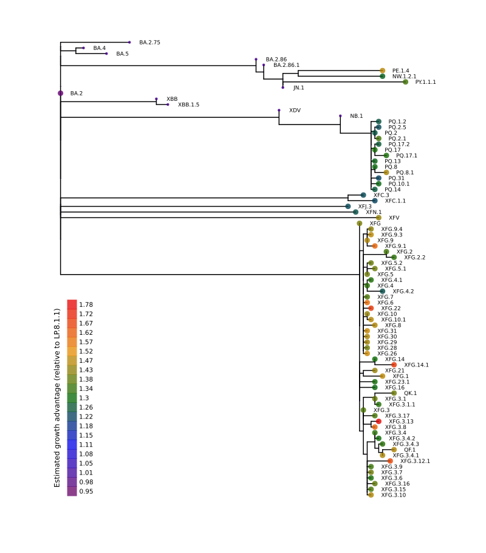
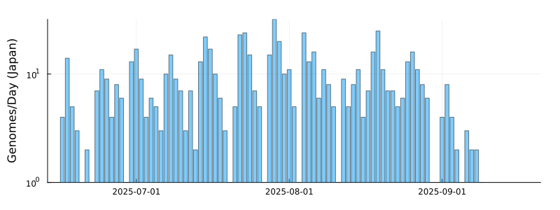
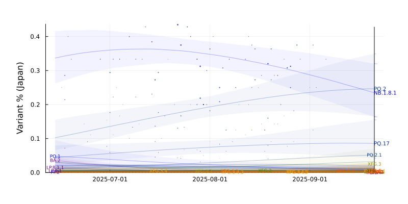
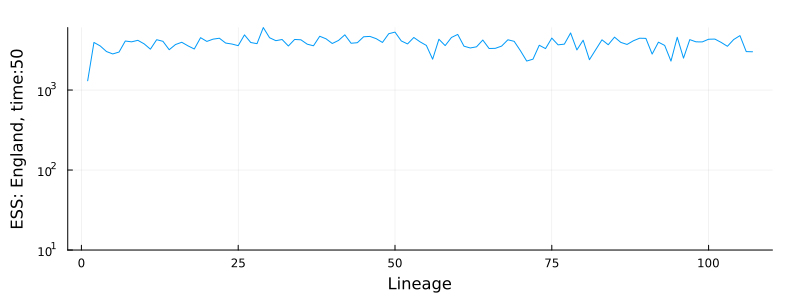

# SARS-CoV-2 Lineage Competition (2024-04-27)

Results from a model of global SARS-CoV-2 lineage competition

Estimates of multiplicative growth advantage (per week) for lineages are provided, both relative to the basal BA.2, and to the recently-dominant JN.1.

## Advantage Estimates

Inferred growth advantage mapped upon the Nextclade-curated phylogeny (pruned to keep only relatively competative variants):

## Variant trajectories

For countries with more than 200 genomes deposited in the last 50 days, we plot the model trajectory estimates and forecasts. Forecasts for variants where the sampled genomes fall off prior to variant emergence are driven by global pooled estimates and should be treated with caution.

Bayesian 95% Credible Intervals are shown for: BA.2.86.1, HK.3, HK.3.2, HV.1, JG.3.2, JN.1, JN.1.1, JN.1.11.1, JN.1.13.1, JN.1.16, JN.1.18, JN.1.19, JN.1.2, JN.1.22, JN.1.31, JN.1.32, JN.1.39, JN.1.4, JN.1.4.2, JN.1.4.5, JN.1.4.6, JN.1.4.7, JN.1.42, JN.1.43, JN.1.46, JN.1.5, JN.1.6, JN.1.7, JN.1.7.2, JN.1.8, JN.1.8.1, JN.1.9, JN.2.5, KP.2, KP.3, KQ.1, KV.2, XDD, XDK, XDP, XDQ.1

Variants are colored (from blue to red) in order of the number (low to high) of convergent mutations they exhibit (ie. those in mutation plot above).

### Model Average

Averaging out the country-specific growth rate and intercept adjustments:

### France

### Chile

### Hubei

### Japan

### Australia

### England

### Canada

### USA

### Sweden

SARS-CoV-2 sequence data from GISAID EpiCov (bulk .fasta download, 2024-04-27). We gratefully acknowledge all data contributors, i.e. the Authors and their Originating Laboratories responsible for obtaining the specimens, and their Submitting Laboratories that generated the genetic sequence and metadata and shared via the GISAID Initiative the data on which part of this research is based. Lineage assignments were made by Nextclade.

Countries included in the model: Finland, Israel, Anhui, Singapore, Sweden, Netherlands, Ireland, Shanxi, Scotland, Taiwan, Liaoning, Henan, Wales, Gansu, Fujian, Russia, Germany, Spain, Sichuan, France, Chile, Hubei, Japan, Australia, England, Canada, USA

SARS-CoV-2 lineages included in the model: BA.2, BA.2.86.1, BA.2.86.3, EG.5.1.1, GK.1.1.1, HK.20.1, HK.3, HK.3.1, HK.3.13, HK.3.2, HK.3.2.2, HV.1, HV.1.1, JC.5.1, JD.1.1, JD.1.1.1, JG.3, JG.3.2, JN.1, JN.1.1, JN.1.1.1, JN.1.1.5, JN.1.10, JN.1.11, JN.1.11.1, JN.1.13.1, JN.1.15, JN.1.16, JN.1.16.1, JN.1.17, JN.1.18, JN.1.18.1, JN.1.18.2, JN.1.19, JN.1.2, JN.1.20, JN.1.21, JN.1.22, JN.1.27, JN.1.28, JN.1.28.1, JN.1.29, JN.1.3, JN.1.30, JN.1.31, JN.1.32, JN.1.33, JN.1.34, JN.1.35, JN.1.37, JN.1.38, JN.1.39, JN.1.4, JN.1.4.1, JN.1.4.2, JN.1.4.3, JN.1.4.4, JN.1.4.5, JN.1.4.6, JN.1.4.7, JN.1.41, JN.1.42, JN.1.42.1, JN.1.43, JN.1.43.1, JN.1.45, JN.1.46, JN.1.5, JN.1.6, JN.1.6.1, JN.1.7, JN.1.7.1, JN.1.7.2, JN.1.8, JN.1.8.1, JN.1.8.3, JN.1.9, JN.1.9.1, JN.11, JN.14, JN.2, JN.2.5, JN.3, JN.4, JN.6, KP.1, KP.1.1, KP.1.1.1, KP.2, KP.3, KQ.1, KR.1, KS.1, KT.1.1, KU.2, KV.2, KW.1, KW.1.1, XDD, XDD.1, XDD.1.1, XDK, XDK.1, XDL, XDN, XDP, XDP.1, XDQ, XDQ.1, XDR, XDS

## HMC Diagnostics

We show Effective Sample Size (ESS) and plot chains for the global lineage advantage parameters, as well as the inferred frequencies for some time points and some countries.

Inferred growth advantage mapped upon the Nextclade-curated phylogeny (full tree):

## Methods summary

Lineage competition is modelled using a Bayesian multinomial regression approach. Briefly the global GISAID SARS-CoV-2 dataset (downloaded as a bulk .fasta file) is filtered for any sequences with collection dates within the previous 100 days. NextClade (with the BA.2.86 reference set, “nextstrain/sars-cov-2/BA.2.86”) is used for lineage assignment, and assignments are compiled into counts per country per lineage per day. If a sub-lineage is too infrequent to be included in the model, its count is added into its most recent included ancestor.

We model growth rates using a hierarchical approach. The growth rate for a lineage in a country is the sum of two components: a global rate, and a country-specific random effect. The global rate for each lineage is itself a sum of : i) branch-specific terms, for each branch ancestral to that lineage, plus ii) the sum of terms for "convergent" spike mutations (those occurring on multiple branches of the phylogeny) possessed by that lineage, plus iii) a lineage specific parameter. The rationale for this parameterization is that the contributions of a set of mutations that only occur on a single branch cannot be separated from each other, so those are just bundled into the branch-specific term, but evidence is shared when mutations occur on multiple branches. Further, growth rates are heritable over the phylogeny, and the model's expectation for a new lineage (which may not yet have large sequence volumes) is strongly informed by that of its ancestor's growth rate, since all-but-one of the branch-specific terms are in common, as are (typically) most of the convergent mutation terms. Practically, this is implemented by constructing a large sparse design matrix that encodes which lineages share branches and convergent mutations. Through this, we also allow recombinants to inherit a weighted mixture of their multiple parent's growth terms.

Introduction times are controlled by lineage-specific intercept terms, which have a global shared term per lineage, and country-specific random effects. Each "kind" of parameter has a Gaussian prior, centered on zero, and we use a Gaussian hyperprior over the log of the standard deviations of these priors. Posterior distributions for all parameters are sampled, via Hamiltonian Monte Carlo with the "No-U-Turn sampler" by AdvancedHMC.jl in Julia.

The "Model average" frequency plot intends to provide a "global" image of variant competition, and is produced using the posterior mean (over all post-burnin HMC samples) over all frequency trajectories but with the country-specific terms (including the country-specific growth rate random effects and the country-specific intercepts) set to their averages, no longer reflecting the details of any specific country, but also not being too strongly biased by unevenly distributed sequencing volumes for any specific country.

