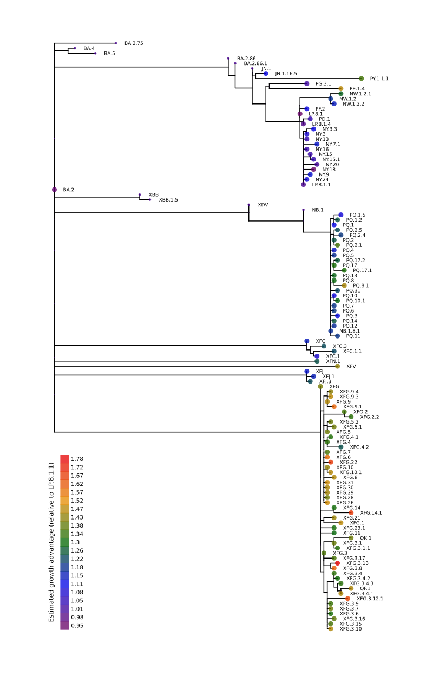
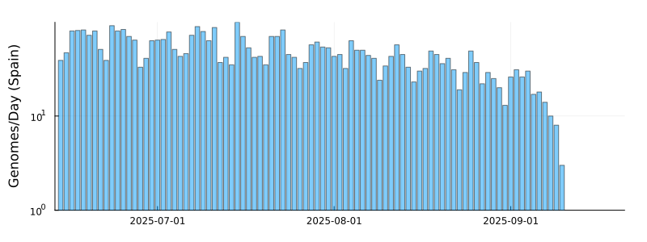
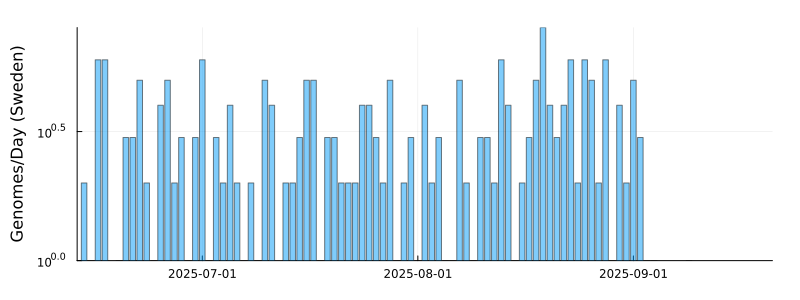
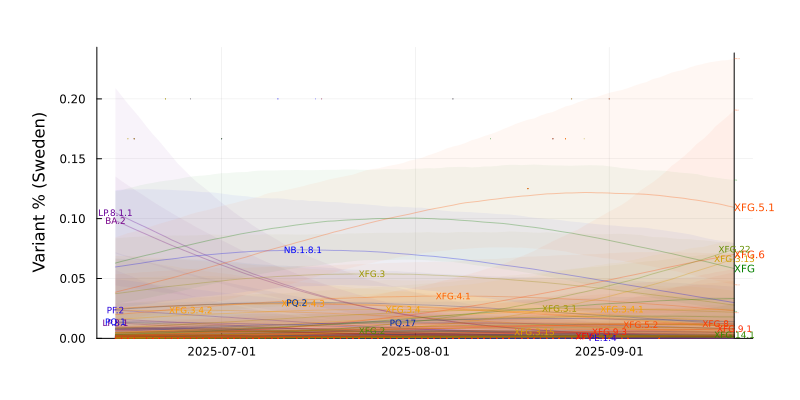
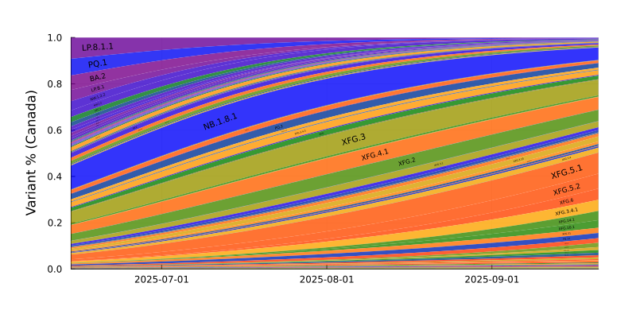
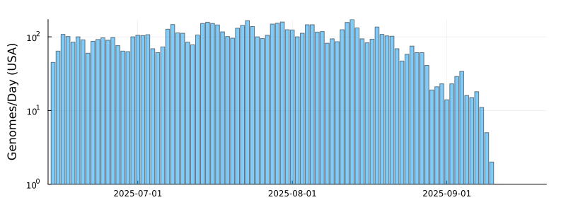
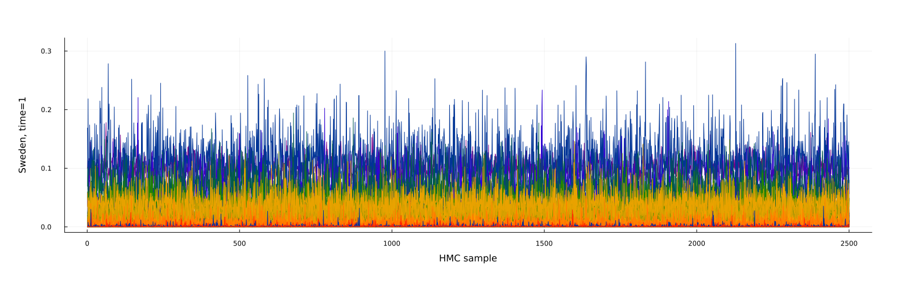
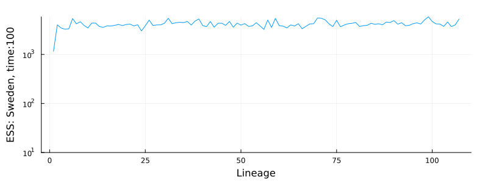

# SARS-CoV-2 Lineage Competition (2022-12-27)

Results from a model of global SARS-CoV-2 lineage competition

Estimates of multiplicative growth advantage (per week) for lineages are provided, both relative to the basal BA.2, and to the recently-dominant BA.5.2.

## Advantage Estimates

Inferred growth advantage mapped upon the Nextclade-curated phylogeny:

## Variant trajectories

For countries with more than 2000 genomes deposited in the last 50 days, we plot the model trajectory estimates and forecasts. Forecasts for variants where the sampled genomes fall off prior to variant emergence are driven by global pooled estimates and should be treated with caution.

Bayesian 95% Credible Intervals are shown for: XBB.1.5, BN.1.3.1, XBB.1.4, CH.1.1, BQ.1.23, BQ.1.22, BQ.1.1.18, XBF, BR.2.1, BQ.1.13, BQ.1.1.20, BF.5, BQ.1, BQ.1.1, BF.7, XBB.3, XBB.1, XBB.1.1, BQ.1.18, BQ.1.1.8, CK.2.1.1, BR.2, BN.1.2, BQ.1.8

Variants are colored (from blue to red) in order of the number (low to high) of convergent mutations they exhibit (ie. those in mutation plot above).

### Spain

### Switzerland

### Italy

### Sweden

### Australia

### France

### Canada

### Japan

### Germany

### England

### Denmark

### USA

SARS-CoV-2 sequence data from GISAID EpiCov (bulk .fasta download, 2022-12-27). We gratefully acknowledge all data contributors, i.e. the Authors and their Originating Laboratories responsible for obtaining the specimens, and their Submitting Laboratories that generated the genetic sequence and metadata and shared via the GISAID Initiative the data on which part of this research is based. Lineage assignments were made by Nextclade.

Countries included in the model: Wales, Russia, Indonesia, Mexico, Chile, Poland, Luxembourg, Portugal, Brazil, Ireland, Iceland, Scotland, Malaysia, Finland, Belgium, Spain, Switzerland, Italy, Sweden, Australia, France, Canada, Japan, Germany, England, Denmark, USA

SARS-CoV-2 lineages included in the model: BA.2, BA.2.12.1, BA.2.3.20, BA.2.75, BA.2.75.1, BA.2.75.2, BA.2.75.4, BA.2.75.5, BA.2.75.6, BA.4, BA.4.1, BA.4.1.10, BA.4.1.8, BA.4.1.9, BA.4.4, BA.4.6, BA.4.6.1, BA.4.6.2, BA.4.6.3, BA.4.6.4, BA.4.6.5, BA.4.7, BA.5, BA.5.1, BA.5.1.1, BA.5.1.10, BA.5.1.12, BA.5.1.17, BA.5.1.18, BA.5.1.19, BA.5.1.2, BA.5.1.20, BA.5.1.21, BA.5.1.22, BA.5.1.23, BA.5.1.24, BA.5.1.25, BA.5.1.26, BA.5.1.27, BA.5.1.28, BA.5.1.3, BA.5.1.30, BA.5.1.4, BA.5.1.5, BA.5.1.6, BA.5.1.7, BA.5.1.8, BA.5.1.9, BA.5.10.1, BA.5.11, BA.5.2, BA.5.2.1, BA.5.2.12, BA.5.2.13, BA.5.2.14, BA.5.2.16, BA.5.2.18, BA.5.2.19, BA.5.2.2, BA.5.2.20, BA.5.2.21, BA.5.2.22, BA.5.2.23, BA.5.2.24, BA.5.2.25, BA.5.2.26, BA.5.2.27, BA.5.2.28, BA.5.2.29, BA.5.2.3, BA.5.2.30, BA.5.2.31, BA.5.2.32, BA.5.2.33, BA.5.2.34, BA.5.2.35, BA.5.2.36, BA.5.2.37, BA.5.2.39, BA.5.2.4, BA.5.2.41, BA.5.2.6, BA.5.2.7, BA.5.2.8, BA.5.2.9, BA.5.3, BA.5.3.1, BA.5.3.3, BA.5.3.5, BA.5.5, BA.5.5.1, BA.5.5.2, BA.5.5.3, BA.5.6, BA.5.6.1, BA.5.6.2, BA.5.6.3, BA.5.6.4, BA.5.7, BA.5.8, BA.5.9, BE.1, BE.1.1, BE.1.1.1, BE.1.1.2, BE.1.2, BE.1.2.1, BE.1.3, BE.1.4, BE.1.4.1, BE.1.4.2, BE.2, BE.3, BE.4, BE.4.1, BE.4.1.1, BE.4.2, BE.6, BE.7, BE.9, BF.1, BF.10, BF.11, BF.11.1, BF.11.2, BF.11.3, BF.11.4, BF.11.5, BF.12, BF.13, BF.14, BF.15, BF.16, BF.17, BF.18, BF.2, BF.21, BF.22, BF.24, BF.25, BF.26, BF.27, BF.28, BF.29, BF.3, BF.30, BF.31, BF.31.1, BF.32, BF.34, BF.4, BF.5, BF.6, BF.7, BF.7.1, BF.7.10, BF.7.11, BF.7.12, BF.7.13.2, BF.7.2, BF.7.3, BF.7.4, BF.7.4.1, BF.7.4.2, BF.7.5, BF.7.5.1, BF.7.6, BF.7.7, BF.7.8, BF.7.9, BF.8, BF.9, BK.1, BL.1, BL.2, BM.1.1, BM.1.1.1, BM.1.1.3, BM.2, BM.4.1.1, BN.1, BN.1.1, BN.1.1.1, BN.1.2, BN.1.2.1, BN.1.3, BN.1.3.1, BN.1.4, BN.1.5, BN.1.7, BN.3.1, BN.5, BN.6, BQ.1, BQ.1.1, BQ.1.1.1, BQ.1.1.10, BQ.1.1.11, BQ.1.1.13, BQ.1.1.15, BQ.1.1.17, BQ.1.1.18, BQ.1.1.19, BQ.1.1.2, BQ.1.1.20, BQ.1.1.21, BQ.1.1.22, BQ.1.1.23, BQ.1.1.24, BQ.1.1.3, BQ.1.1.4, BQ.1.1.5, BQ.1.1.6, BQ.1.1.7, BQ.1.1.8, BQ.1.10, BQ.1.10.1, BQ.1.11, BQ.1.12, BQ.1.13, BQ.1.14, BQ.1.15, BQ.1.16, BQ.1.17, BQ.1.18, BQ.1.19, BQ.1.2, BQ.1.20, BQ.1.21, BQ.1.22, BQ.1.23, BQ.1.25, BQ.1.26, BQ.1.3, BQ.1.4, BQ.1.5, BQ.1.6, BQ.1.7, BQ.1.8, BQ.1.8.2, BQ.1.9, BQ.2, BR.1, BR.1.2, BR.2, BR.2.1, BR.3, BS.1.1, BT.2, BU.1, BU.3, BV.1, BV.2, BW.1, BY.1, BY.1.2, CA.1, CA.3, CA.3.1, CA.5, CA.7, CB.1, CC.1, CD.2, CE.1, CG.1, CH.1.1, CJ.1, CK.1, CK.2.1, CK.2.1.1, CK.3, CL.1, CM.2, CM.3, CM.4, CM.5, CM.8.1, CN.1, CP.1, CP.1.1, CP.4, CP.5, CQ.1, CQ.1.1, CQ.2, CR.1, CR.1.1, CR.2, CV.1, DA.1, DB.1, DB.2, DC.1, DE.1, DE.2, DF.1, DG.1, DH.1, XAY.2, XAZ, XBB, XBB.1, XBB.1.1, XBB.1.3, XBB.1.4, XBB.1.5, XBB.2, XBB.3, XBB.4, XBB.5, XBC.1, XBD, XBE, XBF, XBG

## HMC Diagnostics

We show Effective Sample Size (ESS) and plot chains for the global lineage advantage parameters, as well as the inferred frequencies for some time points and some countries.

## Convergent mutation table

Lineage | N460K | S486P | R346T | L452R | N450D | F490S | G446S | K444T | V445A | Y144- | K444M | R346S | K444N | R346I | L452M | R493Q | L452Q | D253G | A262S | T883I | S255F | K444R | W64L | F486V | G213E | K356T | D339H | S494P | T430I | F486S | V70- | H69-
 ---  |  ---  |  ---  |  ---  |  ---  |  ---  |  ---  |  ---  |  ---  |  ---  |  ---  |  ---  |  ---  |  ---  |  ---  |  ---  |  ---  |  ---  |  ---  |  ---  |  ---  |  ---  |  ---  |  ---  |  ---  |  ---  |  ---  |  ---  |  ---  |  ---  |  ---  |  ---  |  --- 
XBB.1.5 |  :heavy_check_mark:  |  :heavy_check_mark:  |  :heavy_check_mark:  |  &nbsp;  |  &nbsp;  |  :heavy_check_mark:  |  :heavy_check_mark:  |  &nbsp;  |  &nbsp;  |  :heavy_check_mark:  |  &nbsp;  |  &nbsp;  |  &nbsp;  |  &nbsp;  |  &nbsp;  |  :heavy_check_mark:  |  &nbsp;  |  &nbsp;  |  &nbsp;  |  &nbsp;  |  &nbsp;  |  &nbsp;  |  &nbsp;  |  &nbsp;  |  :heavy_check_mark:  |  &nbsp;  |  :heavy_check_mark:  |  &nbsp;  |  &nbsp;  |  &nbsp;  |  &nbsp;  |  &nbsp; 
CH.1.1 |  :heavy_check_mark:  |  &nbsp;  |  :heavy_check_mark:  |  :heavy_check_mark:  |  &nbsp;  |  &nbsp;  |  :heavy_check_mark:  |  :heavy_check_mark:  |  &nbsp;  |  &nbsp;  |  &nbsp;  |  &nbsp;  |  &nbsp;  |  &nbsp;  |  &nbsp;  |  :heavy_check_mark:  |  &nbsp;  |  &nbsp;  |  &nbsp;  |  &nbsp;  |  &nbsp;  |  &nbsp;  |  &nbsp;  |  &nbsp;  |  &nbsp;  |  &nbsp;  |  :heavy_check_mark:  |  &nbsp;  |  &nbsp;  |  :heavy_check_mark:  |  &nbsp;  |  &nbsp; 
XBF |  :heavy_check_mark:  |  &nbsp;  |  :heavy_check_mark:  |  &nbsp;  |  &nbsp;  |  :heavy_check_mark:  |  :heavy_check_mark:  |  &nbsp;  |  &nbsp;  |  &nbsp;  |  &nbsp;  |  &nbsp;  |  &nbsp;  |  &nbsp;  |  &nbsp;  |  :heavy_check_mark:  |  &nbsp;  |  &nbsp;  |  &nbsp;  |  &nbsp;  |  &nbsp;  |  &nbsp;  |  &nbsp;  |  &nbsp;  |  &nbsp;  |  &nbsp;  |  :heavy_check_mark:  |  &nbsp;  |  &nbsp;  |  &nbsp;  |  &nbsp;  |  &nbsp; 
BR.2.1 |  :heavy_check_mark:  |  &nbsp;  |  :heavy_check_mark:  |  :heavy_check_mark:  |  &nbsp;  |  &nbsp;  |  :heavy_check_mark:  |  &nbsp;  |  &nbsp;  |  &nbsp;  |  &nbsp;  |  &nbsp;  |  &nbsp;  |  &nbsp;  |  &nbsp;  |  :heavy_check_mark:  |  &nbsp;  |  &nbsp;  |  &nbsp;  |  &nbsp;  |  &nbsp;  |  &nbsp;  |  &nbsp;  |  &nbsp;  |  &nbsp;  |  &nbsp;  |  :heavy_check_mark:  |  &nbsp;  |  &nbsp;  |  &nbsp;  |  &nbsp;  |  &nbsp; 
BQ.1.1.22 |  :heavy_check_mark:  |  &nbsp;  |  :heavy_check_mark:  |  :heavy_check_mark:  |  &nbsp;  |  &nbsp;  |  &nbsp;  |  :heavy_check_mark:  |  &nbsp;  |  :heavy_check_mark:  |  &nbsp;  |  &nbsp;  |  &nbsp;  |  &nbsp;  |  &nbsp;  |  :heavy_check_mark:  |  &nbsp;  |  &nbsp;  |  &nbsp;  |  &nbsp;  |  &nbsp;  |  &nbsp;  |  &nbsp;  |  :heavy_check_mark:  |  &nbsp;  |  &nbsp;  |  &nbsp;  |  &nbsp;  |  &nbsp;  |  &nbsp;  |  :heavy_check_mark:  |  :heavy_check_mark: 
BQ.1.1.13 |  :heavy_check_mark:  |  &nbsp;  |  :heavy_check_mark:  |  :heavy_check_mark:  |  &nbsp;  |  &nbsp;  |  &nbsp;  |  :heavy_check_mark:  |  &nbsp;  |  &nbsp;  |  &nbsp;  |  &nbsp;  |  &nbsp;  |  &nbsp;  |  &nbsp;  |  :heavy_check_mark:  |  &nbsp;  |  &nbsp;  |  &nbsp;  |  &nbsp;  |  &nbsp;  |  &nbsp;  |  &nbsp;  |  :heavy_check_mark:  |  &nbsp;  |  &nbsp;  |  &nbsp;  |  &nbsp;  |  &nbsp;  |  &nbsp;  |  :heavy_check_mark:  |  :heavy_check_mark: 
BQ.1.1.20 |  :heavy_check_mark:  |  &nbsp;  |  :heavy_check_mark:  |  :heavy_check_mark:  |  &nbsp;  |  &nbsp;  |  &nbsp;  |  :heavy_check_mark:  |  &nbsp;  |  :heavy_check_mark:  |  &nbsp;  |  &nbsp;  |  &nbsp;  |  &nbsp;  |  &nbsp;  |  :heavy_check_mark:  |  &nbsp;  |  &nbsp;  |  &nbsp;  |  &nbsp;  |  &nbsp;  |  &nbsp;  |  &nbsp;  |  :heavy_check_mark:  |  &nbsp;  |  &nbsp;  |  &nbsp;  |  &nbsp;  |  &nbsp;  |  &nbsp;  |  :heavy_check_mark:  |  :heavy_check_mark: 
BN.1.1.1 |  :heavy_check_mark:  |  &nbsp;  |  :heavy_check_mark:  |  &nbsp;  |  &nbsp;  |  :heavy_check_mark:  |  :heavy_check_mark:  |  &nbsp;  |  &nbsp;  |  &nbsp;  |  &nbsp;  |  &nbsp;  |  &nbsp;  |  &nbsp;  |  &nbsp;  |  :heavy_check_mark:  |  &nbsp;  |  &nbsp;  |  &nbsp;  |  &nbsp;  |  &nbsp;  |  &nbsp;  |  &nbsp;  |  &nbsp;  |  &nbsp;  |  :heavy_check_mark:  |  :heavy_check_mark:  |  :heavy_check_mark:  |  &nbsp;  |  &nbsp;  |  &nbsp;  |  &nbsp; 
CM.8.1 |  :heavy_check_mark:  |  &nbsp;  |  &nbsp;  |  &nbsp;  |  :heavy_check_mark:  |  &nbsp;  |  :heavy_check_mark:  |  &nbsp;  |  &nbsp;  |  &nbsp;  |  &nbsp;  |  &nbsp;  |  &nbsp;  |  &nbsp;  |  :heavy_check_mark:  |  :heavy_check_mark:  |  &nbsp;  |  &nbsp;  |  &nbsp;  |  &nbsp;  |  &nbsp;  |  :heavy_check_mark:  |  &nbsp;  |  &nbsp;  |  &nbsp;  |  &nbsp;  |  &nbsp;  |  &nbsp;  |  &nbsp;  |  :heavy_check_mark:  |  &nbsp;  |  &nbsp; 
BQ.1.1.10 |  :heavy_check_mark:  |  &nbsp;  |  :heavy_check_mark:  |  :heavy_check_mark:  |  &nbsp;  |  &nbsp;  |  &nbsp;  |  :heavy_check_mark:  |  &nbsp;  |  :heavy_check_mark:  |  &nbsp;  |  &nbsp;  |  &nbsp;  |  &nbsp;  |  &nbsp;  |  :heavy_check_mark:  |  &nbsp;  |  &nbsp;  |  &nbsp;  |  &nbsp;  |  &nbsp;  |  &nbsp;  |  &nbsp;  |  :heavy_check_mark:  |  &nbsp;  |  &nbsp;  |  &nbsp;  |  &nbsp;  |  &nbsp;  |  &nbsp;  |  :heavy_check_mark:  |  :heavy_check_mark: 
BE.9 |  :heavy_check_mark:  |  &nbsp;  |  &nbsp;  |  :heavy_check_mark:  |  &nbsp;  |  &nbsp;  |  &nbsp;  |  :heavy_check_mark:  |  &nbsp;  |  :heavy_check_mark:  |  &nbsp;  |  &nbsp;  |  &nbsp;  |  &nbsp;  |  &nbsp;  |  :heavy_check_mark:  |  &nbsp;  |  &nbsp;  |  &nbsp;  |  &nbsp;  |  &nbsp;  |  &nbsp;  |  &nbsp;  |  :heavy_check_mark:  |  &nbsp;  |  &nbsp;  |  &nbsp;  |  &nbsp;  |  &nbsp;  |  &nbsp;  |  :heavy_check_mark:  |  :heavy_check_mark: 
XBB.1.4 |  :heavy_check_mark:  |  &nbsp;  |  :heavy_check_mark:  |  &nbsp;  |  &nbsp;  |  :heavy_check_mark:  |  :heavy_check_mark:  |  &nbsp;  |  &nbsp;  |  :heavy_check_mark:  |  &nbsp;  |  &nbsp;  |  &nbsp;  |  &nbsp;  |  &nbsp;  |  :heavy_check_mark:  |  &nbsp;  |  &nbsp;  |  &nbsp;  |  :heavy_check_mark:  |  &nbsp;  |  &nbsp;  |  &nbsp;  |  &nbsp;  |  :heavy_check_mark:  |  &nbsp;  |  :heavy_check_mark:  |  &nbsp;  |  &nbsp;  |  :heavy_check_mark:  |  &nbsp;  |  &nbsp; 
BQ.1.21 |  :heavy_check_mark:  |  &nbsp;  |  &nbsp;  |  :heavy_check_mark:  |  &nbsp;  |  &nbsp;  |  &nbsp;  |  :heavy_check_mark:  |  &nbsp;  |  :heavy_check_mark:  |  &nbsp;  |  :heavy_check_mark:  |  &nbsp;  |  &nbsp;  |  &nbsp;  |  :heavy_check_mark:  |  &nbsp;  |  &nbsp;  |  &nbsp;  |  &nbsp;  |  &nbsp;  |  &nbsp;  |  &nbsp;  |  :heavy_check_mark:  |  &nbsp;  |  &nbsp;  |  &nbsp;  |  &nbsp;  |  &nbsp;  |  &nbsp;  |  :heavy_check_mark:  |  :heavy_check_mark: 
BQ.1.25 |  :heavy_check_mark:  |  &nbsp;  |  :heavy_check_mark:  |  :heavy_check_mark:  |  &nbsp;  |  &nbsp;  |  &nbsp;  |  :heavy_check_mark:  |  &nbsp;  |  &nbsp;  |  &nbsp;  |  &nbsp;  |  &nbsp;  |  &nbsp;  |  &nbsp;  |  :heavy_check_mark:  |  &nbsp;  |  &nbsp;  |  &nbsp;  |  &nbsp;  |  &nbsp;  |  &nbsp;  |  &nbsp;  |  :heavy_check_mark:  |  &nbsp;  |  &nbsp;  |  &nbsp;  |  &nbsp;  |  &nbsp;  |  &nbsp;  |  :heavy_check_mark:  |  :heavy_check_mark: 
BQ.1.1.24 |  :heavy_check_mark:  |  &nbsp;  |  :heavy_check_mark:  |  :heavy_check_mark:  |  &nbsp;  |  &nbsp;  |  &nbsp;  |  :heavy_check_mark:  |  &nbsp;  |  &nbsp;  |  &nbsp;  |  &nbsp;  |  &nbsp;  |  &nbsp;  |  &nbsp;  |  :heavy_check_mark:  |  &nbsp;  |  &nbsp;  |  &nbsp;  |  &nbsp;  |  &nbsp;  |  &nbsp;  |  &nbsp;  |  :heavy_check_mark:  |  &nbsp;  |  &nbsp;  |  &nbsp;  |  &nbsp;  |  &nbsp;  |  &nbsp;  |  :heavy_check_mark:  |  :heavy_check_mark: 
BQ.1.23 |  :heavy_check_mark:  |  &nbsp;  |  &nbsp;  |  :heavy_check_mark:  |  &nbsp;  |  &nbsp;  |  &nbsp;  |  :heavy_check_mark:  |  &nbsp;  |  :heavy_check_mark:  |  &nbsp;  |  &nbsp;  |  &nbsp;  |  &nbsp;  |  &nbsp;  |  :heavy_check_mark:  |  &nbsp;  |  &nbsp;  |  &nbsp;  |  &nbsp;  |  &nbsp;  |  &nbsp;  |  &nbsp;  |  :heavy_check_mark:  |  &nbsp;  |  &nbsp;  |  &nbsp;  |  &nbsp;  |  &nbsp;  |  &nbsp;  |  :heavy_check_mark:  |  :heavy_check_mark: 
BR.2 |  :heavy_check_mark:  |  &nbsp;  |  :heavy_check_mark:  |  :heavy_check_mark:  |  &nbsp;  |  &nbsp;  |  :heavy_check_mark:  |  &nbsp;  |  &nbsp;  |  &nbsp;  |  &nbsp;  |  &nbsp;  |  &nbsp;  |  &nbsp;  |  &nbsp;  |  :heavy_check_mark:  |  &nbsp;  |  &nbsp;  |  &nbsp;  |  &nbsp;  |  &nbsp;  |  &nbsp;  |  &nbsp;  |  &nbsp;  |  &nbsp;  |  &nbsp;  |  :heavy_check_mark:  |  &nbsp;  |  &nbsp;  |  &nbsp;  |  &nbsp;  |  &nbsp; 
BQ.1.1.4 |  :heavy_check_mark:  |  &nbsp;  |  :heavy_check_mark:  |  :heavy_check_mark:  |  &nbsp;  |  &nbsp;  |  &nbsp;  |  :heavy_check_mark:  |  &nbsp;  |  &nbsp;  |  &nbsp;  |  &nbsp;  |  &nbsp;  |  &nbsp;  |  &nbsp;  |  :heavy_check_mark:  |  &nbsp;  |  &nbsp;  |  &nbsp;  |  &nbsp;  |  &nbsp;  |  &nbsp;  |  &nbsp;  |  :heavy_check_mark:  |  &nbsp;  |  &nbsp;  |  &nbsp;  |  &nbsp;  |  &nbsp;  |  &nbsp;  |  :heavy_check_mark:  |  :heavy_check_mark: 
XBB.2 |  :heavy_check_mark:  |  &nbsp;  |  :heavy_check_mark:  |  &nbsp;  |  &nbsp;  |  :heavy_check_mark:  |  :heavy_check_mark:  |  &nbsp;  |  &nbsp;  |  :heavy_check_mark:  |  &nbsp;  |  &nbsp;  |  &nbsp;  |  &nbsp;  |  &nbsp;  |  :heavy_check_mark:  |  &nbsp;  |  :heavy_check_mark:  |  &nbsp;  |  &nbsp;  |  &nbsp;  |  &nbsp;  |  &nbsp;  |  &nbsp;  |  :heavy_check_mark:  |  &nbsp;  |  :heavy_check_mark:  |  &nbsp;  |  &nbsp;  |  :heavy_check_mark:  |  &nbsp;  |  &nbsp; 
BQ.1.1.15 |  :heavy_check_mark:  |  &nbsp;  |  :heavy_check_mark:  |  :heavy_check_mark:  |  &nbsp;  |  &nbsp;  |  &nbsp;  |  :heavy_check_mark:  |  &nbsp;  |  &nbsp;  |  &nbsp;  |  &nbsp;  |  &nbsp;  |  &nbsp;  |  &nbsp;  |  :heavy_check_mark:  |  &nbsp;  |  &nbsp;  |  &nbsp;  |  &nbsp;  |  &nbsp;  |  &nbsp;  |  &nbsp;  |  :heavy_check_mark:  |  &nbsp;  |  &nbsp;  |  &nbsp;  |  &nbsp;  |  &nbsp;  |  &nbsp;  |  :heavy_check_mark:  |  :heavy_check_mark: 
BN.1.2.1 |  :heavy_check_mark:  |  &nbsp;  |  :heavy_check_mark:  |  &nbsp;  |  &nbsp;  |  :heavy_check_mark:  |  :heavy_check_mark:  |  &nbsp;  |  &nbsp;  |  &nbsp;  |  &nbsp;  |  &nbsp;  |  &nbsp;  |  &nbsp;  |  &nbsp;  |  :heavy_check_mark:  |  &nbsp;  |  &nbsp;  |  &nbsp;  |  &nbsp;  |  &nbsp;  |  &nbsp;  |  &nbsp;  |  &nbsp;  |  &nbsp;  |  :heavy_check_mark:  |  :heavy_check_mark:  |  &nbsp;  |  &nbsp;  |  &nbsp;  |  &nbsp;  |  &nbsp; 
XBB.1 |  :heavy_check_mark:  |  &nbsp;  |  :heavy_check_mark:  |  &nbsp;  |  &nbsp;  |  :heavy_check_mark:  |  :heavy_check_mark:  |  &nbsp;  |  &nbsp;  |  :heavy_check_mark:  |  &nbsp;  |  &nbsp;  |  &nbsp;  |  &nbsp;  |  &nbsp;  |  :heavy_check_mark:  |  &nbsp;  |  &nbsp;  |  &nbsp;  |  &nbsp;  |  &nbsp;  |  &nbsp;  |  &nbsp;  |  &nbsp;  |  :heavy_check_mark:  |  &nbsp;  |  :heavy_check_mark:  |  &nbsp;  |  &nbsp;  |  :heavy_check_mark:  |  &nbsp;  |  &nbsp; 
BQ.1.1.2 |  :heavy_check_mark:  |  &nbsp;  |  :heavy_check_mark:  |  :heavy_check_mark:  |  &nbsp;  |  &nbsp;  |  &nbsp;  |  :heavy_check_mark:  |  &nbsp;  |  &nbsp;  |  &nbsp;  |  &nbsp;  |  &nbsp;  |  &nbsp;  |  &nbsp;  |  :heavy_check_mark:  |  &nbsp;  |  :heavy_check_mark:  |  &nbsp;  |  &nbsp;  |  &nbsp;  |  &nbsp;  |  &nbsp;  |  :heavy_check_mark:  |  &nbsp;  |  &nbsp;  |  &nbsp;  |  &nbsp;  |  &nbsp;  |  &nbsp;  |  :heavy_check_mark:  |  :heavy_check_mark: 
BQ.1.9 |  :heavy_check_mark:  |  &nbsp;  |  :heavy_check_mark:  |  :heavy_check_mark:  |  &nbsp;  |  &nbsp;  |  &nbsp;  |  :heavy_check_mark:  |  &nbsp;  |  &nbsp;  |  &nbsp;  |  &nbsp;  |  &nbsp;  |  &nbsp;  |  &nbsp;  |  :heavy_check_mark:  |  &nbsp;  |  &nbsp;  |  &nbsp;  |  &nbsp;  |  &nbsp;  |  &nbsp;  |  &nbsp;  |  :heavy_check_mark:  |  &nbsp;  |  &nbsp;  |  &nbsp;  |  &nbsp;  |  &nbsp;  |  &nbsp;  |  :heavy_check_mark:  |  :heavy_check_mark: 
BN.1.2 |  :heavy_check_mark:  |  &nbsp;  |  :heavy_check_mark:  |  &nbsp;  |  &nbsp;  |  :heavy_check_mark:  |  :heavy_check_mark:  |  &nbsp;  |  &nbsp;  |  &nbsp;  |  &nbsp;  |  &nbsp;  |  &nbsp;  |  &nbsp;  |  &nbsp;  |  :heavy_check_mark:  |  &nbsp;  |  &nbsp;  |  &nbsp;  |  &nbsp;  |  &nbsp;  |  &nbsp;  |  &nbsp;  |  &nbsp;  |  &nbsp;  |  :heavy_check_mark:  |  :heavy_check_mark:  |  &nbsp;  |  &nbsp;  |  &nbsp;  |  &nbsp;  |  &nbsp; 
BQ.1.1.3 |  :heavy_check_mark:  |  &nbsp;  |  :heavy_check_mark:  |  :heavy_check_mark:  |  &nbsp;  |  &nbsp;  |  &nbsp;  |  :heavy_check_mark:  |  &nbsp;  |  &nbsp;  |  &nbsp;  |  &nbsp;  |  &nbsp;  |  &nbsp;  |  &nbsp;  |  :heavy_check_mark:  |  &nbsp;  |  &nbsp;  |  &nbsp;  |  &nbsp;  |  &nbsp;  |  &nbsp;  |  &nbsp;  |  :heavy_check_mark:  |  &nbsp;  |  &nbsp;  |  &nbsp;  |  &nbsp;  |  &nbsp;  |  &nbsp;  |  :heavy_check_mark:  |  :heavy_check_mark: 
CJ.1 |  :heavy_check_mark:  |  :heavy_check_mark:  |  :heavy_check_mark:  |  &nbsp;  |  &nbsp;  |  :heavy_check_mark:  |  :heavy_check_mark:  |  &nbsp;  |  &nbsp;  |  &nbsp;  |  &nbsp;  |  &nbsp;  |  &nbsp;  |  &nbsp;  |  &nbsp;  |  :heavy_check_mark:  |  &nbsp;  |  &nbsp;  |  &nbsp;  |  &nbsp;  |  &nbsp;  |  &nbsp;  |  &nbsp;  |  &nbsp;  |  &nbsp;  |  &nbsp;  |  :heavy_check_mark:  |  &nbsp;  |  &nbsp;  |  &nbsp;  |  &nbsp;  |  &nbsp; 
BN.1.1 |  :heavy_check_mark:  |  &nbsp;  |  :heavy_check_mark:  |  &nbsp;  |  &nbsp;  |  :heavy_check_mark:  |  :heavy_check_mark:  |  &nbsp;  |  &nbsp;  |  &nbsp;  |  &nbsp;  |  &nbsp;  |  &nbsp;  |  &nbsp;  |  &nbsp;  |  :heavy_check_mark:  |  &nbsp;  |  &nbsp;  |  &nbsp;  |  &nbsp;  |  &nbsp;  |  &nbsp;  |  &nbsp;  |  &nbsp;  |  &nbsp;  |  :heavy_check_mark:  |  :heavy_check_mark:  |  :heavy_check_mark:  |  &nbsp;  |  &nbsp;  |  &nbsp;  |  &nbsp; 
BN.1.7 |  :heavy_check_mark:  |  &nbsp;  |  :heavy_check_mark:  |  &nbsp;  |  &nbsp;  |  :heavy_check_mark:  |  :heavy_check_mark:  |  &nbsp;  |  &nbsp;  |  &nbsp;  |  &nbsp;  |  &nbsp;  |  &nbsp;  |  &nbsp;  |  &nbsp;  |  :heavy_check_mark:  |  &nbsp;  |  &nbsp;  |  &nbsp;  |  &nbsp;  |  &nbsp;  |  &nbsp;  |  &nbsp;  |  &nbsp;  |  &nbsp;  |  :heavy_check_mark:  |  :heavy_check_mark:  |  &nbsp;  |  &nbsp;  |  &nbsp;  |  &nbsp;  |  &nbsp; 
BQ.1.18 |  :heavy_check_mark:  |  &nbsp;  |  :heavy_check_mark:  |  :heavy_check_mark:  |  &nbsp;  |  &nbsp;  |  &nbsp;  |  :heavy_check_mark:  |  &nbsp;  |  :heavy_check_mark:  |  &nbsp;  |  &nbsp;  |  &nbsp;  |  &nbsp;  |  &nbsp;  |  :heavy_check_mark:  |  &nbsp;  |  &nbsp;  |  &nbsp;  |  &nbsp;  |  &nbsp;  |  &nbsp;  |  &nbsp;  |  :heavy_check_mark:  |  &nbsp;  |  &nbsp;  |  &nbsp;  |  &nbsp;  |  &nbsp;  |  &nbsp;  |  :heavy_check_mark:  |  :heavy_check_mark: 
BQ.1.1.23 |  :heavy_check_mark:  |  &nbsp;  |  :heavy_check_mark:  |  :heavy_check_mark:  |  &nbsp;  |  &nbsp;  |  &nbsp;  |  :heavy_check_mark:  |  &nbsp;  |  &nbsp;  |  &nbsp;  |  &nbsp;  |  &nbsp;  |  &nbsp;  |  &nbsp;  |  :heavy_check_mark:  |  &nbsp;  |  &nbsp;  |  &nbsp;  |  &nbsp;  |  &nbsp;  |  &nbsp;  |  &nbsp;  |  :heavy_check_mark:  |  &nbsp;  |  &nbsp;  |  &nbsp;  |  &nbsp;  |  &nbsp;  |  &nbsp;  |  :heavy_check_mark:  |  :heavy_check_mark: 
BQ.1.1.18 |  :heavy_check_mark:  |  &nbsp;  |  :heavy_check_mark:  |  :heavy_check_mark:  |  &nbsp;  |  &nbsp;  |  &nbsp;  |  :heavy_check_mark:  |  &nbsp;  |  &nbsp;  |  &nbsp;  |  &nbsp;  |  &nbsp;  |  &nbsp;  |  &nbsp;  |  :heavy_check_mark:  |  &nbsp;  |  &nbsp;  |  &nbsp;  |  &nbsp;  |  &nbsp;  |  &nbsp;  |  &nbsp;  |  :heavy_check_mark:  |  &nbsp;  |  &nbsp;  |  &nbsp;  |  &nbsp;  |  &nbsp;  |  &nbsp;  |  :heavy_check_mark:  |  :heavy_check_mark: 
BQ.1.1.7 |  :heavy_check_mark:  |  &nbsp;  |  :heavy_check_mark:  |  :heavy_check_mark:  |  &nbsp;  |  &nbsp;  |  &nbsp;  |  :heavy_check_mark:  |  &nbsp;  |  &nbsp;  |  &nbsp;  |  &nbsp;  |  &nbsp;  |  &nbsp;  |  &nbsp;  |  :heavy_check_mark:  |  &nbsp;  |  &nbsp;  |  &nbsp;  |  &nbsp;  |  &nbsp;  |  &nbsp;  |  &nbsp;  |  :heavy_check_mark:  |  &nbsp;  |  &nbsp;  |  &nbsp;  |  &nbsp;  |  &nbsp;  |  &nbsp;  |  :heavy_check_mark:  |  :heavy_check_mark: 
BQ.1.22 |  :heavy_check_mark:  |  &nbsp;  |  :heavy_check_mark:  |  :heavy_check_mark:  |  &nbsp;  |  &nbsp;  |  &nbsp;  |  :heavy_check_mark:  |  &nbsp;  |  &nbsp;  |  &nbsp;  |  &nbsp;  |  &nbsp;  |  &nbsp;  |  &nbsp;  |  :heavy_check_mark:  |  &nbsp;  |  &nbsp;  |  &nbsp;  |  &nbsp;  |  &nbsp;  |  &nbsp;  |  &nbsp;  |  :heavy_check_mark:  |  &nbsp;  |  &nbsp;  |  &nbsp;  |  &nbsp;  |  &nbsp;  |  &nbsp;  |  :heavy_check_mark:  |  :heavy_check_mark: 
BQ.1.1 |  :heavy_check_mark:  |  &nbsp;  |  :heavy_check_mark:  |  :heavy_check_mark:  |  &nbsp;  |  &nbsp;  |  &nbsp;  |  :heavy_check_mark:  |  &nbsp;  |  &nbsp;  |  &nbsp;  |  &nbsp;  |  &nbsp;  |  &nbsp;  |  &nbsp;  |  :heavy_check_mark:  |  &nbsp;  |  &nbsp;  |  &nbsp;  |  &nbsp;  |  &nbsp;  |  &nbsp;  |  &nbsp;  |  :heavy_check_mark:  |  &nbsp;  |  &nbsp;  |  &nbsp;  |  &nbsp;  |  &nbsp;  |  &nbsp;  |  :heavy_check_mark:  |  :heavy_check_mark: 
BN.1.4 |  :heavy_check_mark:  |  &nbsp;  |  :heavy_check_mark:  |  &nbsp;  |  &nbsp;  |  :heavy_check_mark:  |  :heavy_check_mark:  |  &nbsp;  |  &nbsp;  |  &nbsp;  |  &nbsp;  |  &nbsp;  |  &nbsp;  |  &nbsp;  |  &nbsp;  |  :heavy_check_mark:  |  &nbsp;  |  &nbsp;  |  &nbsp;  |  &nbsp;  |  &nbsp;  |  &nbsp;  |  &nbsp;  |  &nbsp;  |  &nbsp;  |  :heavy_check_mark:  |  :heavy_check_mark:  |  &nbsp;  |  &nbsp;  |  &nbsp;  |  &nbsp;  |  &nbsp; 
CK.2.1 |  :heavy_check_mark:  |  &nbsp;  |  &nbsp;  |  :heavy_check_mark:  |  &nbsp;  |  &nbsp;  |  &nbsp;  |  &nbsp;  |  &nbsp;  |  &nbsp;  |  &nbsp;  |  &nbsp;  |  :heavy_check_mark:  |  &nbsp;  |  &nbsp;  |  :heavy_check_mark:  |  &nbsp;  |  &nbsp;  |  &nbsp;  |  &nbsp;  |  &nbsp;  |  &nbsp;  |  &nbsp;  |  :heavy_check_mark:  |  &nbsp;  |  &nbsp;  |  &nbsp;  |  &nbsp;  |  &nbsp;  |  &nbsp;  |  :heavy_check_mark:  |  :heavy_check_mark: 
BQ.1.1.19 |  :heavy_check_mark:  |  &nbsp;  |  :heavy_check_mark:  |  :heavy_check_mark:  |  &nbsp;  |  &nbsp;  |  &nbsp;  |  :heavy_check_mark:  |  &nbsp;  |  &nbsp;  |  &nbsp;  |  &nbsp;  |  &nbsp;  |  &nbsp;  |  &nbsp;  |  :heavy_check_mark:  |  &nbsp;  |  &nbsp;  |  &nbsp;  |  &nbsp;  |  &nbsp;  |  &nbsp;  |  &nbsp;  |  :heavy_check_mark:  |  &nbsp;  |  &nbsp;  |  &nbsp;  |  &nbsp;  |  &nbsp;  |  &nbsp;  |  :heavy_check_mark:  |  :heavy_check_mark: 
XAY.2 |  &nbsp;  |  &nbsp;  |  &nbsp;  |  :heavy_check_mark:  |  &nbsp;  |  &nbsp;  |  &nbsp;  |  &nbsp;  |  &nbsp;  |  &nbsp;  |  &nbsp;  |  &nbsp;  |  &nbsp;  |  &nbsp;  |  &nbsp;  |  :heavy_check_mark:  |  &nbsp;  |  &nbsp;  |  &nbsp;  |  &nbsp;  |  &nbsp;  |  &nbsp;  |  &nbsp;  |  &nbsp;  |  &nbsp;  |  &nbsp;  |  &nbsp;  |  &nbsp;  |  &nbsp;  |  &nbsp;  |  &nbsp;  |  &nbsp; 
BQ.1.1.8 |  :heavy_check_mark:  |  &nbsp;  |  :heavy_check_mark:  |  :heavy_check_mark:  |  &nbsp;  |  &nbsp;  |  &nbsp;  |  :heavy_check_mark:  |  &nbsp;  |  &nbsp;  |  &nbsp;  |  &nbsp;  |  &nbsp;  |  &nbsp;  |  &nbsp;  |  :heavy_check_mark:  |  &nbsp;  |  &nbsp;  |  &nbsp;  |  &nbsp;  |  &nbsp;  |  &nbsp;  |  &nbsp;  |  :heavy_check_mark:  |  &nbsp;  |  &nbsp;  |  &nbsp;  |  &nbsp;  |  &nbsp;  |  &nbsp;  |  :heavy_check_mark:  |  :heavy_check_mark: 
CK.1 |  :heavy_check_mark:  |  &nbsp;  |  &nbsp;  |  :heavy_check_mark:  |  &nbsp;  |  &nbsp;  |  &nbsp;  |  &nbsp;  |  &nbsp;  |  &nbsp;  |  &nbsp;  |  &nbsp;  |  :heavy_check_mark:  |  &nbsp;  |  &nbsp;  |  :heavy_check_mark:  |  &nbsp;  |  &nbsp;  |  &nbsp;  |  &nbsp;  |  &nbsp;  |  &nbsp;  |  &nbsp;  |  :heavy_check_mark:  |  &nbsp;  |  &nbsp;  |  &nbsp;  |  &nbsp;  |  &nbsp;  |  &nbsp;  |  :heavy_check_mark:  |  :heavy_check_mark: 
BQ.1.10.1 |  :heavy_check_mark:  |  &nbsp;  |  &nbsp;  |  :heavy_check_mark:  |  &nbsp;  |  &nbsp;  |  &nbsp;  |  :heavy_check_mark:  |  &nbsp;  |  &nbsp;  |  &nbsp;  |  &nbsp;  |  &nbsp;  |  &nbsp;  |  &nbsp;  |  :heavy_check_mark:  |  &nbsp;  |  &nbsp;  |  &nbsp;  |  &nbsp;  |  &nbsp;  |  &nbsp;  |  &nbsp;  |  :heavy_check_mark:  |  &nbsp;  |  &nbsp;  |  &nbsp;  |  &nbsp;  |  &nbsp;  |  &nbsp;  |  :heavy_check_mark:  |  :heavy_check_mark: 
DB.1 |  :heavy_check_mark:  |  &nbsp;  |  :heavy_check_mark:  |  :heavy_check_mark:  |  &nbsp;  |  &nbsp;  |  &nbsp;  |  :heavy_check_mark:  |  &nbsp;  |  &nbsp;  |  &nbsp;  |  &nbsp;  |  &nbsp;  |  &nbsp;  |  &nbsp;  |  :heavy_check_mark:  |  &nbsp;  |  &nbsp;  |  &nbsp;  |  &nbsp;  |  &nbsp;  |  &nbsp;  |  &nbsp;  |  :heavy_check_mark:  |  &nbsp;  |  &nbsp;  |  &nbsp;  |  &nbsp;  |  &nbsp;  |  &nbsp;  |  :heavy_check_mark:  |  :heavy_check_mark: 
XBB |  :heavy_check_mark:  |  &nbsp;  |  :heavy_check_mark:  |  &nbsp;  |  &nbsp;  |  :heavy_check_mark:  |  :heavy_check_mark:  |  &nbsp;  |  &nbsp;  |  :heavy_check_mark:  |  &nbsp;  |  &nbsp;  |  &nbsp;  |  &nbsp;  |  &nbsp;  |  :heavy_check_mark:  |  &nbsp;  |  &nbsp;  |  &nbsp;  |  &nbsp;  |  &nbsp;  |  &nbsp;  |  &nbsp;  |  &nbsp;  |  :heavy_check_mark:  |  &nbsp;  |  :heavy_check_mark:  |  &nbsp;  |  &nbsp;  |  :heavy_check_mark:  |  &nbsp;  |  &nbsp; 
BQ.1.1.5 |  :heavy_check_mark:  |  &nbsp;  |  :heavy_check_mark:  |  :heavy_check_mark:  |  &nbsp;  |  &nbsp;  |  &nbsp;  |  :heavy_check_mark:  |  &nbsp;  |  &nbsp;  |  &nbsp;  |  &nbsp;  |  &nbsp;  |  &nbsp;  |  &nbsp;  |  :heavy_check_mark:  |  &nbsp;  |  &nbsp;  |  &nbsp;  |  &nbsp;  |  &nbsp;  |  &nbsp;  |  &nbsp;  |  :heavy_check_mark:  |  &nbsp;  |  &nbsp;  |  &nbsp;  |  &nbsp;  |  &nbsp;  |  &nbsp;  |  :heavy_check_mark:  |  :heavy_check_mark: 
XBB.1.1 |  :heavy_check_mark:  |  &nbsp;  |  :heavy_check_mark:  |  &nbsp;  |  &nbsp;  |  :heavy_check_mark:  |  :heavy_check_mark:  |  &nbsp;  |  &nbsp;  |  :heavy_check_mark:  |  &nbsp;  |  &nbsp;  |  &nbsp;  |  &nbsp;  |  &nbsp;  |  :heavy_check_mark:  |  &nbsp;  |  &nbsp;  |  &nbsp;  |  &nbsp;  |  &nbsp;  |  &nbsp;  |  &nbsp;  |  &nbsp;  |  :heavy_check_mark:  |  &nbsp;  |  :heavy_check_mark:  |  &nbsp;  |  &nbsp;  |  :heavy_check_mark:  |  &nbsp;  |  &nbsp; 
CQ.2 |  &nbsp;  |  &nbsp;  |  :heavy_check_mark:  |  :heavy_check_mark:  |  &nbsp;  |  &nbsp;  |  &nbsp;  |  &nbsp;  |  :heavy_check_mark:  |  :heavy_check_mark:  |  &nbsp;  |  &nbsp;  |  &nbsp;  |  &nbsp;  |  &nbsp;  |  :heavy_check_mark:  |  &nbsp;  |  &nbsp;  |  &nbsp;  |  &nbsp;  |  &nbsp;  |  :heavy_check_mark:  |  &nbsp;  |  :heavy_check_mark:  |  &nbsp;  |  &nbsp;  |  &nbsp;  |  &nbsp;  |  &nbsp;  |  &nbsp;  |  :heavy_check_mark:  |  :heavy_check_mark: 
BW.1 |  :heavy_check_mark:  |  &nbsp;  |  &nbsp;  |  :heavy_check_mark:  |  &nbsp;  |  &nbsp;  |  &nbsp;  |  :heavy_check_mark:  |  &nbsp;  |  &nbsp;  |  &nbsp;  |  &nbsp;  |  &nbsp;  |  &nbsp;  |  &nbsp;  |  :heavy_check_mark:  |  &nbsp;  |  &nbsp;  |  &nbsp;  |  &nbsp;  |  &nbsp;  |  &nbsp;  |  &nbsp;  |  :heavy_check_mark:  |  &nbsp;  |  &nbsp;  |  &nbsp;  |  &nbsp;  |  &nbsp;  |  &nbsp;  |  :heavy_check_mark:  |  :heavy_check_mark: 
BN.1.3.1 |  :heavy_check_mark:  |  &nbsp;  |  :heavy_check_mark:  |  &nbsp;  |  &nbsp;  |  :heavy_check_mark:  |  :heavy_check_mark:  |  &nbsp;  |  &nbsp;  |  &nbsp;  |  &nbsp;  |  &nbsp;  |  &nbsp;  |  &nbsp;  |  &nbsp;  |  :heavy_check_mark:  |  &nbsp;  |  &nbsp;  |  &nbsp;  |  &nbsp;  |  &nbsp;  |  &nbsp;  |  &nbsp;  |  &nbsp;  |  &nbsp;  |  :heavy_check_mark:  |  :heavy_check_mark:  |  &nbsp;  |  &nbsp;  |  &nbsp;  |  &nbsp;  |  &nbsp; 
BQ.1.1.1 |  :heavy_check_mark:  |  &nbsp;  |  :heavy_check_mark:  |  :heavy_check_mark:  |  &nbsp;  |  &nbsp;  |  &nbsp;  |  :heavy_check_mark:  |  &nbsp;  |  &nbsp;  |  &nbsp;  |  &nbsp;  |  &nbsp;  |  &nbsp;  |  &nbsp;  |  :heavy_check_mark:  |  &nbsp;  |  &nbsp;  |  &nbsp;  |  &nbsp;  |  &nbsp;  |  &nbsp;  |  &nbsp;  |  :heavy_check_mark:  |  &nbsp;  |  &nbsp;  |  &nbsp;  |  &nbsp;  |  &nbsp;  |  &nbsp;  |  :heavy_check_mark:  |  :heavy_check_mark: 
BN.1.5 |  :heavy_check_mark:  |  &nbsp;  |  :heavy_check_mark:  |  &nbsp;  |  &nbsp;  |  :heavy_check_mark:  |  :heavy_check_mark:  |  &nbsp;  |  &nbsp;  |  &nbsp;  |  &nbsp;  |  &nbsp;  |  &nbsp;  |  &nbsp;  |  &nbsp;  |  :heavy_check_mark:  |  &nbsp;  |  &nbsp;  |  &nbsp;  |  &nbsp;  |  &nbsp;  |  &nbsp;  |  &nbsp;  |  &nbsp;  |  &nbsp;  |  :heavy_check_mark:  |  :heavy_check_mark:  |  &nbsp;  |  &nbsp;  |  &nbsp;  |  &nbsp;  |  &nbsp; 
BQ.1.13 |  :heavy_check_mark:  |  &nbsp;  |  &nbsp;  |  :heavy_check_mark:  |  &nbsp;  |  &nbsp;  |  &nbsp;  |  :heavy_check_mark:  |  &nbsp;  |  &nbsp;  |  &nbsp;  |  &nbsp;  |  &nbsp;  |  &nbsp;  |  &nbsp;  |  :heavy_check_mark:  |  &nbsp;  |  &nbsp;  |  &nbsp;  |  &nbsp;  |  &nbsp;  |  &nbsp;  |  &nbsp;  |  :heavy_check_mark:  |  &nbsp;  |  &nbsp;  |  &nbsp;  |  &nbsp;  |  &nbsp;  |  &nbsp;  |  :heavy_check_mark:  |  :heavy_check_mark: 
XBB.1.3 |  :heavy_check_mark:  |  &nbsp;  |  :heavy_check_mark:  |  &nbsp;  |  &nbsp;  |  :heavy_check_mark:  |  :heavy_check_mark:  |  &nbsp;  |  &nbsp;  |  :heavy_check_mark:  |  &nbsp;  |  &nbsp;  |  &nbsp;  |  &nbsp;  |  &nbsp;  |  :heavy_check_mark:  |  &nbsp;  |  &nbsp;  |  &nbsp;  |  &nbsp;  |  &nbsp;  |  &nbsp;  |  &nbsp;  |  &nbsp;  |  :heavy_check_mark:  |  &nbsp;  |  :heavy_check_mark:  |  &nbsp;  |  &nbsp;  |  :heavy_check_mark:  |  &nbsp;  |  &nbsp; 
BN.3.1 |  :heavy_check_mark:  |  &nbsp;  |  &nbsp;  |  &nbsp;  |  :heavy_check_mark:  |  :heavy_check_mark:  |  :heavy_check_mark:  |  &nbsp;  |  &nbsp;  |  &nbsp;  |  &nbsp;  |  &nbsp;  |  &nbsp;  |  &nbsp;  |  &nbsp;  |  :heavy_check_mark:  |  &nbsp;  |  &nbsp;  |  &nbsp;  |  &nbsp;  |  &nbsp;  |  &nbsp;  |  &nbsp;  |  &nbsp;  |  &nbsp;  |  :heavy_check_mark:  |  :heavy_check_mark:  |  &nbsp;  |  &nbsp;  |  &nbsp;  |  &nbsp;  |  &nbsp; 
XBC.1 |  &nbsp;  |  &nbsp;  |  &nbsp;  |  &nbsp;  |  &nbsp;  |  &nbsp;  |  :heavy_check_mark:  |  &nbsp;  |  &nbsp;  |  :heavy_check_mark:  |  &nbsp;  |  &nbsp;  |  &nbsp;  |  &nbsp;  |  :heavy_check_mark:  |  :heavy_check_mark:  |  &nbsp;  |  &nbsp;  |  &nbsp;  |  &nbsp;  |  &nbsp;  |  &nbsp;  |  &nbsp;  |  &nbsp;  |  &nbsp;  |  &nbsp;  |  &nbsp;  |  &nbsp;  |  &nbsp;  |  &nbsp;  |  &nbsp;  |  &nbsp; 
CA.7 |  :heavy_check_mark:  |  &nbsp;  |  :heavy_check_mark:  |  :heavy_check_mark:  |  &nbsp;  |  &nbsp;  |  :heavy_check_mark:  |  &nbsp;  |  &nbsp;  |  &nbsp;  |  &nbsp;  |  &nbsp;  |  &nbsp;  |  &nbsp;  |  &nbsp;  |  :heavy_check_mark:  |  &nbsp;  |  &nbsp;  |  &nbsp;  |  &nbsp;  |  &nbsp;  |  &nbsp;  |  &nbsp;  |  &nbsp;  |  &nbsp;  |  &nbsp;  |  :heavy_check_mark:  |  &nbsp;  |  &nbsp;  |  :heavy_check_mark:  |  &nbsp;  |  &nbsp; 
CL.1 |  :heavy_check_mark:  |  &nbsp;  |  &nbsp;  |  :heavy_check_mark:  |  &nbsp;  |  &nbsp;  |  &nbsp;  |  &nbsp;  |  &nbsp;  |  &nbsp;  |  &nbsp;  |  &nbsp;  |  :heavy_check_mark:  |  &nbsp;  |  &nbsp;  |  :heavy_check_mark:  |  &nbsp;  |  &nbsp;  |  &nbsp;  |  &nbsp;  |  &nbsp;  |  &nbsp;  |  &nbsp;  |  :heavy_check_mark:  |  &nbsp;  |  &nbsp;  |  &nbsp;  |  &nbsp;  |  &nbsp;  |  &nbsp;  |  :heavy_check_mark:  |  :heavy_check_mark: 
BQ.1.26 |  :heavy_check_mark:  |  &nbsp;  |  &nbsp;  |  :heavy_check_mark:  |  &nbsp;  |  &nbsp;  |  &nbsp;  |  :heavy_check_mark:  |  &nbsp;  |  :heavy_check_mark:  |  &nbsp;  |  &nbsp;  |  &nbsp;  |  &nbsp;  |  &nbsp;  |  :heavy_check_mark:  |  &nbsp;  |  &nbsp;  |  &nbsp;  |  &nbsp;  |  &nbsp;  |  &nbsp;  |  &nbsp;  |  :heavy_check_mark:  |  &nbsp;  |  &nbsp;  |  &nbsp;  |  &nbsp;  |  &nbsp;  |  &nbsp;  |  :heavy_check_mark:  |  :heavy_check_mark: 
BQ.1.1.21 |  :heavy_check_mark:  |  &nbsp;  |  :heavy_check_mark:  |  :heavy_check_mark:  |  &nbsp;  |  &nbsp;  |  &nbsp;  |  :heavy_check_mark:  |  &nbsp;  |  :heavy_check_mark:  |  &nbsp;  |  &nbsp;  |  &nbsp;  |  &nbsp;  |  &nbsp;  |  :heavy_check_mark:  |  &nbsp;  |  &nbsp;  |  &nbsp;  |  &nbsp;  |  &nbsp;  |  &nbsp;  |  &nbsp;  |  :heavy_check_mark:  |  &nbsp;  |  &nbsp;  |  &nbsp;  |  &nbsp;  |  &nbsp;  |  &nbsp;  |  :heavy_check_mark:  |  :heavy_check_mark: 
BN.1.3 |  :heavy_check_mark:  |  &nbsp;  |  :heavy_check_mark:  |  &nbsp;  |  &nbsp;  |  :heavy_check_mark:  |  :heavy_check_mark:  |  &nbsp;  |  &nbsp;  |  &nbsp;  |  &nbsp;  |  &nbsp;  |  &nbsp;  |  &nbsp;  |  &nbsp;  |  :heavy_check_mark:  |  &nbsp;  |  &nbsp;  |  &nbsp;  |  &nbsp;  |  &nbsp;  |  &nbsp;  |  &nbsp;  |  &nbsp;  |  &nbsp;  |  :heavy_check_mark:  |  :heavy_check_mark:  |  &nbsp;  |  &nbsp;  |  &nbsp;  |  &nbsp;  |  &nbsp; 
BQ.1.1.6 |  :heavy_check_mark:  |  &nbsp;  |  :heavy_check_mark:  |  :heavy_check_mark:  |  &nbsp;  |  &nbsp;  |  &nbsp;  |  :heavy_check_mark:  |  &nbsp;  |  &nbsp;  |  &nbsp;  |  &nbsp;  |  &nbsp;  |  &nbsp;  |  &nbsp;  |  :heavy_check_mark:  |  &nbsp;  |  &nbsp;  |  &nbsp;  |  &nbsp;  |  &nbsp;  |  &nbsp;  |  &nbsp;  |  :heavy_check_mark:  |  &nbsp;  |  &nbsp;  |  &nbsp;  |  &nbsp;  |  &nbsp;  |  &nbsp;  |  :heavy_check_mark:  |  :heavy_check_mark: 
BE.4.2 |  :heavy_check_mark:  |  &nbsp;  |  &nbsp;  |  :heavy_check_mark:  |  &nbsp;  |  &nbsp;  |  &nbsp;  |  &nbsp;  |  &nbsp;  |  &nbsp;  |  &nbsp;  |  &nbsp;  |  :heavy_check_mark:  |  &nbsp;  |  &nbsp;  |  :heavy_check_mark:  |  &nbsp;  |  &nbsp;  |  &nbsp;  |  &nbsp;  |  &nbsp;  |  &nbsp;  |  &nbsp;  |  :heavy_check_mark:  |  &nbsp;  |  &nbsp;  |  &nbsp;  |  &nbsp;  |  &nbsp;  |  &nbsp;  |  :heavy_check_mark:  |  :heavy_check_mark: 
BQ.1.3 |  :heavy_check_mark:  |  &nbsp;  |  &nbsp;  |  :heavy_check_mark:  |  &nbsp;  |  &nbsp;  |  &nbsp;  |  :heavy_check_mark:  |  &nbsp;  |  &nbsp;  |  &nbsp;  |  &nbsp;  |  &nbsp;  |  &nbsp;  |  &nbsp;  |  :heavy_check_mark:  |  &nbsp;  |  &nbsp;  |  &nbsp;  |  &nbsp;  |  &nbsp;  |  &nbsp;  |  &nbsp;  |  :heavy_check_mark:  |  &nbsp;  |  &nbsp;  |  &nbsp;  |  &nbsp;  |  &nbsp;  |  &nbsp;  |  :heavy_check_mark:  |  :heavy_check_mark: 
BN.1 |  :heavy_check_mark:  |  &nbsp;  |  :heavy_check_mark:  |  &nbsp;  |  &nbsp;  |  :heavy_check_mark:  |  :heavy_check_mark:  |  &nbsp;  |  &nbsp;  |  &nbsp;  |  &nbsp;  |  &nbsp;  |  &nbsp;  |  &nbsp;  |  &nbsp;  |  :heavy_check_mark:  |  &nbsp;  |  &nbsp;  |  &nbsp;  |  &nbsp;  |  &nbsp;  |  &nbsp;  |  &nbsp;  |  &nbsp;  |  &nbsp;  |  :heavy_check_mark:  |  :heavy_check_mark:  |  &nbsp;  |  &nbsp;  |  &nbsp;  |  &nbsp;  |  &nbsp; 
BQ.1.8 |  :heavy_check_mark:  |  &nbsp;  |  &nbsp;  |  :heavy_check_mark:  |  &nbsp;  |  &nbsp;  |  &nbsp;  |  :heavy_check_mark:  |  &nbsp;  |  :heavy_check_mark:  |  &nbsp;  |  &nbsp;  |  &nbsp;  |  &nbsp;  |  &nbsp;  |  :heavy_check_mark:  |  &nbsp;  |  &nbsp;  |  &nbsp;  |  &nbsp;  |  &nbsp;  |  &nbsp;  |  &nbsp;  |  :heavy_check_mark:  |  &nbsp;  |  &nbsp;  |  &nbsp;  |  &nbsp;  |  &nbsp;  |  &nbsp;  |  :heavy_check_mark:  |  :heavy_check_mark: 
BQ.1.11 |  :heavy_check_mark:  |  &nbsp;  |  &nbsp;  |  :heavy_check_mark:  |  &nbsp;  |  &nbsp;  |  &nbsp;  |  :heavy_check_mark:  |  &nbsp;  |  &nbsp;  |  &nbsp;  |  &nbsp;  |  &nbsp;  |  &nbsp;  |  &nbsp;  |  :heavy_check_mark:  |  &nbsp;  |  &nbsp;  |  &nbsp;  |  &nbsp;  |  &nbsp;  |  &nbsp;  |  &nbsp;  |  :heavy_check_mark:  |  &nbsp;  |  &nbsp;  |  &nbsp;  |  &nbsp;  |  &nbsp;  |  &nbsp;  |  :heavy_check_mark:  |  :heavy_check_mark: 
BQ.1.10 |  :heavy_check_mark:  |  &nbsp;  |  &nbsp;  |  :heavy_check_mark:  |  &nbsp;  |  &nbsp;  |  &nbsp;  |  :heavy_check_mark:  |  &nbsp;  |  &nbsp;  |  &nbsp;  |  &nbsp;  |  &nbsp;  |  &nbsp;  |  &nbsp;  |  :heavy_check_mark:  |  &nbsp;  |  &nbsp;  |  &nbsp;  |  &nbsp;  |  &nbsp;  |  &nbsp;  |  &nbsp;  |  :heavy_check_mark:  |  &nbsp;  |  &nbsp;  |  &nbsp;  |  &nbsp;  |  &nbsp;  |  &nbsp;  |  :heavy_check_mark:  |  :heavy_check_mark: 
CV.1 |  :heavy_check_mark:  |  &nbsp;  |  :heavy_check_mark:  |  :heavy_check_mark:  |  &nbsp;  |  &nbsp;  |  :heavy_check_mark:  |  &nbsp;  |  &nbsp;  |  &nbsp;  |  &nbsp;  |  &nbsp;  |  &nbsp;  |  &nbsp;  |  &nbsp;  |  :heavy_check_mark:  |  &nbsp;  |  &nbsp;  |  &nbsp;  |  &nbsp;  |  &nbsp;  |  &nbsp;  |  &nbsp;  |  &nbsp;  |  &nbsp;  |  &nbsp;  |  :heavy_check_mark:  |  &nbsp;  |  &nbsp;  |  :heavy_check_mark:  |  &nbsp;  |  &nbsp; 
DG.1 |  :heavy_check_mark:  |  &nbsp;  |  &nbsp;  |  :heavy_check_mark:  |  &nbsp;  |  &nbsp;  |  &nbsp;  |  &nbsp;  |  &nbsp;  |  &nbsp;  |  &nbsp;  |  &nbsp;  |  :heavy_check_mark:  |  &nbsp;  |  &nbsp;  |  :heavy_check_mark:  |  &nbsp;  |  &nbsp;  |  &nbsp;  |  &nbsp;  |  :heavy_check_mark:  |  &nbsp;  |  &nbsp;  |  :heavy_check_mark:  |  &nbsp;  |  &nbsp;  |  &nbsp;  |  &nbsp;  |  &nbsp;  |  &nbsp;  |  :heavy_check_mark:  |  :heavy_check_mark: 
XBB.5 |  :heavy_check_mark:  |  &nbsp;  |  :heavy_check_mark:  |  &nbsp;  |  &nbsp;  |  :heavy_check_mark:  |  :heavy_check_mark:  |  &nbsp;  |  &nbsp;  |  :heavy_check_mark:  |  &nbsp;  |  &nbsp;  |  &nbsp;  |  &nbsp;  |  &nbsp;  |  :heavy_check_mark:  |  &nbsp;  |  &nbsp;  |  &nbsp;  |  &nbsp;  |  &nbsp;  |  &nbsp;  |  &nbsp;  |  &nbsp;  |  :heavy_check_mark:  |  &nbsp;  |  :heavy_check_mark:  |  &nbsp;  |  &nbsp;  |  :heavy_check_mark:  |  &nbsp;  |  &nbsp; 
BQ.1.2 |  :heavy_check_mark:  |  &nbsp;  |  &nbsp;  |  :heavy_check_mark:  |  &nbsp;  |  &nbsp;  |  &nbsp;  |  :heavy_check_mark:  |  &nbsp;  |  &nbsp;  |  &nbsp;  |  &nbsp;  |  &nbsp;  |  &nbsp;  |  &nbsp;  |  :heavy_check_mark:  |  &nbsp;  |  &nbsp;  |  &nbsp;  |  &nbsp;  |  &nbsp;  |  &nbsp;  |  &nbsp;  |  :heavy_check_mark:  |  &nbsp;  |  &nbsp;  |  &nbsp;  |  &nbsp;  |  &nbsp;  |  &nbsp;  |  :heavy_check_mark:  |  :heavy_check_mark: 
CK.3 |  :heavy_check_mark:  |  &nbsp;  |  &nbsp;  |  :heavy_check_mark:  |  &nbsp;  |  &nbsp;  |  &nbsp;  |  &nbsp;  |  &nbsp;  |  &nbsp;  |  &nbsp;  |  &nbsp;  |  :heavy_check_mark:  |  &nbsp;  |  &nbsp;  |  :heavy_check_mark:  |  &nbsp;  |  &nbsp;  |  &nbsp;  |  &nbsp;  |  &nbsp;  |  &nbsp;  |  &nbsp;  |  :heavy_check_mark:  |  &nbsp;  |  &nbsp;  |  &nbsp;  |  &nbsp;  |  &nbsp;  |  &nbsp;  |  :heavy_check_mark:  |  :heavy_check_mark: 
BQ.1.14 |  :heavy_check_mark:  |  &nbsp;  |  &nbsp;  |  :heavy_check_mark:  |  &nbsp;  |  &nbsp;  |  &nbsp;  |  :heavy_check_mark:  |  &nbsp;  |  &nbsp;  |  &nbsp;  |  &nbsp;  |  &nbsp;  |  &nbsp;  |  &nbsp;  |  :heavy_check_mark:  |  &nbsp;  |  &nbsp;  |  &nbsp;  |  &nbsp;  |  &nbsp;  |  &nbsp;  |  &nbsp;  |  :heavy_check_mark:  |  &nbsp;  |  &nbsp;  |  &nbsp;  |  &nbsp;  |  &nbsp;  |  &nbsp;  |  :heavy_check_mark:  |  :heavy_check_mark: 
BQ.1.8.2 |  :heavy_check_mark:  |  &nbsp;  |  &nbsp;  |  :heavy_check_mark:  |  &nbsp;  |  &nbsp;  |  &nbsp;  |  :heavy_check_mark:  |  &nbsp;  |  :heavy_check_mark:  |  &nbsp;  |  &nbsp;  |  &nbsp;  |  &nbsp;  |  &nbsp;  |  :heavy_check_mark:  |  &nbsp;  |  &nbsp;  |  &nbsp;  |  &nbsp;  |  &nbsp;  |  &nbsp;  |  &nbsp;  |  :heavy_check_mark:  |  &nbsp;  |  &nbsp;  |  &nbsp;  |  &nbsp;  |  &nbsp;  |  &nbsp;  |  :heavy_check_mark:  |  :heavy_check_mark: 
CA.3.1 |  :heavy_check_mark:  |  &nbsp;  |  :heavy_check_mark:  |  :heavy_check_mark:  |  &nbsp;  |  &nbsp;  |  :heavy_check_mark:  |  &nbsp;  |  &nbsp;  |  &nbsp;  |  :heavy_check_mark:  |  &nbsp;  |  &nbsp;  |  &nbsp;  |  &nbsp;  |  :heavy_check_mark:  |  &nbsp;  |  &nbsp;  |  &nbsp;  |  &nbsp;  |  &nbsp;  |  &nbsp;  |  &nbsp;  |  &nbsp;  |  &nbsp;  |  &nbsp;  |  :heavy_check_mark:  |  &nbsp;  |  &nbsp;  |  :heavy_check_mark:  |  &nbsp;  |  &nbsp; 
BQ.1.12 |  :heavy_check_mark:  |  &nbsp;  |  &nbsp;  |  :heavy_check_mark:  |  &nbsp;  |  &nbsp;  |  &nbsp;  |  :heavy_check_mark:  |  &nbsp;  |  &nbsp;  |  &nbsp;  |  &nbsp;  |  &nbsp;  |  &nbsp;  |  &nbsp;  |  :heavy_check_mark:  |  &nbsp;  |  &nbsp;  |  &nbsp;  |  &nbsp;  |  &nbsp;  |  &nbsp;  |  &nbsp;  |  :heavy_check_mark:  |  &nbsp;  |  &nbsp;  |  &nbsp;  |  &nbsp;  |  &nbsp;  |  &nbsp;  |  :heavy_check_mark:  |  :heavy_check_mark: 
BQ.1 |  :heavy_check_mark:  |  &nbsp;  |  &nbsp;  |  :heavy_check_mark:  |  &nbsp;  |  &nbsp;  |  &nbsp;  |  :heavy_check_mark:  |  &nbsp;  |  &nbsp;  |  &nbsp;  |  &nbsp;  |  &nbsp;  |  &nbsp;  |  &nbsp;  |  :heavy_check_mark:  |  &nbsp;  |  &nbsp;  |  &nbsp;  |  &nbsp;  |  &nbsp;  |  &nbsp;  |  &nbsp;  |  :heavy_check_mark:  |  &nbsp;  |  &nbsp;  |  &nbsp;  |  &nbsp;  |  &nbsp;  |  &nbsp;  |  :heavy_check_mark:  |  :heavy_check_mark: 
BU.1 |  :heavy_check_mark:  |  &nbsp;  |  &nbsp;  |  :heavy_check_mark:  |  &nbsp;  |  &nbsp;  |  &nbsp;  |  &nbsp;  |  &nbsp;  |  :heavy_check_mark:  |  :heavy_check_mark:  |  &nbsp;  |  &nbsp;  |  &nbsp;  |  &nbsp;  |  :heavy_check_mark:  |  &nbsp;  |  &nbsp;  |  &nbsp;  |  &nbsp;  |  &nbsp;  |  &nbsp;  |  &nbsp;  |  :heavy_check_mark:  |  &nbsp;  |  &nbsp;  |  &nbsp;  |  &nbsp;  |  &nbsp;  |  &nbsp;  |  :heavy_check_mark:  |  :heavy_check_mark: 
BA.5.11 |  &nbsp;  |  &nbsp;  |  :heavy_check_mark:  |  :heavy_check_mark:  |  &nbsp;  |  &nbsp;  |  &nbsp;  |  &nbsp;  |  &nbsp;  |  &nbsp;  |  &nbsp;  |  &nbsp;  |  &nbsp;  |  &nbsp;  |  &nbsp;  |  :heavy_check_mark:  |  &nbsp;  |  &nbsp;  |  &nbsp;  |  &nbsp;  |  &nbsp;  |  &nbsp;  |  &nbsp;  |  :heavy_check_mark:  |  &nbsp;  |  &nbsp;  |  &nbsp;  |  &nbsp;  |  &nbsp;  |  &nbsp;  |  :heavy_check_mark:  |  :heavy_check_mark: 
BQ.1.1.17 |  :heavy_check_mark:  |  &nbsp;  |  :heavy_check_mark:  |  :heavy_check_mark:  |  &nbsp;  |  &nbsp;  |  &nbsp;  |  :heavy_check_mark:  |  &nbsp;  |  &nbsp;  |  &nbsp;  |  &nbsp;  |  &nbsp;  |  &nbsp;  |  &nbsp;  |  :heavy_check_mark:  |  &nbsp;  |  &nbsp;  |  &nbsp;  |  &nbsp;  |  &nbsp;  |  &nbsp;  |  &nbsp;  |  :heavy_check_mark:  |  &nbsp;  |  &nbsp;  |  &nbsp;  |  &nbsp;  |  &nbsp;  |  &nbsp;  |  :heavy_check_mark:  |  :heavy_check_mark: 
BQ.1.1.11 |  :heavy_check_mark:  |  &nbsp;  |  :heavy_check_mark:  |  :heavy_check_mark:  |  &nbsp;  |  &nbsp;  |  &nbsp;  |  :heavy_check_mark:  |  &nbsp;  |  &nbsp;  |  &nbsp;  |  &nbsp;  |  &nbsp;  |  &nbsp;  |  &nbsp;  |  :heavy_check_mark:  |  &nbsp;  |  &nbsp;  |  &nbsp;  |  &nbsp;  |  &nbsp;  |  &nbsp;  |  &nbsp;  |  :heavy_check_mark:  |  &nbsp;  |  &nbsp;  |  &nbsp;  |  :heavy_check_mark:  |  &nbsp;  |  &nbsp;  |  :heavy_check_mark:  |  :heavy_check_mark: 
BQ.1.15 |  :heavy_check_mark:  |  &nbsp;  |  &nbsp;  |  :heavy_check_mark:  |  &nbsp;  |  &nbsp;  |  &nbsp;  |  :heavy_check_mark:  |  &nbsp;  |  &nbsp;  |  &nbsp;  |  &nbsp;  |  &nbsp;  |  &nbsp;  |  &nbsp;  |  :heavy_check_mark:  |  &nbsp;  |  &nbsp;  |  &nbsp;  |  &nbsp;  |  &nbsp;  |  &nbsp;  |  &nbsp;  |  :heavy_check_mark:  |  &nbsp;  |  &nbsp;  |  &nbsp;  |  &nbsp;  |  &nbsp;  |  &nbsp;  |  :heavy_check_mark:  |  :heavy_check_mark: 
CR.1.1 |  &nbsp;  |  &nbsp;  |  :heavy_check_mark:  |  :heavy_check_mark:  |  &nbsp;  |  &nbsp;  |  &nbsp;  |  &nbsp;  |  &nbsp;  |  :heavy_check_mark:  |  &nbsp;  |  &nbsp;  |  &nbsp;  |  &nbsp;  |  &nbsp;  |  :heavy_check_mark:  |  &nbsp;  |  &nbsp;  |  &nbsp;  |  &nbsp;  |  &nbsp;  |  :heavy_check_mark:  |  &nbsp;  |  :heavy_check_mark:  |  &nbsp;  |  &nbsp;  |  &nbsp;  |  &nbsp;  |  &nbsp;  |  &nbsp;  |  :heavy_check_mark:  |  :heavy_check_mark: 
BQ.1.20 |  :heavy_check_mark:  |  &nbsp;  |  &nbsp;  |  :heavy_check_mark:  |  &nbsp;  |  &nbsp;  |  &nbsp;  |  :heavy_check_mark:  |  &nbsp;  |  &nbsp;  |  &nbsp;  |  &nbsp;  |  &nbsp;  |  &nbsp;  |  &nbsp;  |  :heavy_check_mark:  |  &nbsp;  |  &nbsp;  |  &nbsp;  |  &nbsp;  |  &nbsp;  |  &nbsp;  |  &nbsp;  |  :heavy_check_mark:  |  &nbsp;  |  &nbsp;  |  &nbsp;  |  &nbsp;  |  &nbsp;  |  &nbsp;  |  :heavy_check_mark:  |  :heavy_check_mark: 
XBB.4 |  :heavy_check_mark:  |  &nbsp;  |  :heavy_check_mark:  |  &nbsp;  |  &nbsp;  |  :heavy_check_mark:  |  :heavy_check_mark:  |  &nbsp;  |  &nbsp;  |  :heavy_check_mark:  |  &nbsp;  |  &nbsp;  |  &nbsp;  |  &nbsp;  |  &nbsp;  |  :heavy_check_mark:  |  &nbsp;  |  &nbsp;  |  &nbsp;  |  &nbsp;  |  &nbsp;  |  :heavy_check_mark:  |  &nbsp;  |  &nbsp;  |  :heavy_check_mark:  |  &nbsp;  |  :heavy_check_mark:  |  &nbsp;  |  &nbsp;  |  :heavy_check_mark:  |  &nbsp;  |  &nbsp; 
BQ.1.6 |  :heavy_check_mark:  |  &nbsp;  |  &nbsp;  |  :heavy_check_mark:  |  &nbsp;  |  &nbsp;  |  &nbsp;  |  :heavy_check_mark:  |  &nbsp;  |  &nbsp;  |  &nbsp;  |  &nbsp;  |  &nbsp;  |  &nbsp;  |  &nbsp;  |  :heavy_check_mark:  |  &nbsp;  |  &nbsp;  |  &nbsp;  |  &nbsp;  |  &nbsp;  |  &nbsp;  |  &nbsp;  |  :heavy_check_mark:  |  &nbsp;  |  &nbsp;  |  &nbsp;  |  &nbsp;  |  &nbsp;  |  &nbsp;  |  :heavy_check_mark:  |  :heavy_check_mark: 
BF.11.2 |  &nbsp;  |  &nbsp;  |  :heavy_check_mark:  |  :heavy_check_mark:  |  &nbsp;  |  &nbsp;  |  &nbsp;  |  &nbsp;  |  &nbsp;  |  &nbsp;  |  &nbsp;  |  &nbsp;  |  &nbsp;  |  &nbsp;  |  &nbsp;  |  :heavy_check_mark:  |  &nbsp;  |  &nbsp;  |  &nbsp;  |  &nbsp;  |  &nbsp;  |  &nbsp;  |  &nbsp;  |  :heavy_check_mark:  |  &nbsp;  |  &nbsp;  |  &nbsp;  |  &nbsp;  |  &nbsp;  |  &nbsp;  |  :heavy_check_mark:  |  :heavy_check_mark: 
BA.5.3.5 |  &nbsp;  |  &nbsp;  |  :heavy_check_mark:  |  :heavy_check_mark:  |  &nbsp;  |  &nbsp;  |  &nbsp;  |  &nbsp;  |  &nbsp;  |  &nbsp;  |  &nbsp;  |  &nbsp;  |  &nbsp;  |  &nbsp;  |  &nbsp;  |  :heavy_check_mark:  |  &nbsp;  |  &nbsp;  |  &nbsp;  |  &nbsp;  |  &nbsp;  |  &nbsp;  |  &nbsp;  |  :heavy_check_mark:  |  &nbsp;  |  &nbsp;  |  &nbsp;  |  &nbsp;  |  &nbsp;  |  &nbsp;  |  :heavy_check_mark:  |  :heavy_check_mark: 
BS.1.1 |  :heavy_check_mark:  |  &nbsp;  |  :heavy_check_mark:  |  :heavy_check_mark:  |  &nbsp;  |  &nbsp;  |  &nbsp;  |  &nbsp;  |  &nbsp;  |  :heavy_check_mark:  |  &nbsp;  |  &nbsp;  |  &nbsp;  |  &nbsp;  |  &nbsp;  |  :heavy_check_mark:  |  &nbsp;  |  &nbsp;  |  &nbsp;  |  &nbsp;  |  &nbsp;  |  &nbsp;  |  &nbsp;  |  &nbsp;  |  &nbsp;  |  :heavy_check_mark:  |  &nbsp;  |  &nbsp;  |  &nbsp;  |  &nbsp;  |  &nbsp;  |  &nbsp; 
BQ.1.5 |  :heavy_check_mark:  |  &nbsp;  |  &nbsp;  |  :heavy_check_mark:  |  &nbsp;  |  &nbsp;  |  &nbsp;  |  :heavy_check_mark:  |  &nbsp;  |  &nbsp;  |  &nbsp;  |  &nbsp;  |  &nbsp;  |  &nbsp;  |  &nbsp;  |  :heavy_check_mark:  |  &nbsp;  |  &nbsp;  |  &nbsp;  |  &nbsp;  |  &nbsp;  |  &nbsp;  |  &nbsp;  |  :heavy_check_mark:  |  &nbsp;  |  &nbsp;  |  &nbsp;  |  &nbsp;  |  &nbsp;  |  &nbsp;  |  :heavy_check_mark:  |  :heavy_check_mark: 
CK.2.1.1 |  :heavy_check_mark:  |  &nbsp;  |  &nbsp;  |  :heavy_check_mark:  |  &nbsp;  |  &nbsp;  |  &nbsp;  |  &nbsp;  |  &nbsp;  |  &nbsp;  |  &nbsp;  |  &nbsp;  |  :heavy_check_mark:  |  &nbsp;  |  &nbsp;  |  :heavy_check_mark:  |  &nbsp;  |  &nbsp;  |  &nbsp;  |  &nbsp;  |  :heavy_check_mark:  |  &nbsp;  |  &nbsp;  |  :heavy_check_mark:  |  &nbsp;  |  &nbsp;  |  &nbsp;  |  &nbsp;  |  &nbsp;  |  &nbsp;  |  :heavy_check_mark:  |  :heavy_check_mark: 
BU.3 |  &nbsp;  |  &nbsp;  |  &nbsp;  |  :heavy_check_mark:  |  :heavy_check_mark:  |  &nbsp;  |  &nbsp;  |  &nbsp;  |  &nbsp;  |  &nbsp;  |  &nbsp;  |  &nbsp;  |  &nbsp;  |  &nbsp;  |  &nbsp;  |  :heavy_check_mark:  |  &nbsp;  |  &nbsp;  |  &nbsp;  |  &nbsp;  |  &nbsp;  |  &nbsp;  |  &nbsp;  |  :heavy_check_mark:  |  &nbsp;  |  &nbsp;  |  &nbsp;  |  &nbsp;  |  &nbsp;  |  &nbsp;  |  :heavy_check_mark:  |  :heavy_check_mark: 
BA.4.6.3 |  :heavy_check_mark:  |  &nbsp;  |  :heavy_check_mark:  |  :heavy_check_mark:  |  &nbsp;  |  &nbsp;  |  &nbsp;  |  &nbsp;  |  &nbsp;  |  :heavy_check_mark:  |  &nbsp;  |  &nbsp;  |  :heavy_check_mark:  |  &nbsp;  |  &nbsp;  |  :heavy_check_mark:  |  &nbsp;  |  &nbsp;  |  &nbsp;  |  &nbsp;  |  &nbsp;  |  &nbsp;  |  &nbsp;  |  :heavy_check_mark:  |  &nbsp;  |  &nbsp;  |  &nbsp;  |  &nbsp;  |  &nbsp;  |  &nbsp;  |  :heavy_check_mark:  |  :heavy_check_mark: 
DF.1 |  &nbsp;  |  &nbsp;  |  :heavy_check_mark:  |  :heavy_check_mark:  |  &nbsp;  |  &nbsp;  |  &nbsp;  |  &nbsp;  |  &nbsp;  |  :heavy_check_mark:  |  &nbsp;  |  &nbsp;  |  &nbsp;  |  &nbsp;  |  &nbsp;  |  :heavy_check_mark:  |  &nbsp;  |  &nbsp;  |  :heavy_check_mark:  |  &nbsp;  |  &nbsp;  |  &nbsp;  |  &nbsp;  |  :heavy_check_mark:  |  &nbsp;  |  &nbsp;  |  &nbsp;  |  &nbsp;  |  &nbsp;  |  &nbsp;  |  :heavy_check_mark:  |  :heavy_check_mark: 
CR.1 |  &nbsp;  |  &nbsp;  |  :heavy_check_mark:  |  :heavy_check_mark:  |  &nbsp;  |  &nbsp;  |  &nbsp;  |  &nbsp;  |  &nbsp;  |  :heavy_check_mark:  |  &nbsp;  |  &nbsp;  |  &nbsp;  |  &nbsp;  |  &nbsp;  |  :heavy_check_mark:  |  &nbsp;  |  &nbsp;  |  &nbsp;  |  &nbsp;  |  &nbsp;  |  :heavy_check_mark:  |  &nbsp;  |  :heavy_check_mark:  |  &nbsp;  |  &nbsp;  |  &nbsp;  |  &nbsp;  |  &nbsp;  |  &nbsp;  |  :heavy_check_mark:  |  :heavy_check_mark: 
BR.1.2 |  :heavy_check_mark:  |  &nbsp;  |  &nbsp;  |  :heavy_check_mark:  |  &nbsp;  |  &nbsp;  |  :heavy_check_mark:  |  &nbsp;  |  &nbsp;  |  &nbsp;  |  :heavy_check_mark:  |  &nbsp;  |  &nbsp;  |  &nbsp;  |  &nbsp;  |  :heavy_check_mark:  |  &nbsp;  |  &nbsp;  |  &nbsp;  |  &nbsp;  |  &nbsp;  |  &nbsp;  |  &nbsp;  |  &nbsp;  |  &nbsp;  |  &nbsp;  |  :heavy_check_mark:  |  &nbsp;  |  &nbsp;  |  :heavy_check_mark:  |  &nbsp;  |  &nbsp; 
BQ.1.4 |  :heavy_check_mark:  |  &nbsp;  |  &nbsp;  |  :heavy_check_mark:  |  &nbsp;  |  &nbsp;  |  &nbsp;  |  :heavy_check_mark:  |  &nbsp;  |  &nbsp;  |  &nbsp;  |  &nbsp;  |  &nbsp;  |  &nbsp;  |  &nbsp;  |  :heavy_check_mark:  |  &nbsp;  |  &nbsp;  |  &nbsp;  |  &nbsp;  |  &nbsp;  |  &nbsp;  |  &nbsp;  |  :heavy_check_mark:  |  &nbsp;  |  &nbsp;  |  &nbsp;  |  &nbsp;  |  &nbsp;  |  &nbsp;  |  :heavy_check_mark:  |  :heavy_check_mark: 
CQ.1.1 |  &nbsp;  |  &nbsp;  |  :heavy_check_mark:  |  :heavy_check_mark:  |  &nbsp;  |  &nbsp;  |  &nbsp;  |  &nbsp;  |  &nbsp;  |  :heavy_check_mark:  |  &nbsp;  |  &nbsp;  |  &nbsp;  |  &nbsp;  |  &nbsp;  |  :heavy_check_mark:  |  &nbsp;  |  &nbsp;  |  :heavy_check_mark:  |  &nbsp;  |  &nbsp;  |  :heavy_check_mark:  |  &nbsp;  |  :heavy_check_mark:  |  &nbsp;  |  &nbsp;  |  &nbsp;  |  &nbsp;  |  &nbsp;  |  &nbsp;  |  :heavy_check_mark:  |  :heavy_check_mark: 
BR.3 |  :heavy_check_mark:  |  &nbsp;  |  :heavy_check_mark:  |  :heavy_check_mark:  |  &nbsp;  |  &nbsp;  |  :heavy_check_mark:  |  &nbsp;  |  &nbsp;  |  &nbsp;  |  &nbsp;  |  &nbsp;  |  &nbsp;  |  &nbsp;  |  &nbsp;  |  :heavy_check_mark:  |  &nbsp;  |  &nbsp;  |  &nbsp;  |  &nbsp;  |  &nbsp;  |  &nbsp;  |  &nbsp;  |  &nbsp;  |  &nbsp;  |  &nbsp;  |  :heavy_check_mark:  |  &nbsp;  |  &nbsp;  |  &nbsp;  |  &nbsp;  |  &nbsp; 
BQ.1.19 |  :heavy_check_mark:  |  &nbsp;  |  &nbsp;  |  :heavy_check_mark:  |  &nbsp;  |  &nbsp;  |  &nbsp;  |  :heavy_check_mark:  |  &nbsp;  |  &nbsp;  |  &nbsp;  |  &nbsp;  |  &nbsp;  |  &nbsp;  |  &nbsp;  |  :heavy_check_mark:  |  &nbsp;  |  &nbsp;  |  &nbsp;  |  &nbsp;  |  &nbsp;  |  &nbsp;  |  &nbsp;  |  :heavy_check_mark:  |  &nbsp;  |  &nbsp;  |  &nbsp;  |  :heavy_check_mark:  |  &nbsp;  |  &nbsp;  |  :heavy_check_mark:  |  :heavy_check_mark: 
XBG |  &nbsp;  |  &nbsp;  |  :heavy_check_mark:  |  :heavy_check_mark:  |  &nbsp;  |  &nbsp;  |  &nbsp;  |  &nbsp;  |  &nbsp;  |  &nbsp;  |  &nbsp;  |  &nbsp;  |  &nbsp;  |  &nbsp;  |  &nbsp;  |  :heavy_check_mark:  |  &nbsp;  |  &nbsp;  |  &nbsp;  |  &nbsp;  |  &nbsp;  |  &nbsp;  |  &nbsp;  |  :heavy_check_mark:  |  &nbsp;  |  &nbsp;  |  &nbsp;  |  &nbsp;  |  &nbsp;  |  &nbsp;  |  &nbsp;  |  &nbsp; 
BA.5.1.27 |  &nbsp;  |  &nbsp;  |  :heavy_check_mark:  |  :heavy_check_mark:  |  &nbsp;  |  &nbsp;  |  &nbsp;  |  &nbsp;  |  &nbsp;  |  &nbsp;  |  &nbsp;  |  &nbsp;  |  &nbsp;  |  &nbsp;  |  &nbsp;  |  :heavy_check_mark:  |  &nbsp;  |  &nbsp;  |  &nbsp;  |  &nbsp;  |  &nbsp;  |  &nbsp;  |  &nbsp;  |  :heavy_check_mark:  |  &nbsp;  |  &nbsp;  |  &nbsp;  |  &nbsp;  |  &nbsp;  |  &nbsp;  |  :heavy_check_mark:  |  :heavy_check_mark: 
BE.7 |  &nbsp;  |  &nbsp;  |  :heavy_check_mark:  |  :heavy_check_mark:  |  &nbsp;  |  &nbsp;  |  &nbsp;  |  &nbsp;  |  &nbsp;  |  &nbsp;  |  &nbsp;  |  &nbsp;  |  &nbsp;  |  &nbsp;  |  &nbsp;  |  :heavy_check_mark:  |  &nbsp;  |  &nbsp;  |  &nbsp;  |  &nbsp;  |  &nbsp;  |  &nbsp;  |  &nbsp;  |  :heavy_check_mark:  |  &nbsp;  |  &nbsp;  |  &nbsp;  |  &nbsp;  |  &nbsp;  |  &nbsp;  |  :heavy_check_mark:  |  :heavy_check_mark: 
BQ.1.7 |  :heavy_check_mark:  |  &nbsp;  |  &nbsp;  |  :heavy_check_mark:  |  &nbsp;  |  &nbsp;  |  &nbsp;  |  :heavy_check_mark:  |  &nbsp;  |  &nbsp;  |  &nbsp;  |  &nbsp;  |  &nbsp;  |  &nbsp;  |  &nbsp;  |  :heavy_check_mark:  |  &nbsp;  |  &nbsp;  |  &nbsp;  |  &nbsp;  |  &nbsp;  |  &nbsp;  |  &nbsp;  |  :heavy_check_mark:  |  &nbsp;  |  &nbsp;  |  &nbsp;  |  &nbsp;  |  &nbsp;  |  &nbsp;  |  :heavy_check_mark:  |  :heavy_check_mark: 
BE.1.2.1 |  &nbsp;  |  &nbsp;  |  :heavy_check_mark:  |  :heavy_check_mark:  |  &nbsp;  |  &nbsp;  |  &nbsp;  |  &nbsp;  |  :heavy_check_mark:  |  &nbsp;  |  &nbsp;  |  &nbsp;  |  &nbsp;  |  &nbsp;  |  &nbsp;  |  :heavy_check_mark:  |  &nbsp;  |  &nbsp;  |  &nbsp;  |  &nbsp;  |  &nbsp;  |  &nbsp;  |  &nbsp;  |  :heavy_check_mark:  |  &nbsp;  |  &nbsp;  |  &nbsp;  |  &nbsp;  |  &nbsp;  |  &nbsp;  |  :heavy_check_mark:  |  :heavy_check_mark: 
XBB.3 |  :heavy_check_mark:  |  &nbsp;  |  :heavy_check_mark:  |  &nbsp;  |  &nbsp;  |  :heavy_check_mark:  |  :heavy_check_mark:  |  &nbsp;  |  &nbsp;  |  :heavy_check_mark:  |  &nbsp;  |  &nbsp;  |  &nbsp;  |  &nbsp;  |  &nbsp;  |  :heavy_check_mark:  |  &nbsp;  |  &nbsp;  |  &nbsp;  |  &nbsp;  |  &nbsp;  |  &nbsp;  |  &nbsp;  |  &nbsp;  |  :heavy_check_mark:  |  &nbsp;  |  :heavy_check_mark:  |  &nbsp;  |  &nbsp;  |  :heavy_check_mark:  |  &nbsp;  |  &nbsp; 
BF.7.4.1 |  &nbsp;  |  &nbsp;  |  :heavy_check_mark:  |  :heavy_check_mark:  |  &nbsp;  |  &nbsp;  |  &nbsp;  |  &nbsp;  |  &nbsp;  |  &nbsp;  |  &nbsp;  |  &nbsp;  |  &nbsp;  |  &nbsp;  |  &nbsp;  |  :heavy_check_mark:  |  &nbsp;  |  &nbsp;  |  &nbsp;  |  &nbsp;  |  &nbsp;  |  &nbsp;  |  &nbsp;  |  :heavy_check_mark:  |  &nbsp;  |  &nbsp;  |  &nbsp;  |  &nbsp;  |  &nbsp;  |  &nbsp;  |  :heavy_check_mark:  |  :heavy_check_mark: 
BM.2 |  :heavy_check_mark:  |  &nbsp;  |  :heavy_check_mark:  |  &nbsp;  |  &nbsp;  |  &nbsp;  |  :heavy_check_mark:  |  &nbsp;  |  &nbsp;  |  &nbsp;  |  &nbsp;  |  &nbsp;  |  &nbsp;  |  &nbsp;  |  &nbsp;  |  :heavy_check_mark:  |  &nbsp;  |  &nbsp;  |  &nbsp;  |  &nbsp;  |  &nbsp;  |  &nbsp;  |  &nbsp;  |  &nbsp;  |  &nbsp;  |  &nbsp;  |  :heavy_check_mark:  |  &nbsp;  |  &nbsp;  |  &nbsp;  |  &nbsp;  |  &nbsp; 
CN.1 |  &nbsp;  |  &nbsp;  |  &nbsp;  |  :heavy_check_mark:  |  :heavy_check_mark:  |  &nbsp;  |  &nbsp;  |  &nbsp;  |  &nbsp;  |  &nbsp;  |  &nbsp;  |  &nbsp;  |  &nbsp;  |  &nbsp;  |  &nbsp;  |  :heavy_check_mark:  |  &nbsp;  |  &nbsp;  |  &nbsp;  |  &nbsp;  |  &nbsp;  |  &nbsp;  |  &nbsp;  |  :heavy_check_mark:  |  &nbsp;  |  &nbsp;  |  &nbsp;  |  &nbsp;  |  &nbsp;  |  &nbsp;  |  :heavy_check_mark:  |  :heavy_check_mark: 
BF.7.5.1 |  &nbsp;  |  &nbsp;  |  :heavy_check_mark:  |  :heavy_check_mark:  |  &nbsp;  |  &nbsp;  |  &nbsp;  |  &nbsp;  |  &nbsp;  |  :heavy_check_mark:  |  &nbsp;  |  &nbsp;  |  &nbsp;  |  &nbsp;  |  &nbsp;  |  :heavy_check_mark:  |  &nbsp;  |  &nbsp;  |  &nbsp;  |  &nbsp;  |  &nbsp;  |  &nbsp;  |  &nbsp;  |  :heavy_check_mark:  |  &nbsp;  |  &nbsp;  |  &nbsp;  |  &nbsp;  |  &nbsp;  |  &nbsp;  |  :heavy_check_mark:  |  :heavy_check_mark: 
CM.3 |  :heavy_check_mark:  |  &nbsp;  |  &nbsp;  |  &nbsp;  |  :heavy_check_mark:  |  &nbsp;  |  &nbsp;  |  &nbsp;  |  &nbsp;  |  &nbsp;  |  &nbsp;  |  &nbsp;  |  &nbsp;  |  &nbsp;  |  :heavy_check_mark:  |  :heavy_check_mark:  |  &nbsp;  |  &nbsp;  |  &nbsp;  |  &nbsp;  |  &nbsp;  |  :heavy_check_mark:  |  &nbsp;  |  &nbsp;  |  &nbsp;  |  &nbsp;  |  &nbsp;  |  &nbsp;  |  &nbsp;  |  &nbsp;  |  &nbsp;  |  &nbsp; 
BQ.1.17 |  :heavy_check_mark:  |  &nbsp;  |  &nbsp;  |  :heavy_check_mark:  |  &nbsp;  |  &nbsp;  |  &nbsp;  |  &nbsp;  |  &nbsp;  |  &nbsp;  |  &nbsp;  |  &nbsp;  |  &nbsp;  |  &nbsp;  |  &nbsp;  |  :heavy_check_mark:  |  &nbsp;  |  &nbsp;  |  &nbsp;  |  &nbsp;  |  &nbsp;  |  &nbsp;  |  &nbsp;  |  :heavy_check_mark:  |  &nbsp;  |  &nbsp;  |  &nbsp;  |  &nbsp;  |  &nbsp;  |  &nbsp;  |  :heavy_check_mark:  |  :heavy_check_mark: 
CM.4 |  :heavy_check_mark:  |  &nbsp;  |  &nbsp;  |  &nbsp;  |  :heavy_check_mark:  |  &nbsp;  |  &nbsp;  |  &nbsp;  |  &nbsp;  |  &nbsp;  |  &nbsp;  |  &nbsp;  |  &nbsp;  |  &nbsp;  |  :heavy_check_mark:  |  :heavy_check_mark:  |  &nbsp;  |  &nbsp;  |  &nbsp;  |  &nbsp;  |  &nbsp;  |  :heavy_check_mark:  |  &nbsp;  |  &nbsp;  |  &nbsp;  |  &nbsp;  |  &nbsp;  |  &nbsp;  |  &nbsp;  |  &nbsp;  |  &nbsp;  |  &nbsp; 
CP.1.1 |  &nbsp;  |  &nbsp;  |  :heavy_check_mark:  |  :heavy_check_mark:  |  &nbsp;  |  &nbsp;  |  &nbsp;  |  &nbsp;  |  :heavy_check_mark:  |  &nbsp;  |  &nbsp;  |  &nbsp;  |  &nbsp;  |  &nbsp;  |  &nbsp;  |  :heavy_check_mark:  |  &nbsp;  |  &nbsp;  |  &nbsp;  |  &nbsp;  |  &nbsp;  |  &nbsp;  |  &nbsp;  |  :heavy_check_mark:  |  &nbsp;  |  &nbsp;  |  &nbsp;  |  &nbsp;  |  &nbsp;  |  &nbsp;  |  :heavy_check_mark:  |  :heavy_check_mark: 
XBD |  :heavy_check_mark:  |  &nbsp;  |  :heavy_check_mark:  |  &nbsp;  |  &nbsp;  |  &nbsp;  |  :heavy_check_mark:  |  &nbsp;  |  &nbsp;  |  &nbsp;  |  &nbsp;  |  &nbsp;  |  &nbsp;  |  &nbsp;  |  &nbsp;  |  :heavy_check_mark:  |  &nbsp;  |  &nbsp;  |  &nbsp;  |  &nbsp;  |  &nbsp;  |  &nbsp;  |  &nbsp;  |  &nbsp;  |  &nbsp;  |  &nbsp;  |  :heavy_check_mark:  |  &nbsp;  |  &nbsp;  |  :heavy_check_mark:  |  &nbsp;  |  &nbsp; 
BA.2.3.20 |  :heavy_check_mark:  |  &nbsp;  |  &nbsp;  |  &nbsp;  |  :heavy_check_mark:  |  &nbsp;  |  &nbsp;  |  &nbsp;  |  &nbsp;  |  &nbsp;  |  &nbsp;  |  &nbsp;  |  &nbsp;  |  &nbsp;  |  :heavy_check_mark:  |  :heavy_check_mark:  |  &nbsp;  |  &nbsp;  |  &nbsp;  |  &nbsp;  |  &nbsp;  |  :heavy_check_mark:  |  &nbsp;  |  &nbsp;  |  &nbsp;  |  &nbsp;  |  &nbsp;  |  &nbsp;  |  &nbsp;  |  &nbsp;  |  &nbsp;  |  &nbsp; 
CM.2 |  :heavy_check_mark:  |  &nbsp;  |  &nbsp;  |  &nbsp;  |  :heavy_check_mark:  |  &nbsp;  |  &nbsp;  |  &nbsp;  |  &nbsp;  |  &nbsp;  |  &nbsp;  |  &nbsp;  |  &nbsp;  |  &nbsp;  |  :heavy_check_mark:  |  :heavy_check_mark:  |  &nbsp;  |  &nbsp;  |  &nbsp;  |  &nbsp;  |  &nbsp;  |  :heavy_check_mark:  |  &nbsp;  |  &nbsp;  |  &nbsp;  |  &nbsp;  |  &nbsp;  |  &nbsp;  |  &nbsp;  |  &nbsp;  |  &nbsp;  |  &nbsp; 
BA.5.2.35 |  &nbsp;  |  &nbsp;  |  :heavy_check_mark:  |  :heavy_check_mark:  |  &nbsp;  |  &nbsp;  |  &nbsp;  |  &nbsp;  |  &nbsp;  |  &nbsp;  |  &nbsp;  |  &nbsp;  |  &nbsp;  |  &nbsp;  |  &nbsp;  |  :heavy_check_mark:  |  &nbsp;  |  &nbsp;  |  &nbsp;  |  &nbsp;  |  &nbsp;  |  &nbsp;  |  &nbsp;  |  :heavy_check_mark:  |  &nbsp;  |  &nbsp;  |  &nbsp;  |  &nbsp;  |  &nbsp;  |  &nbsp;  |  :heavy_check_mark:  |  :heavy_check_mark: 
BF.7.10 |  &nbsp;  |  &nbsp;  |  :heavy_check_mark:  |  :heavy_check_mark:  |  &nbsp;  |  &nbsp;  |  &nbsp;  |  &nbsp;  |  &nbsp;  |  &nbsp;  |  &nbsp;  |  &nbsp;  |  &nbsp;  |  &nbsp;  |  &nbsp;  |  :heavy_check_mark:  |  &nbsp;  |  &nbsp;  |  &nbsp;  |  &nbsp;  |  &nbsp;  |  &nbsp;  |  &nbsp;  |  :heavy_check_mark:  |  &nbsp;  |  &nbsp;  |  &nbsp;  |  &nbsp;  |  &nbsp;  |  &nbsp;  |  :heavy_check_mark:  |  :heavy_check_mark: 
BR.1 |  :heavy_check_mark:  |  &nbsp;  |  &nbsp;  |  :heavy_check_mark:  |  &nbsp;  |  &nbsp;  |  :heavy_check_mark:  |  &nbsp;  |  &nbsp;  |  &nbsp;  |  :heavy_check_mark:  |  &nbsp;  |  &nbsp;  |  &nbsp;  |  &nbsp;  |  :heavy_check_mark:  |  &nbsp;  |  &nbsp;  |  &nbsp;  |  &nbsp;  |  &nbsp;  |  &nbsp;  |  &nbsp;  |  &nbsp;  |  &nbsp;  |  &nbsp;  |  :heavy_check_mark:  |  &nbsp;  |  &nbsp;  |  &nbsp;  |  &nbsp;  |  &nbsp; 
BE.1.4.2 |  &nbsp;  |  &nbsp;  |  :heavy_check_mark:  |  :heavy_check_mark:  |  &nbsp;  |  &nbsp;  |  &nbsp;  |  &nbsp;  |  &nbsp;  |  &nbsp;  |  &nbsp;  |  &nbsp;  |  &nbsp;  |  &nbsp;  |  &nbsp;  |  :heavy_check_mark:  |  &nbsp;  |  &nbsp;  |  &nbsp;  |  &nbsp;  |  &nbsp;  |  &nbsp;  |  &nbsp;  |  :heavy_check_mark:  |  &nbsp;  |  &nbsp;  |  &nbsp;  |  &nbsp;  |  &nbsp;  |  &nbsp;  |  :heavy_check_mark:  |  :heavy_check_mark: 
CP.4 |  &nbsp;  |  &nbsp;  |  :heavy_check_mark:  |  :heavy_check_mark:  |  &nbsp;  |  &nbsp;  |  &nbsp;  |  &nbsp;  |  &nbsp;  |  &nbsp;  |  &nbsp;  |  &nbsp;  |  &nbsp;  |  &nbsp;  |  &nbsp;  |  :heavy_check_mark:  |  &nbsp;  |  &nbsp;  |  &nbsp;  |  &nbsp;  |  &nbsp;  |  &nbsp;  |  &nbsp;  |  :heavy_check_mark:  |  &nbsp;  |  &nbsp;  |  &nbsp;  |  &nbsp;  |  &nbsp;  |  &nbsp;  |  :heavy_check_mark:  |  :heavy_check_mark: 
BF.31.1 |  &nbsp;  |  &nbsp;  |  &nbsp;  |  :heavy_check_mark:  |  &nbsp;  |  &nbsp;  |  &nbsp;  |  &nbsp;  |  &nbsp;  |  &nbsp;  |  &nbsp;  |  &nbsp;  |  &nbsp;  |  &nbsp;  |  &nbsp;  |  :heavy_check_mark:  |  &nbsp;  |  &nbsp;  |  &nbsp;  |  &nbsp;  |  &nbsp;  |  &nbsp;  |  &nbsp;  |  :heavy_check_mark:  |  &nbsp;  |  &nbsp;  |  &nbsp;  |  &nbsp;  |  &nbsp;  |  &nbsp;  |  :heavy_check_mark:  |  :heavy_check_mark: 
BF.7.11 |  &nbsp;  |  &nbsp;  |  :heavy_check_mark:  |  :heavy_check_mark:  |  &nbsp;  |  &nbsp;  |  &nbsp;  |  &nbsp;  |  &nbsp;  |  &nbsp;  |  &nbsp;  |  &nbsp;  |  &nbsp;  |  &nbsp;  |  &nbsp;  |  :heavy_check_mark:  |  &nbsp;  |  &nbsp;  |  &nbsp;  |  &nbsp;  |  &nbsp;  |  &nbsp;  |  &nbsp;  |  :heavy_check_mark:  |  &nbsp;  |  &nbsp;  |  &nbsp;  |  &nbsp;  |  &nbsp;  |  &nbsp;  |  :heavy_check_mark:  |  :heavy_check_mark: 
BA.5.2.39 |  &nbsp;  |  &nbsp;  |  :heavy_check_mark:  |  :heavy_check_mark:  |  &nbsp;  |  &nbsp;  |  &nbsp;  |  &nbsp;  |  &nbsp;  |  &nbsp;  |  &nbsp;  |  &nbsp;  |  &nbsp;  |  &nbsp;  |  &nbsp;  |  :heavy_check_mark:  |  &nbsp;  |  &nbsp;  |  &nbsp;  |  &nbsp;  |  &nbsp;  |  &nbsp;  |  &nbsp;  |  :heavy_check_mark:  |  &nbsp;  |  &nbsp;  |  &nbsp;  |  &nbsp;  |  &nbsp;  |  &nbsp;  |  :heavy_check_mark:  |  :heavy_check_mark: 
BF.7.8 |  &nbsp;  |  &nbsp;  |  :heavy_check_mark:  |  :heavy_check_mark:  |  &nbsp;  |  &nbsp;  |  &nbsp;  |  &nbsp;  |  &nbsp;  |  &nbsp;  |  &nbsp;  |  &nbsp;  |  &nbsp;  |  &nbsp;  |  &nbsp;  |  :heavy_check_mark:  |  &nbsp;  |  &nbsp;  |  &nbsp;  |  :heavy_check_mark:  |  &nbsp;  |  &nbsp;  |  &nbsp;  |  :heavy_check_mark:  |  &nbsp;  |  &nbsp;  |  &nbsp;  |  &nbsp;  |  &nbsp;  |  &nbsp;  |  :heavy_check_mark:  |  :heavy_check_mark: 
BF.11.5 |  &nbsp;  |  &nbsp;  |  :heavy_check_mark:  |  :heavy_check_mark:  |  &nbsp;  |  &nbsp;  |  &nbsp;  |  &nbsp;  |  &nbsp;  |  &nbsp;  |  &nbsp;  |  &nbsp;  |  &nbsp;  |  &nbsp;  |  &nbsp;  |  :heavy_check_mark:  |  &nbsp;  |  &nbsp;  |  &nbsp;  |  &nbsp;  |  &nbsp;  |  &nbsp;  |  &nbsp;  |  :heavy_check_mark:  |  &nbsp;  |  &nbsp;  |  &nbsp;  |  &nbsp;  |  &nbsp;  |  &nbsp;  |  :heavy_check_mark:  |  :heavy_check_mark: 
BQ.1.16 |  :heavy_check_mark:  |  &nbsp;  |  &nbsp;  |  :heavy_check_mark:  |  &nbsp;  |  &nbsp;  |  &nbsp;  |  :heavy_check_mark:  |  &nbsp;  |  &nbsp;  |  &nbsp;  |  &nbsp;  |  &nbsp;  |  &nbsp;  |  &nbsp;  |  :heavy_check_mark:  |  &nbsp;  |  &nbsp;  |  &nbsp;  |  &nbsp;  |  &nbsp;  |  &nbsp;  |  &nbsp;  |  :heavy_check_mark:  |  &nbsp;  |  &nbsp;  |  &nbsp;  |  &nbsp;  |  &nbsp;  |  &nbsp;  |  :heavy_check_mark:  |  :heavy_check_mark: 
BE.4.1.1 |  &nbsp;  |  &nbsp;  |  :heavy_check_mark:  |  :heavy_check_mark:  |  &nbsp;  |  &nbsp;  |  &nbsp;  |  &nbsp;  |  &nbsp;  |  &nbsp;  |  &nbsp;  |  &nbsp;  |  &nbsp;  |  &nbsp;  |  &nbsp;  |  :heavy_check_mark:  |  &nbsp;  |  &nbsp;  |  &nbsp;  |  &nbsp;  |  &nbsp;  |  :heavy_check_mark:  |  &nbsp;  |  :heavy_check_mark:  |  &nbsp;  |  &nbsp;  |  &nbsp;  |  &nbsp;  |  &nbsp;  |  &nbsp;  |  :heavy_check_mark:  |  :heavy_check_mark: 
BF.30 |  &nbsp;  |  &nbsp;  |  :heavy_check_mark:  |  :heavy_check_mark:  |  &nbsp;  |  &nbsp;  |  &nbsp;  |  &nbsp;  |  &nbsp;  |  &nbsp;  |  &nbsp;  |  &nbsp;  |  &nbsp;  |  &nbsp;  |  &nbsp;  |  :heavy_check_mark:  |  &nbsp;  |  &nbsp;  |  &nbsp;  |  &nbsp;  |  &nbsp;  |  &nbsp;  |  &nbsp;  |  :heavy_check_mark:  |  &nbsp;  |  &nbsp;  |  &nbsp;  |  &nbsp;  |  &nbsp;  |  &nbsp;  |  :heavy_check_mark:  |  :heavy_check_mark: 
BA.5.2.34 |  &nbsp;  |  &nbsp;  |  :heavy_check_mark:  |  :heavy_check_mark:  |  &nbsp;  |  &nbsp;  |  &nbsp;  |  &nbsp;  |  &nbsp;  |  &nbsp;  |  &nbsp;  |  &nbsp;  |  &nbsp;  |  &nbsp;  |  &nbsp;  |  :heavy_check_mark:  |  &nbsp;  |  &nbsp;  |  &nbsp;  |  &nbsp;  |  &nbsp;  |  &nbsp;  |  &nbsp;  |  :heavy_check_mark:  |  &nbsp;  |  &nbsp;  |  &nbsp;  |  &nbsp;  |  &nbsp;  |  &nbsp;  |  :heavy_check_mark:  |  :heavy_check_mark: 
CP.1 |  &nbsp;  |  &nbsp;  |  :heavy_check_mark:  |  :heavy_check_mark:  |  &nbsp;  |  &nbsp;  |  &nbsp;  |  &nbsp;  |  &nbsp;  |  &nbsp;  |  &nbsp;  |  &nbsp;  |  &nbsp;  |  &nbsp;  |  &nbsp;  |  :heavy_check_mark:  |  &nbsp;  |  &nbsp;  |  &nbsp;  |  &nbsp;  |  &nbsp;  |  &nbsp;  |  &nbsp;  |  :heavy_check_mark:  |  &nbsp;  |  &nbsp;  |  &nbsp;  |  &nbsp;  |  &nbsp;  |  &nbsp;  |  :heavy_check_mark:  |  :heavy_check_mark: 
BA.5.1.28 |  &nbsp;  |  &nbsp;  |  :heavy_check_mark:  |  :heavy_check_mark:  |  &nbsp;  |  &nbsp;  |  &nbsp;  |  &nbsp;  |  &nbsp;  |  &nbsp;  |  &nbsp;  |  &nbsp;  |  &nbsp;  |  &nbsp;  |  &nbsp;  |  :heavy_check_mark:  |  &nbsp;  |  &nbsp;  |  &nbsp;  |  &nbsp;  |  &nbsp;  |  &nbsp;  |  &nbsp;  |  :heavy_check_mark:  |  &nbsp;  |  &nbsp;  |  &nbsp;  |  &nbsp;  |  &nbsp;  |  &nbsp;  |  :heavy_check_mark:  |  :heavy_check_mark: 
BF.7.13.2 |  &nbsp;  |  &nbsp;  |  :heavy_check_mark:  |  :heavy_check_mark:  |  &nbsp;  |  &nbsp;  |  &nbsp;  |  &nbsp;  |  &nbsp;  |  &nbsp;  |  &nbsp;  |  &nbsp;  |  &nbsp;  |  &nbsp;  |  &nbsp;  |  :heavy_check_mark:  |  &nbsp;  |  &nbsp;  |  &nbsp;  |  &nbsp;  |  &nbsp;  |  &nbsp;  |  &nbsp;  |  :heavy_check_mark:  |  &nbsp;  |  &nbsp;  |  &nbsp;  |  &nbsp;  |  &nbsp;  |  &nbsp;  |  :heavy_check_mark:  |  :heavy_check_mark: 
CA.5 |  :heavy_check_mark:  |  &nbsp;  |  :heavy_check_mark:  |  &nbsp;  |  &nbsp;  |  &nbsp;  |  :heavy_check_mark:  |  &nbsp;  |  &nbsp;  |  &nbsp;  |  &nbsp;  |  &nbsp;  |  &nbsp;  |  &nbsp;  |  &nbsp;  |  :heavy_check_mark:  |  &nbsp;  |  &nbsp;  |  &nbsp;  |  &nbsp;  |  &nbsp;  |  &nbsp;  |  &nbsp;  |  &nbsp;  |  &nbsp;  |  &nbsp;  |  :heavy_check_mark:  |  &nbsp;  |  &nbsp;  |  :heavy_check_mark:  |  &nbsp;  |  &nbsp; 
CM.5 |  :heavy_check_mark:  |  &nbsp;  |  &nbsp;  |  &nbsp;  |  :heavy_check_mark:  |  &nbsp;  |  &nbsp;  |  &nbsp;  |  &nbsp;  |  &nbsp;  |  &nbsp;  |  &nbsp;  |  &nbsp;  |  &nbsp;  |  :heavy_check_mark:  |  :heavy_check_mark:  |  &nbsp;  |  &nbsp;  |  &nbsp;  |  &nbsp;  |  &nbsp;  |  :heavy_check_mark:  |  &nbsp;  |  &nbsp;  |  &nbsp;  |  &nbsp;  |  &nbsp;  |  &nbsp;  |  &nbsp;  |  &nbsp;  |  &nbsp;  |  &nbsp; 
CQ.1 |  &nbsp;  |  &nbsp;  |  :heavy_check_mark:  |  :heavy_check_mark:  |  &nbsp;  |  &nbsp;  |  &nbsp;  |  &nbsp;  |  &nbsp;  |  :heavy_check_mark:  |  &nbsp;  |  &nbsp;  |  &nbsp;  |  &nbsp;  |  &nbsp;  |  :heavy_check_mark:  |  &nbsp;  |  &nbsp;  |  &nbsp;  |  &nbsp;  |  &nbsp;  |  :heavy_check_mark:  |  &nbsp;  |  :heavy_check_mark:  |  &nbsp;  |  &nbsp;  |  &nbsp;  |  &nbsp;  |  &nbsp;  |  &nbsp;  |  :heavy_check_mark:  |  :heavy_check_mark: 
BF.32 |  &nbsp;  |  &nbsp;  |  &nbsp;  |  :heavy_check_mark:  |  :heavy_check_mark:  |  &nbsp;  |  &nbsp;  |  &nbsp;  |  &nbsp;  |  &nbsp;  |  &nbsp;  |  &nbsp;  |  &nbsp;  |  &nbsp;  |  &nbsp;  |  :heavy_check_mark:  |  &nbsp;  |  &nbsp;  |  &nbsp;  |  &nbsp;  |  &nbsp;  |  &nbsp;  |  &nbsp;  |  :heavy_check_mark:  |  &nbsp;  |  &nbsp;  |  &nbsp;  |  &nbsp;  |  &nbsp;  |  &nbsp;  |  :heavy_check_mark:  |  :heavy_check_mark: 
BF.7.6 |  &nbsp;  |  &nbsp;  |  :heavy_check_mark:  |  :heavy_check_mark:  |  &nbsp;  |  &nbsp;  |  &nbsp;  |  &nbsp;  |  &nbsp;  |  &nbsp;  |  &nbsp;  |  &nbsp;  |  &nbsp;  |  &nbsp;  |  &nbsp;  |  :heavy_check_mark:  |  &nbsp;  |  &nbsp;  |  &nbsp;  |  &nbsp;  |  &nbsp;  |  &nbsp;  |  &nbsp;  |  :heavy_check_mark:  |  &nbsp;  |  &nbsp;  |  &nbsp;  |  &nbsp;  |  &nbsp;  |  &nbsp;  |  :heavy_check_mark:  |  :heavy_check_mark: 
BF.7.7 |  &nbsp;  |  &nbsp;  |  :heavy_check_mark:  |  :heavy_check_mark:  |  &nbsp;  |  &nbsp;  |  &nbsp;  |  &nbsp;  |  &nbsp;  |  &nbsp;  |  &nbsp;  |  &nbsp;  |  &nbsp;  |  &nbsp;  |  &nbsp;  |  :heavy_check_mark:  |  &nbsp;  |  &nbsp;  |  &nbsp;  |  &nbsp;  |  &nbsp;  |  &nbsp;  |  &nbsp;  |  :heavy_check_mark:  |  &nbsp;  |  &nbsp;  |  &nbsp;  |  &nbsp;  |  &nbsp;  |  &nbsp;  |  :heavy_check_mark:  |  :heavy_check_mark: 
BF.11.3 |  &nbsp;  |  &nbsp;  |  :heavy_check_mark:  |  :heavy_check_mark:  |  &nbsp;  |  &nbsp;  |  &nbsp;  |  &nbsp;  |  &nbsp;  |  &nbsp;  |  &nbsp;  |  &nbsp;  |  &nbsp;  |  &nbsp;  |  &nbsp;  |  :heavy_check_mark:  |  &nbsp;  |  &nbsp;  |  &nbsp;  |  &nbsp;  |  &nbsp;  |  &nbsp;  |  &nbsp;  |  :heavy_check_mark:  |  &nbsp;  |  &nbsp;  |  &nbsp;  |  &nbsp;  |  &nbsp;  |  &nbsp;  |  :heavy_check_mark:  |  :heavy_check_mark: 
BF.7.3 |  &nbsp;  |  &nbsp;  |  :heavy_check_mark:  |  :heavy_check_mark:  |  &nbsp;  |  &nbsp;  |  &nbsp;  |  &nbsp;  |  &nbsp;  |  &nbsp;  |  &nbsp;  |  &nbsp;  |  &nbsp;  |  &nbsp;  |  &nbsp;  |  :heavy_check_mark:  |  &nbsp;  |  &nbsp;  |  &nbsp;  |  &nbsp;  |  &nbsp;  |  &nbsp;  |  &nbsp;  |  :heavy_check_mark:  |  &nbsp;  |  &nbsp;  |  &nbsp;  |  &nbsp;  |  &nbsp;  |  &nbsp;  |  :heavy_check_mark:  |  :heavy_check_mark: 
DB.2 |  &nbsp;  |  &nbsp;  |  &nbsp;  |  :heavy_check_mark:  |  &nbsp;  |  &nbsp;  |  &nbsp;  |  :heavy_check_mark:  |  &nbsp;  |  &nbsp;  |  &nbsp;  |  &nbsp;  |  &nbsp;  |  &nbsp;  |  &nbsp;  |  :heavy_check_mark:  |  &nbsp;  |  &nbsp;  |  :heavy_check_mark:  |  &nbsp;  |  &nbsp;  |  &nbsp;  |  &nbsp;  |  :heavy_check_mark:  |  &nbsp;  |  &nbsp;  |  &nbsp;  |  &nbsp;  |  &nbsp;  |  &nbsp;  |  :heavy_check_mark:  |  :heavy_check_mark: 
BF.7.5 |  &nbsp;  |  &nbsp;  |  :heavy_check_mark:  |  :heavy_check_mark:  |  &nbsp;  |  &nbsp;  |  &nbsp;  |  &nbsp;  |  &nbsp;  |  &nbsp;  |  &nbsp;  |  &nbsp;  |  &nbsp;  |  &nbsp;  |  &nbsp;  |  :heavy_check_mark:  |  &nbsp;  |  &nbsp;  |  &nbsp;  |  &nbsp;  |  &nbsp;  |  &nbsp;  |  &nbsp;  |  :heavy_check_mark:  |  &nbsp;  |  &nbsp;  |  &nbsp;  |  &nbsp;  |  &nbsp;  |  &nbsp;  |  :heavy_check_mark:  |  :heavy_check_mark: 
BA.5.2.6 |  &nbsp;  |  &nbsp;  |  :heavy_check_mark:  |  :heavy_check_mark:  |  &nbsp;  |  &nbsp;  |  &nbsp;  |  &nbsp;  |  &nbsp;  |  &nbsp;  |  &nbsp;  |  &nbsp;  |  &nbsp;  |  &nbsp;  |  &nbsp;  |  :heavy_check_mark:  |  &nbsp;  |  &nbsp;  |  &nbsp;  |  &nbsp;  |  &nbsp;  |  &nbsp;  |  &nbsp;  |  :heavy_check_mark:  |  &nbsp;  |  &nbsp;  |  &nbsp;  |  &nbsp;  |  &nbsp;  |  &nbsp;  |  :heavy_check_mark:  |  :heavy_check_mark: 
BA.5.1.26 |  &nbsp;  |  &nbsp;  |  :heavy_check_mark:  |  :heavy_check_mark:  |  &nbsp;  |  &nbsp;  |  &nbsp;  |  &nbsp;  |  &nbsp;  |  &nbsp;  |  &nbsp;  |  &nbsp;  |  &nbsp;  |  &nbsp;  |  &nbsp;  |  :heavy_check_mark:  |  &nbsp;  |  &nbsp;  |  &nbsp;  |  &nbsp;  |  &nbsp;  |  &nbsp;  |  &nbsp;  |  :heavy_check_mark:  |  &nbsp;  |  &nbsp;  |  &nbsp;  |  &nbsp;  |  &nbsp;  |  &nbsp;  |  :heavy_check_mark:  |  :heavy_check_mark: 
BF.7.12 |  &nbsp;  |  &nbsp;  |  :heavy_check_mark:  |  :heavy_check_mark:  |  &nbsp;  |  &nbsp;  |  &nbsp;  |  &nbsp;  |  &nbsp;  |  &nbsp;  |  &nbsp;  |  &nbsp;  |  &nbsp;  |  &nbsp;  |  &nbsp;  |  :heavy_check_mark:  |  &nbsp;  |  &nbsp;  |  &nbsp;  |  &nbsp;  |  &nbsp;  |  &nbsp;  |  &nbsp;  |  :heavy_check_mark:  |  &nbsp;  |  &nbsp;  |  &nbsp;  |  &nbsp;  |  &nbsp;  |  &nbsp;  |  :heavy_check_mark:  |  :heavy_check_mark: 
BF.11.1 |  &nbsp;  |  &nbsp;  |  :heavy_check_mark:  |  :heavy_check_mark:  |  &nbsp;  |  &nbsp;  |  &nbsp;  |  &nbsp;  |  &nbsp;  |  &nbsp;  |  &nbsp;  |  &nbsp;  |  &nbsp;  |  &nbsp;  |  &nbsp;  |  :heavy_check_mark:  |  &nbsp;  |  &nbsp;  |  &nbsp;  |  &nbsp;  |  &nbsp;  |  &nbsp;  |  &nbsp;  |  :heavy_check_mark:  |  &nbsp;  |  &nbsp;  |  &nbsp;  |  &nbsp;  |  &nbsp;  |  &nbsp;  |  :heavy_check_mark:  |  :heavy_check_mark: 
CB.1 |  :heavy_check_mark:  |  &nbsp;  |  :heavy_check_mark:  |  &nbsp;  |  &nbsp;  |  &nbsp;  |  :heavy_check_mark:  |  &nbsp;  |  &nbsp;  |  &nbsp;  |  &nbsp;  |  &nbsp;  |  &nbsp;  |  &nbsp;  |  &nbsp;  |  :heavy_check_mark:  |  &nbsp;  |  &nbsp;  |  &nbsp;  |  &nbsp;  |  &nbsp;  |  &nbsp;  |  &nbsp;  |  :heavy_check_mark:  |  &nbsp;  |  &nbsp;  |  :heavy_check_mark:  |  &nbsp;  |  &nbsp;  |  &nbsp;  |  &nbsp;  |  &nbsp; 
BF.14 |  &nbsp;  |  &nbsp;  |  &nbsp;  |  :heavy_check_mark:  |  :heavy_check_mark:  |  &nbsp;  |  &nbsp;  |  &nbsp;  |  &nbsp;  |  &nbsp;  |  &nbsp;  |  &nbsp;  |  &nbsp;  |  &nbsp;  |  &nbsp;  |  :heavy_check_mark:  |  &nbsp;  |  &nbsp;  |  &nbsp;  |  &nbsp;  |  &nbsp;  |  &nbsp;  |  &nbsp;  |  :heavy_check_mark:  |  &nbsp;  |  &nbsp;  |  &nbsp;  |  &nbsp;  |  &nbsp;  |  &nbsp;  |  :heavy_check_mark:  |  :heavy_check_mark: 
BF.7.1 |  &nbsp;  |  &nbsp;  |  :heavy_check_mark:  |  :heavy_check_mark:  |  &nbsp;  |  &nbsp;  |  &nbsp;  |  &nbsp;  |  &nbsp;  |  &nbsp;  |  &nbsp;  |  &nbsp;  |  &nbsp;  |  &nbsp;  |  &nbsp;  |  :heavy_check_mark:  |  &nbsp;  |  &nbsp;  |  &nbsp;  |  &nbsp;  |  &nbsp;  |  &nbsp;  |  &nbsp;  |  :heavy_check_mark:  |  &nbsp;  |  &nbsp;  |  &nbsp;  |  &nbsp;  |  &nbsp;  |  &nbsp;  |  :heavy_check_mark:  |  :heavy_check_mark: 
BF.11 |  &nbsp;  |  &nbsp;  |  :heavy_check_mark:  |  :heavy_check_mark:  |  &nbsp;  |  &nbsp;  |  &nbsp;  |  &nbsp;  |  &nbsp;  |  &nbsp;  |  &nbsp;  |  &nbsp;  |  &nbsp;  |  &nbsp;  |  &nbsp;  |  :heavy_check_mark:  |  &nbsp;  |  &nbsp;  |  &nbsp;  |  &nbsp;  |  &nbsp;  |  &nbsp;  |  &nbsp;  |  :heavy_check_mark:  |  &nbsp;  |  &nbsp;  |  &nbsp;  |  &nbsp;  |  &nbsp;  |  &nbsp;  |  :heavy_check_mark:  |  :heavy_check_mark: 
BM.4.1.1 |  :heavy_check_mark:  |  &nbsp;  |  :heavy_check_mark:  |  &nbsp;  |  &nbsp;  |  &nbsp;  |  :heavy_check_mark:  |  &nbsp;  |  &nbsp;  |  &nbsp;  |  &nbsp;  |  &nbsp;  |  &nbsp;  |  &nbsp;  |  &nbsp;  |  :heavy_check_mark:  |  &nbsp;  |  &nbsp;  |  &nbsp;  |  &nbsp;  |  &nbsp;  |  &nbsp;  |  &nbsp;  |  &nbsp;  |  &nbsp;  |  &nbsp;  |  :heavy_check_mark:  |  &nbsp;  |  &nbsp;  |  :heavy_check_mark:  |  &nbsp;  |  &nbsp; 
DC.1 |  &nbsp;  |  &nbsp;  |  :heavy_check_mark:  |  :heavy_check_mark:  |  &nbsp;  |  &nbsp;  |  &nbsp;  |  &nbsp;  |  &nbsp;  |  &nbsp;  |  &nbsp;  |  &nbsp;  |  &nbsp;  |  &nbsp;  |  &nbsp;  |  :heavy_check_mark:  |  &nbsp;  |  &nbsp;  |  &nbsp;  |  &nbsp;  |  &nbsp;  |  &nbsp;  |  &nbsp;  |  :heavy_check_mark:  |  &nbsp;  |  &nbsp;  |  &nbsp;  |  &nbsp;  |  &nbsp;  |  &nbsp;  |  :heavy_check_mark:  |  :heavy_check_mark: 
BF.7.2 |  &nbsp;  |  &nbsp;  |  :heavy_check_mark:  |  :heavy_check_mark:  |  &nbsp;  |  &nbsp;  |  &nbsp;  |  &nbsp;  |  &nbsp;  |  &nbsp;  |  &nbsp;  |  &nbsp;  |  &nbsp;  |  &nbsp;  |  &nbsp;  |  :heavy_check_mark:  |  &nbsp;  |  &nbsp;  |  &nbsp;  |  &nbsp;  |  &nbsp;  |  &nbsp;  |  &nbsp;  |  &nbsp;  |  &nbsp;  |  &nbsp;  |  &nbsp;  |  &nbsp;  |  &nbsp;  |  &nbsp;  |  :heavy_check_mark:  |  :heavy_check_mark: 
BM.1.1.3 |  :heavy_check_mark:  |  &nbsp;  |  :heavy_check_mark:  |  &nbsp;  |  &nbsp;  |  &nbsp;  |  :heavy_check_mark:  |  &nbsp;  |  &nbsp;  |  &nbsp;  |  &nbsp;  |  &nbsp;  |  &nbsp;  |  &nbsp;  |  &nbsp;  |  :heavy_check_mark:  |  &nbsp;  |  &nbsp;  |  &nbsp;  |  &nbsp;  |  &nbsp;  |  &nbsp;  |  &nbsp;  |  &nbsp;  |  &nbsp;  |  &nbsp;  |  :heavy_check_mark:  |  &nbsp;  |  &nbsp;  |  :heavy_check_mark:  |  &nbsp;  |  &nbsp; 
BA.5.2.32 |  &nbsp;  |  &nbsp;  |  &nbsp;  |  :heavy_check_mark:  |  :heavy_check_mark:  |  &nbsp;  |  &nbsp;  |  &nbsp;  |  &nbsp;  |  &nbsp;  |  &nbsp;  |  &nbsp;  |  &nbsp;  |  &nbsp;  |  &nbsp;  |  :heavy_check_mark:  |  &nbsp;  |  &nbsp;  |  &nbsp;  |  &nbsp;  |  &nbsp;  |  &nbsp;  |  &nbsp;  |  :heavy_check_mark:  |  &nbsp;  |  &nbsp;  |  &nbsp;  |  &nbsp;  |  &nbsp;  |  &nbsp;  |  :heavy_check_mark:  |  :heavy_check_mark: 
CA.1 |  :heavy_check_mark:  |  &nbsp;  |  :heavy_check_mark:  |  :heavy_check_mark:  |  &nbsp;  |  &nbsp;  |  :heavy_check_mark:  |  &nbsp;  |  &nbsp;  |  &nbsp;  |  &nbsp;  |  &nbsp;  |  &nbsp;  |  &nbsp;  |  &nbsp;  |  :heavy_check_mark:  |  &nbsp;  |  &nbsp;  |  &nbsp;  |  &nbsp;  |  &nbsp;  |  &nbsp;  |  &nbsp;  |  &nbsp;  |  &nbsp;  |  &nbsp;  |  :heavy_check_mark:  |  &nbsp;  |  &nbsp;  |  :heavy_check_mark:  |  &nbsp;  |  &nbsp; 
CP.5 |  &nbsp;  |  &nbsp;  |  :heavy_check_mark:  |  :heavy_check_mark:  |  &nbsp;  |  &nbsp;  |  &nbsp;  |  &nbsp;  |  &nbsp;  |  &nbsp;  |  &nbsp;  |  &nbsp;  |  &nbsp;  |  &nbsp;  |  &nbsp;  |  :heavy_check_mark:  |  &nbsp;  |  &nbsp;  |  &nbsp;  |  &nbsp;  |  &nbsp;  |  &nbsp;  |  &nbsp;  |  :heavy_check_mark:  |  &nbsp;  |  &nbsp;  |  &nbsp;  |  &nbsp;  |  &nbsp;  |  &nbsp;  |  :heavy_check_mark:  |  :heavy_check_mark: 
BF.34 |  &nbsp;  |  &nbsp;  |  :heavy_check_mark:  |  :heavy_check_mark:  |  &nbsp;  |  &nbsp;  |  &nbsp;  |  &nbsp;  |  &nbsp;  |  &nbsp;  |  &nbsp;  |  &nbsp;  |  &nbsp;  |  &nbsp;  |  &nbsp;  |  :heavy_check_mark:  |  &nbsp;  |  &nbsp;  |  &nbsp;  |  &nbsp;  |  &nbsp;  |  &nbsp;  |  &nbsp;  |  :heavy_check_mark:  |  &nbsp;  |  &nbsp;  |  &nbsp;  |  &nbsp;  |  &nbsp;  |  &nbsp;  |  :heavy_check_mark:  |  :heavy_check_mark: 
BF.11.4 |  &nbsp;  |  &nbsp;  |  :heavy_check_mark:  |  :heavy_check_mark:  |  &nbsp;  |  &nbsp;  |  &nbsp;  |  &nbsp;  |  &nbsp;  |  &nbsp;  |  &nbsp;  |  &nbsp;  |  &nbsp;  |  &nbsp;  |  &nbsp;  |  :heavy_check_mark:  |  &nbsp;  |  &nbsp;  |  &nbsp;  |  &nbsp;  |  &nbsp;  |  &nbsp;  |  &nbsp;  |  :heavy_check_mark:  |  &nbsp;  |  &nbsp;  |  &nbsp;  |  &nbsp;  |  &nbsp;  |  &nbsp;  |  :heavy_check_mark:  |  :heavy_check_mark: 
BA.5.2.13 |  &nbsp;  |  &nbsp;  |  :heavy_check_mark:  |  :heavy_check_mark:  |  &nbsp;  |  &nbsp;  |  &nbsp;  |  &nbsp;  |  &nbsp;  |  &nbsp;  |  &nbsp;  |  &nbsp;  |  &nbsp;  |  &nbsp;  |  &nbsp;  |  :heavy_check_mark:  |  &nbsp;  |  &nbsp;  |  &nbsp;  |  &nbsp;  |  &nbsp;  |  &nbsp;  |  &nbsp;  |  :heavy_check_mark:  |  &nbsp;  |  &nbsp;  |  &nbsp;  |  &nbsp;  |  &nbsp;  |  &nbsp;  |  :heavy_check_mark:  |  :heavy_check_mark: 
BF.7.4 |  &nbsp;  |  &nbsp;  |  :heavy_check_mark:  |  :heavy_check_mark:  |  &nbsp;  |  &nbsp;  |  &nbsp;  |  &nbsp;  |  &nbsp;  |  &nbsp;  |  &nbsp;  |  &nbsp;  |  &nbsp;  |  &nbsp;  |  &nbsp;  |  :heavy_check_mark:  |  &nbsp;  |  &nbsp;  |  &nbsp;  |  &nbsp;  |  &nbsp;  |  &nbsp;  |  &nbsp;  |  :heavy_check_mark:  |  &nbsp;  |  &nbsp;  |  &nbsp;  |  &nbsp;  |  &nbsp;  |  &nbsp;  |  :heavy_check_mark:  |  :heavy_check_mark: 
BA.5.2.36 |  &nbsp;  |  &nbsp;  |  &nbsp;  |  :heavy_check_mark:  |  &nbsp;  |  &nbsp;  |  &nbsp;  |  :heavy_check_mark:  |  &nbsp;  |  &nbsp;  |  &nbsp;  |  &nbsp;  |  &nbsp;  |  &nbsp;  |  &nbsp;  |  :heavy_check_mark:  |  &nbsp;  |  &nbsp;  |  &nbsp;  |  &nbsp;  |  &nbsp;  |  &nbsp;  |  &nbsp;  |  :heavy_check_mark:  |  &nbsp;  |  &nbsp;  |  &nbsp;  |  &nbsp;  |  &nbsp;  |  &nbsp;  |  :heavy_check_mark:  |  :heavy_check_mark: 
BA.2.75.4 |  :heavy_check_mark:  |  &nbsp;  |  &nbsp;  |  :heavy_check_mark:  |  &nbsp;  |  &nbsp;  |  :heavy_check_mark:  |  &nbsp;  |  &nbsp;  |  &nbsp;  |  &nbsp;  |  &nbsp;  |  &nbsp;  |  &nbsp;  |  &nbsp;  |  :heavy_check_mark:  |  &nbsp;  |  &nbsp;  |  &nbsp;  |  &nbsp;  |  &nbsp;  |  &nbsp;  |  &nbsp;  |  &nbsp;  |  &nbsp;  |  &nbsp;  |  :heavy_check_mark:  |  &nbsp;  |  &nbsp;  |  &nbsp;  |  &nbsp;  |  &nbsp; 
BA.5.2.25 |  &nbsp;  |  &nbsp;  |  &nbsp;  |  :heavy_check_mark:  |  &nbsp;  |  &nbsp;  |  &nbsp;  |  :heavy_check_mark:  |  &nbsp;  |  &nbsp;  |  &nbsp;  |  &nbsp;  |  &nbsp;  |  &nbsp;  |  &nbsp;  |  :heavy_check_mark:  |  &nbsp;  |  &nbsp;  |  &nbsp;  |  &nbsp;  |  &nbsp;  |  &nbsp;  |  &nbsp;  |  :heavy_check_mark:  |  &nbsp;  |  &nbsp;  |  &nbsp;  |  &nbsp;  |  &nbsp;  |  &nbsp;  |  :heavy_check_mark:  |  :heavy_check_mark: 
BE.6 |  &nbsp;  |  &nbsp;  |  &nbsp;  |  :heavy_check_mark:  |  &nbsp;  |  &nbsp;  |  &nbsp;  |  &nbsp;  |  &nbsp;  |  &nbsp;  |  &nbsp;  |  &nbsp;  |  &nbsp;  |  &nbsp;  |  &nbsp;  |  :heavy_check_mark:  |  &nbsp;  |  &nbsp;  |  &nbsp;  |  &nbsp;  |  &nbsp;  |  &nbsp;  |  &nbsp;  |  :heavy_check_mark:  |  &nbsp;  |  &nbsp;  |  &nbsp;  |  &nbsp;  |  &nbsp;  |  &nbsp;  |  :heavy_check_mark:  |  :heavy_check_mark: 
BA.5.2.23 |  &nbsp;  |  &nbsp;  |  &nbsp;  |  :heavy_check_mark:  |  &nbsp;  |  &nbsp;  |  &nbsp;  |  &nbsp;  |  :heavy_check_mark:  |  &nbsp;  |  &nbsp;  |  &nbsp;  |  &nbsp;  |  &nbsp;  |  &nbsp;  |  :heavy_check_mark:  |  &nbsp;  |  &nbsp;  |  &nbsp;  |  &nbsp;  |  :heavy_check_mark:  |  &nbsp;  |  &nbsp;  |  :heavy_check_mark:  |  &nbsp;  |  &nbsp;  |  &nbsp;  |  &nbsp;  |  &nbsp;  |  &nbsp;  |  :heavy_check_mark:  |  :heavy_check_mark: 
BF.7.9 |  &nbsp;  |  &nbsp;  |  :heavy_check_mark:  |  :heavy_check_mark:  |  &nbsp;  |  &nbsp;  |  &nbsp;  |  &nbsp;  |  &nbsp;  |  &nbsp;  |  &nbsp;  |  &nbsp;  |  &nbsp;  |  &nbsp;  |  &nbsp;  |  :heavy_check_mark:  |  &nbsp;  |  &nbsp;  |  &nbsp;  |  &nbsp;  |  &nbsp;  |  &nbsp;  |  &nbsp;  |  :heavy_check_mark:  |  &nbsp;  |  &nbsp;  |  &nbsp;  |  &nbsp;  |  &nbsp;  |  &nbsp;  |  :heavy_check_mark:  |  :heavy_check_mark: 
BM.1.1.1 |  :heavy_check_mark:  |  &nbsp;  |  :heavy_check_mark:  |  &nbsp;  |  &nbsp;  |  :heavy_check_mark:  |  :heavy_check_mark:  |  &nbsp;  |  &nbsp;  |  &nbsp;  |  &nbsp;  |  &nbsp;  |  &nbsp;  |  &nbsp;  |  &nbsp;  |  :heavy_check_mark:  |  &nbsp;  |  &nbsp;  |  &nbsp;  |  &nbsp;  |  &nbsp;  |  &nbsp;  |  &nbsp;  |  &nbsp;  |  &nbsp;  |  &nbsp;  |  :heavy_check_mark:  |  &nbsp;  |  &nbsp;  |  :heavy_check_mark:  |  &nbsp;  |  &nbsp; 
BE.4.1 |  &nbsp;  |  &nbsp;  |  :heavy_check_mark:  |  :heavy_check_mark:  |  &nbsp;  |  &nbsp;  |  &nbsp;  |  &nbsp;  |  &nbsp;  |  &nbsp;  |  &nbsp;  |  &nbsp;  |  &nbsp;  |  &nbsp;  |  &nbsp;  |  :heavy_check_mark:  |  &nbsp;  |  &nbsp;  |  &nbsp;  |  &nbsp;  |  &nbsp;  |  &nbsp;  |  &nbsp;  |  :heavy_check_mark:  |  &nbsp;  |  &nbsp;  |  &nbsp;  |  &nbsp;  |  &nbsp;  |  &nbsp;  |  :heavy_check_mark:  |  :heavy_check_mark: 
BA.5.1.18 |  &nbsp;  |  &nbsp;  |  :heavy_check_mark:  |  :heavy_check_mark:  |  &nbsp;  |  &nbsp;  |  &nbsp;  |  &nbsp;  |  &nbsp;  |  &nbsp;  |  &nbsp;  |  &nbsp;  |  &nbsp;  |  &nbsp;  |  &nbsp;  |  :heavy_check_mark:  |  &nbsp;  |  &nbsp;  |  &nbsp;  |  &nbsp;  |  &nbsp;  |  &nbsp;  |  &nbsp;  |  :heavy_check_mark:  |  &nbsp;  |  &nbsp;  |  &nbsp;  |  &nbsp;  |  &nbsp;  |  &nbsp;  |  :heavy_check_mark:  |  :heavy_check_mark: 
BF.7 |  &nbsp;  |  &nbsp;  |  :heavy_check_mark:  |  :heavy_check_mark:  |  &nbsp;  |  &nbsp;  |  &nbsp;  |  &nbsp;  |  &nbsp;  |  &nbsp;  |  &nbsp;  |  &nbsp;  |  &nbsp;  |  &nbsp;  |  &nbsp;  |  :heavy_check_mark:  |  &nbsp;  |  &nbsp;  |  &nbsp;  |  &nbsp;  |  &nbsp;  |  &nbsp;  |  &nbsp;  |  :heavy_check_mark:  |  &nbsp;  |  &nbsp;  |  &nbsp;  |  &nbsp;  |  &nbsp;  |  &nbsp;  |  :heavy_check_mark:  |  :heavy_check_mark: 
BA.4.6.2 |  &nbsp;  |  &nbsp;  |  :heavy_check_mark:  |  :heavy_check_mark:  |  &nbsp;  |  &nbsp;  |  &nbsp;  |  &nbsp;  |  :heavy_check_mark:  |  &nbsp;  |  &nbsp;  |  &nbsp;  |  &nbsp;  |  &nbsp;  |  &nbsp;  |  :heavy_check_mark:  |  &nbsp;  |  &nbsp;  |  &nbsp;  |  &nbsp;  |  &nbsp;  |  &nbsp;  |  &nbsp;  |  :heavy_check_mark:  |  &nbsp;  |  &nbsp;  |  &nbsp;  |  &nbsp;  |  &nbsp;  |  &nbsp;  |  :heavy_check_mark:  |  :heavy_check_mark: 
BF.7.4.2 |  &nbsp;  |  &nbsp;  |  :heavy_check_mark:  |  :heavy_check_mark:  |  &nbsp;  |  &nbsp;  |  &nbsp;  |  &nbsp;  |  &nbsp;  |  &nbsp;  |  &nbsp;  |  &nbsp;  |  &nbsp;  |  &nbsp;  |  &nbsp;  |  :heavy_check_mark:  |  &nbsp;  |  &nbsp;  |  &nbsp;  |  &nbsp;  |  &nbsp;  |  &nbsp;  |  &nbsp;  |  :heavy_check_mark:  |  &nbsp;  |  &nbsp;  |  &nbsp;  |  &nbsp;  |  &nbsp;  |  &nbsp;  |  :heavy_check_mark:  |  :heavy_check_mark: 
BF.25 |  &nbsp;  |  &nbsp;  |  &nbsp;  |  :heavy_check_mark:  |  &nbsp;  |  &nbsp;  |  &nbsp;  |  &nbsp;  |  :heavy_check_mark:  |  &nbsp;  |  &nbsp;  |  &nbsp;  |  &nbsp;  |  &nbsp;  |  &nbsp;  |  :heavy_check_mark:  |  &nbsp;  |  &nbsp;  |  &nbsp;  |  &nbsp;  |  &nbsp;  |  &nbsp;  |  &nbsp;  |  :heavy_check_mark:  |  &nbsp;  |  &nbsp;  |  &nbsp;  |  &nbsp;  |  &nbsp;  |  &nbsp;  |  :heavy_check_mark:  |  :heavy_check_mark: 
BY.1 |  :heavy_check_mark:  |  &nbsp;  |  :heavy_check_mark:  |  &nbsp;  |  &nbsp;  |  &nbsp;  |  :heavy_check_mark:  |  &nbsp;  |  &nbsp;  |  &nbsp;  |  &nbsp;  |  &nbsp;  |  &nbsp;  |  &nbsp;  |  &nbsp;  |  :heavy_check_mark:  |  &nbsp;  |  &nbsp;  |  &nbsp;  |  &nbsp;  |  &nbsp;  |  &nbsp;  |  &nbsp;  |  &nbsp;  |  &nbsp;  |  &nbsp;  |  :heavy_check_mark:  |  &nbsp;  |  &nbsp;  |  :heavy_check_mark:  |  &nbsp;  |  &nbsp; 
DE.2 |  &nbsp;  |  &nbsp;  |  :heavy_check_mark:  |  :heavy_check_mark:  |  &nbsp;  |  &nbsp;  |  &nbsp;  |  &nbsp;  |  &nbsp;  |  &nbsp;  |  &nbsp;  |  &nbsp;  |  &nbsp;  |  &nbsp;  |  &nbsp;  |  :heavy_check_mark:  |  &nbsp;  |  &nbsp;  |  &nbsp;  |  &nbsp;  |  &nbsp;  |  &nbsp;  |  &nbsp;  |  :heavy_check_mark:  |  &nbsp;  |  &nbsp;  |  &nbsp;  |  &nbsp;  |  &nbsp;  |  &nbsp;  |  :heavy_check_mark:  |  :heavy_check_mark: 
BA.2.75.6 |  :heavy_check_mark:  |  &nbsp;  |  :heavy_check_mark:  |  &nbsp;  |  &nbsp;  |  &nbsp;  |  :heavy_check_mark:  |  &nbsp;  |  &nbsp;  |  &nbsp;  |  &nbsp;  |  &nbsp;  |  &nbsp;  |  &nbsp;  |  &nbsp;  |  :heavy_check_mark:  |  &nbsp;  |  &nbsp;  |  &nbsp;  |  &nbsp;  |  &nbsp;  |  &nbsp;  |  &nbsp;  |  &nbsp;  |  &nbsp;  |  &nbsp;  |  :heavy_check_mark:  |  &nbsp;  |  &nbsp;  |  &nbsp;  |  &nbsp;  |  &nbsp; 
BA.5.2.14 |  &nbsp;  |  &nbsp;  |  &nbsp;  |  :heavy_check_mark:  |  &nbsp;  |  &nbsp;  |  &nbsp;  |  &nbsp;  |  &nbsp;  |  &nbsp;  |  :heavy_check_mark:  |  &nbsp;  |  &nbsp;  |  &nbsp;  |  &nbsp;  |  :heavy_check_mark:  |  &nbsp;  |  &nbsp;  |  &nbsp;  |  &nbsp;  |  &nbsp;  |  &nbsp;  |  :heavy_check_mark:  |  :heavy_check_mark:  |  &nbsp;  |  &nbsp;  |  &nbsp;  |  &nbsp;  |  &nbsp;  |  &nbsp;  |  :heavy_check_mark:  |  :heavy_check_mark: 
BM.1.1 |  :heavy_check_mark:  |  &nbsp;  |  :heavy_check_mark:  |  &nbsp;  |  &nbsp;  |  &nbsp;  |  :heavy_check_mark:  |  &nbsp;  |  &nbsp;  |  &nbsp;  |  &nbsp;  |  &nbsp;  |  &nbsp;  |  &nbsp;  |  &nbsp;  |  :heavy_check_mark:  |  &nbsp;  |  &nbsp;  |  &nbsp;  |  &nbsp;  |  &nbsp;  |  &nbsp;  |  &nbsp;  |  &nbsp;  |  &nbsp;  |  &nbsp;  |  :heavy_check_mark:  |  &nbsp;  |  &nbsp;  |  :heavy_check_mark:  |  &nbsp;  |  &nbsp; 
XBE |  &nbsp;  |  &nbsp;  |  :heavy_check_mark:  |  :heavy_check_mark:  |  &nbsp;  |  &nbsp;  |  &nbsp;  |  &nbsp;  |  &nbsp;  |  &nbsp;  |  &nbsp;  |  &nbsp;  |  &nbsp;  |  &nbsp;  |  &nbsp;  |  :heavy_check_mark:  |  &nbsp;  |  &nbsp;  |  &nbsp;  |  &nbsp;  |  &nbsp;  |  &nbsp;  |  &nbsp;  |  :heavy_check_mark:  |  &nbsp;  |  &nbsp;  |  &nbsp;  |  &nbsp;  |  &nbsp;  |  &nbsp;  |  :heavy_check_mark:  |  :heavy_check_mark: 
BE.1.2 |  &nbsp;  |  &nbsp;  |  :heavy_check_mark:  |  :heavy_check_mark:  |  &nbsp;  |  &nbsp;  |  &nbsp;  |  &nbsp;  |  &nbsp;  |  &nbsp;  |  &nbsp;  |  &nbsp;  |  &nbsp;  |  &nbsp;  |  &nbsp;  |  :heavy_check_mark:  |  &nbsp;  |  &nbsp;  |  &nbsp;  |  &nbsp;  |  &nbsp;  |  &nbsp;  |  &nbsp;  |  :heavy_check_mark:  |  &nbsp;  |  &nbsp;  |  &nbsp;  |  &nbsp;  |  &nbsp;  |  &nbsp;  |  :heavy_check_mark:  |  :heavy_check_mark: 
CE.1 |  &nbsp;  |  &nbsp;  |  &nbsp;  |  :heavy_check_mark:  |  &nbsp;  |  &nbsp;  |  &nbsp;  |  &nbsp;  |  &nbsp;  |  &nbsp;  |  &nbsp;  |  &nbsp;  |  &nbsp;  |  :heavy_check_mark:  |  &nbsp;  |  :heavy_check_mark:  |  &nbsp;  |  &nbsp;  |  &nbsp;  |  &nbsp;  |  &nbsp;  |  &nbsp;  |  &nbsp;  |  :heavy_check_mark:  |  &nbsp;  |  &nbsp;  |  &nbsp;  |  &nbsp;  |  &nbsp;  |  &nbsp;  |  :heavy_check_mark:  |  :heavy_check_mark: 
BQ.2 |  &nbsp;  |  &nbsp;  |  &nbsp;  |  :heavy_check_mark:  |  &nbsp;  |  &nbsp;  |  &nbsp;  |  :heavy_check_mark:  |  &nbsp;  |  &nbsp;  |  &nbsp;  |  &nbsp;  |  &nbsp;  |  &nbsp;  |  &nbsp;  |  :heavy_check_mark:  |  &nbsp;  |  &nbsp;  |  &nbsp;  |  &nbsp;  |  &nbsp;  |  &nbsp;  |  &nbsp;  |  :heavy_check_mark:  |  &nbsp;  |  &nbsp;  |  &nbsp;  |  &nbsp;  |  &nbsp;  |  &nbsp;  |  :heavy_check_mark:  |  :heavy_check_mark: 
BA.5.6.3 |  &nbsp;  |  &nbsp;  |  :heavy_check_mark:  |  :heavy_check_mark:  |  &nbsp;  |  &nbsp;  |  &nbsp;  |  &nbsp;  |  &nbsp;  |  &nbsp;  |  &nbsp;  |  &nbsp;  |  &nbsp;  |  &nbsp;  |  &nbsp;  |  :heavy_check_mark:  |  &nbsp;  |  &nbsp;  |  &nbsp;  |  &nbsp;  |  &nbsp;  |  &nbsp;  |  &nbsp;  |  :heavy_check_mark:  |  &nbsp;  |  &nbsp;  |  &nbsp;  |  &nbsp;  |  &nbsp;  |  &nbsp;  |  :heavy_check_mark:  |  :heavy_check_mark: 
BF.13 |  &nbsp;  |  &nbsp;  |  &nbsp;  |  :heavy_check_mark:  |  &nbsp;  |  &nbsp;  |  &nbsp;  |  &nbsp;  |  &nbsp;  |  &nbsp;  |  &nbsp;  |  :heavy_check_mark:  |  &nbsp;  |  &nbsp;  |  &nbsp;  |  :heavy_check_mark:  |  &nbsp;  |  &nbsp;  |  &nbsp;  |  &nbsp;  |  &nbsp;  |  &nbsp;  |  &nbsp;  |  :heavy_check_mark:  |  &nbsp;  |  &nbsp;  |  &nbsp;  |  &nbsp;  |  &nbsp;  |  &nbsp;  |  :heavy_check_mark:  |  :heavy_check_mark: 
BY.1.2 |  :heavy_check_mark:  |  &nbsp;  |  :heavy_check_mark:  |  &nbsp;  |  &nbsp;  |  &nbsp;  |  :heavy_check_mark:  |  &nbsp;  |  &nbsp;  |  &nbsp;  |  &nbsp;  |  &nbsp;  |  &nbsp;  |  &nbsp;  |  &nbsp;  |  :heavy_check_mark:  |  &nbsp;  |  &nbsp;  |  &nbsp;  |  &nbsp;  |  &nbsp;  |  &nbsp;  |  &nbsp;  |  &nbsp;  |  &nbsp;  |  &nbsp;  |  :heavy_check_mark:  |  &nbsp;  |  &nbsp;  |  :heavy_check_mark:  |  &nbsp;  |  &nbsp; 
BA.5.1.20 |  &nbsp;  |  &nbsp;  |  :heavy_check_mark:  |  :heavy_check_mark:  |  &nbsp;  |  &nbsp;  |  &nbsp;  |  &nbsp;  |  &nbsp;  |  &nbsp;  |  &nbsp;  |  &nbsp;  |  &nbsp;  |  &nbsp;  |  &nbsp;  |  :heavy_check_mark:  |  &nbsp;  |  &nbsp;  |  &nbsp;  |  &nbsp;  |  &nbsp;  |  &nbsp;  |  &nbsp;  |  :heavy_check_mark:  |  &nbsp;  |  &nbsp;  |  &nbsp;  |  &nbsp;  |  &nbsp;  |  &nbsp;  |  :heavy_check_mark:  |  :heavy_check_mark: 
BL.1 |  :heavy_check_mark:  |  &nbsp;  |  :heavy_check_mark:  |  &nbsp;  |  &nbsp;  |  &nbsp;  |  :heavy_check_mark:  |  &nbsp;  |  &nbsp;  |  &nbsp;  |  &nbsp;  |  &nbsp;  |  &nbsp;  |  &nbsp;  |  &nbsp;  |  :heavy_check_mark:  |  &nbsp;  |  &nbsp;  |  &nbsp;  |  &nbsp;  |  &nbsp;  |  &nbsp;  |  &nbsp;  |  &nbsp;  |  &nbsp;  |  &nbsp;  |  :heavy_check_mark:  |  &nbsp;  |  &nbsp;  |  &nbsp;  |  &nbsp;  |  &nbsp; 
BA.2.75.2 |  :heavy_check_mark:  |  &nbsp;  |  :heavy_check_mark:  |  &nbsp;  |  &nbsp;  |  &nbsp;  |  :heavy_check_mark:  |  &nbsp;  |  &nbsp;  |  &nbsp;  |  &nbsp;  |  &nbsp;  |  &nbsp;  |  &nbsp;  |  &nbsp;  |  :heavy_check_mark:  |  &nbsp;  |  &nbsp;  |  &nbsp;  |  &nbsp;  |  &nbsp;  |  &nbsp;  |  &nbsp;  |  &nbsp;  |  &nbsp;  |  &nbsp;  |  :heavy_check_mark:  |  &nbsp;  |  &nbsp;  |  :heavy_check_mark:  |  &nbsp;  |  &nbsp; 
CC.1 |  &nbsp;  |  &nbsp;  |  &nbsp;  |  :heavy_check_mark:  |  :heavy_check_mark:  |  &nbsp;  |  &nbsp;  |  &nbsp;  |  &nbsp;  |  &nbsp;  |  &nbsp;  |  &nbsp;  |  &nbsp;  |  &nbsp;  |  &nbsp;  |  :heavy_check_mark:  |  &nbsp;  |  &nbsp;  |  &nbsp;  |  &nbsp;  |  &nbsp;  |  &nbsp;  |  &nbsp;  |  :heavy_check_mark:  |  &nbsp;  |  &nbsp;  |  &nbsp;  |  &nbsp;  |  &nbsp;  |  &nbsp;  |  :heavy_check_mark:  |  :heavy_check_mark: 
CD.2 |  &nbsp;  |  &nbsp;  |  &nbsp;  |  :heavy_check_mark:  |  &nbsp;  |  &nbsp;  |  &nbsp;  |  &nbsp;  |  &nbsp;  |  &nbsp;  |  &nbsp;  |  &nbsp;  |  &nbsp;  |  &nbsp;  |  &nbsp;  |  :heavy_check_mark:  |  &nbsp;  |  &nbsp;  |  &nbsp;  |  &nbsp;  |  &nbsp;  |  &nbsp;  |  &nbsp;  |  :heavy_check_mark:  |  &nbsp;  |  &nbsp;  |  &nbsp;  |  &nbsp;  |  &nbsp;  |  &nbsp;  |  :heavy_check_mark:  |  :heavy_check_mark: 
BA.5.1.12 |  &nbsp;  |  &nbsp;  |  &nbsp;  |  :heavy_check_mark:  |  &nbsp;  |  &nbsp;  |  &nbsp;  |  &nbsp;  |  :heavy_check_mark:  |  &nbsp;  |  &nbsp;  |  &nbsp;  |  &nbsp;  |  &nbsp;  |  &nbsp;  |  :heavy_check_mark:  |  &nbsp;  |  &nbsp;  |  &nbsp;  |  &nbsp;  |  &nbsp;  |  &nbsp;  |  &nbsp;  |  :heavy_check_mark:  |  &nbsp;  |  &nbsp;  |  &nbsp;  |  &nbsp;  |  &nbsp;  |  &nbsp;  |  :heavy_check_mark:  |  :heavy_check_mark: 
BF.2 |  &nbsp;  |  &nbsp;  |  &nbsp;  |  :heavy_check_mark:  |  &nbsp;  |  &nbsp;  |  &nbsp;  |  &nbsp;  |  &nbsp;  |  &nbsp;  |  &nbsp;  |  &nbsp;  |  &nbsp;  |  &nbsp;  |  &nbsp;  |  :heavy_check_mark:  |  &nbsp;  |  &nbsp;  |  &nbsp;  |  &nbsp;  |  &nbsp;  |  &nbsp;  |  &nbsp;  |  :heavy_check_mark:  |  &nbsp;  |  &nbsp;  |  &nbsp;  |  &nbsp;  |  &nbsp;  |  &nbsp;  |  :heavy_check_mark:  |  :heavy_check_mark: 
BA.5.2.24 |  &nbsp;  |  &nbsp;  |  &nbsp;  |  :heavy_check_mark:  |  &nbsp;  |  &nbsp;  |  &nbsp;  |  &nbsp;  |  &nbsp;  |  &nbsp;  |  &nbsp;  |  &nbsp;  |  :heavy_check_mark:  |  &nbsp;  |  &nbsp;  |  :heavy_check_mark:  |  &nbsp;  |  &nbsp;  |  &nbsp;  |  &nbsp;  |  &nbsp;  |  &nbsp;  |  &nbsp;  |  :heavy_check_mark:  |  &nbsp;  |  &nbsp;  |  &nbsp;  |  &nbsp;  |  &nbsp;  |  &nbsp;  |  :heavy_check_mark:  |  :heavy_check_mark: 
BA.5.9 |  &nbsp;  |  &nbsp;  |  &nbsp;  |  :heavy_check_mark:  |  &nbsp;  |  &nbsp;  |  &nbsp;  |  &nbsp;  |  &nbsp;  |  &nbsp;  |  &nbsp;  |  &nbsp;  |  &nbsp;  |  :heavy_check_mark:  |  &nbsp;  |  :heavy_check_mark:  |  &nbsp;  |  &nbsp;  |  &nbsp;  |  &nbsp;  |  &nbsp;  |  &nbsp;  |  &nbsp;  |  :heavy_check_mark:  |  &nbsp;  |  &nbsp;  |  &nbsp;  |  &nbsp;  |  &nbsp;  |  &nbsp;  |  :heavy_check_mark:  |  :heavy_check_mark: 
BF.31 |  &nbsp;  |  &nbsp;  |  &nbsp;  |  :heavy_check_mark:  |  &nbsp;  |  &nbsp;  |  &nbsp;  |  &nbsp;  |  &nbsp;  |  &nbsp;  |  &nbsp;  |  &nbsp;  |  &nbsp;  |  &nbsp;  |  &nbsp;  |  :heavy_check_mark:  |  &nbsp;  |  &nbsp;  |  &nbsp;  |  &nbsp;  |  &nbsp;  |  &nbsp;  |  &nbsp;  |  :heavy_check_mark:  |  &nbsp;  |  &nbsp;  |  &nbsp;  |  &nbsp;  |  &nbsp;  |  &nbsp;  |  :heavy_check_mark:  |  :heavy_check_mark: 
BA.5.1.25 |  &nbsp;  |  &nbsp;  |  &nbsp;  |  :heavy_check_mark:  |  &nbsp;  |  &nbsp;  |  &nbsp;  |  &nbsp;  |  &nbsp;  |  &nbsp;  |  &nbsp;  |  &nbsp;  |  &nbsp;  |  &nbsp;  |  &nbsp;  |  :heavy_check_mark:  |  &nbsp;  |  &nbsp;  |  &nbsp;  |  &nbsp;  |  &nbsp;  |  &nbsp;  |  &nbsp;  |  :heavy_check_mark:  |  &nbsp;  |  &nbsp;  |  &nbsp;  |  &nbsp;  |  &nbsp;  |  &nbsp;  |  :heavy_check_mark:  |  :heavy_check_mark: 
BA.4.6.4 |  &nbsp;  |  &nbsp;  |  :heavy_check_mark:  |  :heavy_check_mark:  |  &nbsp;  |  &nbsp;  |  &nbsp;  |  &nbsp;  |  &nbsp;  |  &nbsp;  |  &nbsp;  |  &nbsp;  |  &nbsp;  |  &nbsp;  |  &nbsp;  |  :heavy_check_mark:  |  &nbsp;  |  &nbsp;  |  &nbsp;  |  &nbsp;  |  &nbsp;  |  &nbsp;  |  &nbsp;  |  :heavy_check_mark:  |  &nbsp;  |  &nbsp;  |  &nbsp;  |  &nbsp;  |  &nbsp;  |  &nbsp;  |  :heavy_check_mark:  |  :heavy_check_mark: 
BA.5.6.4 |  &nbsp;  |  &nbsp;  |  &nbsp;  |  :heavy_check_mark:  |  &nbsp;  |  &nbsp;  |  &nbsp;  |  &nbsp;  |  &nbsp;  |  &nbsp;  |  &nbsp;  |  &nbsp;  |  &nbsp;  |  &nbsp;  |  &nbsp;  |  :heavy_check_mark:  |  &nbsp;  |  &nbsp;  |  &nbsp;  |  &nbsp;  |  &nbsp;  |  &nbsp;  |  &nbsp;  |  :heavy_check_mark:  |  &nbsp;  |  &nbsp;  |  &nbsp;  |  &nbsp;  |  &nbsp;  |  &nbsp;  |  :heavy_check_mark:  |  :heavy_check_mark: 
BE.1.1.1 |  &nbsp;  |  &nbsp;  |  &nbsp;  |  :heavy_check_mark:  |  &nbsp;  |  &nbsp;  |  &nbsp;  |  :heavy_check_mark:  |  &nbsp;  |  &nbsp;  |  &nbsp;  |  &nbsp;  |  &nbsp;  |  &nbsp;  |  &nbsp;  |  :heavy_check_mark:  |  &nbsp;  |  &nbsp;  |  &nbsp;  |  &nbsp;  |  &nbsp;  |  &nbsp;  |  &nbsp;  |  :heavy_check_mark:  |  &nbsp;  |  &nbsp;  |  &nbsp;  |  &nbsp;  |  &nbsp;  |  &nbsp;  |  :heavy_check_mark:  |  :heavy_check_mark: 
BA.5.6.2 |  &nbsp;  |  &nbsp;  |  &nbsp;  |  :heavy_check_mark:  |  &nbsp;  |  &nbsp;  |  &nbsp;  |  :heavy_check_mark:  |  &nbsp;  |  &nbsp;  |  &nbsp;  |  &nbsp;  |  &nbsp;  |  &nbsp;  |  &nbsp;  |  :heavy_check_mark:  |  &nbsp;  |  &nbsp;  |  &nbsp;  |  &nbsp;  |  &nbsp;  |  &nbsp;  |  &nbsp;  |  :heavy_check_mark:  |  &nbsp;  |  &nbsp;  |  &nbsp;  |  &nbsp;  |  &nbsp;  |  &nbsp;  |  :heavy_check_mark:  |  :heavy_check_mark: 
BA.5.2.28 |  &nbsp;  |  &nbsp;  |  &nbsp;  |  :heavy_check_mark:  |  &nbsp;  |  &nbsp;  |  &nbsp;  |  &nbsp;  |  &nbsp;  |  &nbsp;  |  &nbsp;  |  &nbsp;  |  &nbsp;  |  &nbsp;  |  &nbsp;  |  :heavy_check_mark:  |  &nbsp;  |  &nbsp;  |  &nbsp;  |  &nbsp;  |  &nbsp;  |  &nbsp;  |  &nbsp;  |  :heavy_check_mark:  |  &nbsp;  |  &nbsp;  |  &nbsp;  |  &nbsp;  |  &nbsp;  |  &nbsp;  |  :heavy_check_mark:  |  :heavy_check_mark: 
CR.2 |  &nbsp;  |  &nbsp;  |  &nbsp;  |  :heavy_check_mark:  |  &nbsp;  |  &nbsp;  |  &nbsp;  |  &nbsp;  |  &nbsp;  |  &nbsp;  |  &nbsp;  |  &nbsp;  |  &nbsp;  |  &nbsp;  |  &nbsp;  |  :heavy_check_mark:  |  &nbsp;  |  &nbsp;  |  &nbsp;  |  &nbsp;  |  &nbsp;  |  :heavy_check_mark:  |  &nbsp;  |  :heavy_check_mark:  |  &nbsp;  |  &nbsp;  |  &nbsp;  |  &nbsp;  |  &nbsp;  |  &nbsp;  |  :heavy_check_mark:  |  :heavy_check_mark: 
BA.4.1.8 |  &nbsp;  |  &nbsp;  |  :heavy_check_mark:  |  :heavy_check_mark:  |  &nbsp;  |  &nbsp;  |  &nbsp;  |  &nbsp;  |  &nbsp;  |  &nbsp;  |  &nbsp;  |  &nbsp;  |  &nbsp;  |  &nbsp;  |  &nbsp;  |  :heavy_check_mark:  |  &nbsp;  |  &nbsp;  |  &nbsp;  |  &nbsp;  |  &nbsp;  |  &nbsp;  |  &nbsp;  |  :heavy_check_mark:  |  &nbsp;  |  &nbsp;  |  &nbsp;  |  &nbsp;  |  &nbsp;  |  &nbsp;  |  :heavy_check_mark:  |  :heavy_check_mark: 
BA.4.6.1 |  &nbsp;  |  &nbsp;  |  :heavy_check_mark:  |  :heavy_check_mark:  |  &nbsp;  |  &nbsp;  |  &nbsp;  |  &nbsp;  |  &nbsp;  |  &nbsp;  |  &nbsp;  |  &nbsp;  |  &nbsp;  |  &nbsp;  |  &nbsp;  |  :heavy_check_mark:  |  &nbsp;  |  &nbsp;  |  &nbsp;  |  &nbsp;  |  &nbsp;  |  &nbsp;  |  &nbsp;  |  :heavy_check_mark:  |  &nbsp;  |  &nbsp;  |  &nbsp;  |  &nbsp;  |  &nbsp;  |  &nbsp;  |  :heavy_check_mark:  |  :heavy_check_mark: 
BA.5.2.30 |  &nbsp;  |  &nbsp;  |  &nbsp;  |  :heavy_check_mark:  |  &nbsp;  |  &nbsp;  |  &nbsp;  |  &nbsp;  |  &nbsp;  |  &nbsp;  |  &nbsp;  |  &nbsp;  |  &nbsp;  |  &nbsp;  |  &nbsp;  |  :heavy_check_mark:  |  &nbsp;  |  &nbsp;  |  &nbsp;  |  &nbsp;  |  &nbsp;  |  &nbsp;  |  &nbsp;  |  :heavy_check_mark:  |  &nbsp;  |  &nbsp;  |  &nbsp;  |  &nbsp;  |  &nbsp;  |  &nbsp;  |  :heavy_check_mark:  |  :heavy_check_mark: 
BA.5.2.7 |  &nbsp;  |  &nbsp;  |  &nbsp;  |  :heavy_check_mark:  |  &nbsp;  |  &nbsp;  |  &nbsp;  |  &nbsp;  |  &nbsp;  |  &nbsp;  |  :heavy_check_mark:  |  &nbsp;  |  &nbsp;  |  &nbsp;  |  &nbsp;  |  :heavy_check_mark:  |  &nbsp;  |  &nbsp;  |  &nbsp;  |  &nbsp;  |  &nbsp;  |  &nbsp;  |  &nbsp;  |  :heavy_check_mark:  |  &nbsp;  |  &nbsp;  |  &nbsp;  |  &nbsp;  |  &nbsp;  |  &nbsp;  |  :heavy_check_mark:  |  :heavy_check_mark: 
BF.17 |  &nbsp;  |  &nbsp;  |  &nbsp;  |  :heavy_check_mark:  |  &nbsp;  |  &nbsp;  |  &nbsp;  |  &nbsp;  |  &nbsp;  |  &nbsp;  |  &nbsp;  |  &nbsp;  |  &nbsp;  |  &nbsp;  |  &nbsp;  |  :heavy_check_mark:  |  &nbsp;  |  &nbsp;  |  &nbsp;  |  &nbsp;  |  &nbsp;  |  &nbsp;  |  &nbsp;  |  :heavy_check_mark:  |  &nbsp;  |  &nbsp;  |  &nbsp;  |  &nbsp;  |  &nbsp;  |  &nbsp;  |  :heavy_check_mark:  |  :heavy_check_mark: 
BA.5.1.5 |  &nbsp;  |  &nbsp;  |  &nbsp;  |  :heavy_check_mark:  |  &nbsp;  |  &nbsp;  |  &nbsp;  |  &nbsp;  |  &nbsp;  |  &nbsp;  |  &nbsp;  |  &nbsp;  |  &nbsp;  |  &nbsp;  |  &nbsp;  |  :heavy_check_mark:  |  &nbsp;  |  &nbsp;  |  &nbsp;  |  &nbsp;  |  &nbsp;  |  &nbsp;  |  &nbsp;  |  :heavy_check_mark:  |  &nbsp;  |  &nbsp;  |  &nbsp;  |  &nbsp;  |  &nbsp;  |  &nbsp;  |  :heavy_check_mark:  |  :heavy_check_mark: 
BA.5.3.1 |  &nbsp;  |  &nbsp;  |  &nbsp;  |  :heavy_check_mark:  |  &nbsp;  |  &nbsp;  |  &nbsp;  |  &nbsp;  |  &nbsp;  |  &nbsp;  |  &nbsp;  |  &nbsp;  |  &nbsp;  |  &nbsp;  |  &nbsp;  |  :heavy_check_mark:  |  &nbsp;  |  &nbsp;  |  &nbsp;  |  &nbsp;  |  &nbsp;  |  &nbsp;  |  &nbsp;  |  :heavy_check_mark:  |  &nbsp;  |  &nbsp;  |  &nbsp;  |  &nbsp;  |  &nbsp;  |  &nbsp;  |  :heavy_check_mark:  |  :heavy_check_mark: 
BF.16 |  &nbsp;  |  &nbsp;  |  &nbsp;  |  :heavy_check_mark:  |  &nbsp;  |  &nbsp;  |  &nbsp;  |  &nbsp;  |  &nbsp;  |  &nbsp;  |  &nbsp;  |  &nbsp;  |  &nbsp;  |  &nbsp;  |  &nbsp;  |  :heavy_check_mark:  |  &nbsp;  |  &nbsp;  |  &nbsp;  |  &nbsp;  |  &nbsp;  |  :heavy_check_mark:  |  &nbsp;  |  :heavy_check_mark:  |  &nbsp;  |  &nbsp;  |  &nbsp;  |  &nbsp;  |  &nbsp;  |  &nbsp;  |  :heavy_check_mark:  |  :heavy_check_mark: 
BA.5.2.33 |  &nbsp;  |  &nbsp;  |  &nbsp;  |  :heavy_check_mark:  |  &nbsp;  |  &nbsp;  |  &nbsp;  |  &nbsp;  |  &nbsp;  |  &nbsp;  |  &nbsp;  |  &nbsp;  |  &nbsp;  |  &nbsp;  |  &nbsp;  |  :heavy_check_mark:  |  &nbsp;  |  &nbsp;  |  &nbsp;  |  &nbsp;  |  &nbsp;  |  &nbsp;  |  &nbsp;  |  :heavy_check_mark:  |  &nbsp;  |  &nbsp;  |  &nbsp;  |  &nbsp;  |  &nbsp;  |  &nbsp;  |  :heavy_check_mark:  |  :heavy_check_mark: 
BA.2.75 |  :heavy_check_mark:  |  &nbsp;  |  &nbsp;  |  &nbsp;  |  &nbsp;  |  &nbsp;  |  :heavy_check_mark:  |  &nbsp;  |  &nbsp;  |  &nbsp;  |  &nbsp;  |  &nbsp;  |  &nbsp;  |  &nbsp;  |  &nbsp;  |  :heavy_check_mark:  |  &nbsp;  |  &nbsp;  |  &nbsp;  |  &nbsp;  |  &nbsp;  |  &nbsp;  |  &nbsp;  |  &nbsp;  |  &nbsp;  |  &nbsp;  |  :heavy_check_mark:  |  &nbsp;  |  &nbsp;  |  &nbsp;  |  &nbsp;  |  &nbsp; 
CG.1 |  &nbsp;  |  &nbsp;  |  &nbsp;  |  :heavy_check_mark:  |  &nbsp;  |  &nbsp;  |  &nbsp;  |  &nbsp;  |  &nbsp;  |  &nbsp;  |  :heavy_check_mark:  |  &nbsp;  |  &nbsp;  |  &nbsp;  |  &nbsp;  |  :heavy_check_mark:  |  &nbsp;  |  &nbsp;  |  &nbsp;  |  &nbsp;  |  &nbsp;  |  &nbsp;  |  &nbsp;  |  :heavy_check_mark:  |  &nbsp;  |  &nbsp;  |  &nbsp;  |  &nbsp;  |  &nbsp;  |  &nbsp;  |  :heavy_check_mark:  |  :heavy_check_mark: 
BT.2 |  &nbsp;  |  &nbsp;  |  &nbsp;  |  :heavy_check_mark:  |  &nbsp;  |  &nbsp;  |  &nbsp;  |  &nbsp;  |  &nbsp;  |  &nbsp;  |  &nbsp;  |  &nbsp;  |  &nbsp;  |  &nbsp;  |  &nbsp;  |  :heavy_check_mark:  |  &nbsp;  |  &nbsp;  |  &nbsp;  |  &nbsp;  |  &nbsp;  |  &nbsp;  |  &nbsp;  |  :heavy_check_mark:  |  &nbsp;  |  &nbsp;  |  &nbsp;  |  &nbsp;  |  &nbsp;  |  &nbsp;  |  :heavy_check_mark:  |  :heavy_check_mark: 
DA.1 |  &nbsp;  |  &nbsp;  |  :heavy_check_mark:  |  :heavy_check_mark:  |  &nbsp;  |  &nbsp;  |  &nbsp;  |  &nbsp;  |  &nbsp;  |  &nbsp;  |  &nbsp;  |  &nbsp;  |  &nbsp;  |  &nbsp;  |  &nbsp;  |  :heavy_check_mark:  |  &nbsp;  |  &nbsp;  |  &nbsp;  |  &nbsp;  |  &nbsp;  |  &nbsp;  |  &nbsp;  |  :heavy_check_mark:  |  &nbsp;  |  &nbsp;  |  &nbsp;  |  &nbsp;  |  :heavy_check_mark:  |  &nbsp;  |  :heavy_check_mark:  |  :heavy_check_mark: 
BA.5.2.12 |  &nbsp;  |  &nbsp;  |  &nbsp;  |  :heavy_check_mark:  |  &nbsp;  |  &nbsp;  |  &nbsp;  |  &nbsp;  |  &nbsp;  |  &nbsp;  |  &nbsp;  |  &nbsp;  |  &nbsp;  |  &nbsp;  |  &nbsp;  |  :heavy_check_mark:  |  &nbsp;  |  &nbsp;  |  &nbsp;  |  &nbsp;  |  &nbsp;  |  &nbsp;  |  &nbsp;  |  :heavy_check_mark:  |  &nbsp;  |  &nbsp;  |  &nbsp;  |  &nbsp;  |  &nbsp;  |  &nbsp;  |  :heavy_check_mark:  |  :heavy_check_mark: 
BF.22 |  &nbsp;  |  &nbsp;  |  &nbsp;  |  :heavy_check_mark:  |  &nbsp;  |  &nbsp;  |  &nbsp;  |  &nbsp;  |  &nbsp;  |  &nbsp;  |  &nbsp;  |  &nbsp;  |  &nbsp;  |  &nbsp;  |  &nbsp;  |  :heavy_check_mark:  |  &nbsp;  |  &nbsp;  |  &nbsp;  |  &nbsp;  |  &nbsp;  |  &nbsp;  |  &nbsp;  |  :heavy_check_mark:  |  &nbsp;  |  &nbsp;  |  &nbsp;  |  &nbsp;  |  &nbsp;  |  &nbsp;  |  :heavy_check_mark:  |  :heavy_check_mark: 
BA.2.75.5 |  :heavy_check_mark:  |  &nbsp;  |  &nbsp;  |  &nbsp;  |  &nbsp;  |  &nbsp;  |  :heavy_check_mark:  |  &nbsp;  |  &nbsp;  |  &nbsp;  |  &nbsp;  |  &nbsp;  |  &nbsp;  |  &nbsp;  |  &nbsp;  |  :heavy_check_mark:  |  &nbsp;  |  &nbsp;  |  &nbsp;  |  &nbsp;  |  &nbsp;  |  &nbsp;  |  &nbsp;  |  &nbsp;  |  &nbsp;  |  :heavy_check_mark:  |  :heavy_check_mark:  |  &nbsp;  |  &nbsp;  |  &nbsp;  |  &nbsp;  |  &nbsp; 
BA.5.2.29 |  &nbsp;  |  &nbsp;  |  &nbsp;  |  :heavy_check_mark:  |  &nbsp;  |  &nbsp;  |  &nbsp;  |  &nbsp;  |  &nbsp;  |  &nbsp;  |  &nbsp;  |  &nbsp;  |  &nbsp;  |  &nbsp;  |  &nbsp;  |  :heavy_check_mark:  |  &nbsp;  |  &nbsp;  |  &nbsp;  |  &nbsp;  |  &nbsp;  |  &nbsp;  |  &nbsp;  |  :heavy_check_mark:  |  &nbsp;  |  &nbsp;  |  &nbsp;  |  &nbsp;  |  &nbsp;  |  &nbsp;  |  :heavy_check_mark:  |  :heavy_check_mark: 
BF.26 |  &nbsp;  |  &nbsp;  |  &nbsp;  |  :heavy_check_mark:  |  &nbsp;  |  &nbsp;  |  &nbsp;  |  &nbsp;  |  &nbsp;  |  &nbsp;  |  &nbsp;  |  &nbsp;  |  &nbsp;  |  &nbsp;  |  &nbsp;  |  :heavy_check_mark:  |  &nbsp;  |  &nbsp;  |  &nbsp;  |  &nbsp;  |  &nbsp;  |  &nbsp;  |  &nbsp;  |  :heavy_check_mark:  |  &nbsp;  |  &nbsp;  |  &nbsp;  |  &nbsp;  |  &nbsp;  |  &nbsp;  |  :heavy_check_mark:  |  :heavy_check_mark: 
BA.5.1.7 |  &nbsp;  |  &nbsp;  |  &nbsp;  |  :heavy_check_mark:  |  &nbsp;  |  &nbsp;  |  &nbsp;  |  &nbsp;  |  &nbsp;  |  &nbsp;  |  &nbsp;  |  &nbsp;  |  &nbsp;  |  &nbsp;  |  &nbsp;  |  :heavy_check_mark:  |  &nbsp;  |  &nbsp;  |  &nbsp;  |  &nbsp;  |  &nbsp;  |  &nbsp;  |  &nbsp;  |  :heavy_check_mark:  |  &nbsp;  |  &nbsp;  |  &nbsp;  |  &nbsp;  |  &nbsp;  |  &nbsp;  |  :heavy_check_mark:  |  :heavy_check_mark: 
BA.5.2.19 |  &nbsp;  |  &nbsp;  |  &nbsp;  |  :heavy_check_mark:  |  &nbsp;  |  &nbsp;  |  &nbsp;  |  &nbsp;  |  &nbsp;  |  &nbsp;  |  &nbsp;  |  &nbsp;  |  &nbsp;  |  &nbsp;  |  &nbsp;  |  :heavy_check_mark:  |  &nbsp;  |  &nbsp;  |  &nbsp;  |  &nbsp;  |  &nbsp;  |  &nbsp;  |  &nbsp;  |  :heavy_check_mark:  |  &nbsp;  |  &nbsp;  |  &nbsp;  |  &nbsp;  |  &nbsp;  |  &nbsp;  |  :heavy_check_mark:  |  :heavy_check_mark: 
BA.5.7 |  &nbsp;  |  &nbsp;  |  &nbsp;  |  :heavy_check_mark:  |  &nbsp;  |  &nbsp;  |  &nbsp;  |  &nbsp;  |  &nbsp;  |  &nbsp;  |  &nbsp;  |  &nbsp;  |  &nbsp;  |  &nbsp;  |  &nbsp;  |  :heavy_check_mark:  |  &nbsp;  |  &nbsp;  |  &nbsp;  |  &nbsp;  |  &nbsp;  |  &nbsp;  |  &nbsp;  |  :heavy_check_mark:  |  &nbsp;  |  &nbsp;  |  &nbsp;  |  &nbsp;  |  &nbsp;  |  &nbsp;  |  :heavy_check_mark:  |  :heavy_check_mark: 
BN.6 |  :heavy_check_mark:  |  &nbsp;  |  &nbsp;  |  &nbsp;  |  &nbsp;  |  &nbsp;  |  :heavy_check_mark:  |  &nbsp;  |  &nbsp;  |  &nbsp;  |  &nbsp;  |  &nbsp;  |  &nbsp;  |  &nbsp;  |  &nbsp;  |  :heavy_check_mark:  |  &nbsp;  |  &nbsp;  |  &nbsp;  |  &nbsp;  |  &nbsp;  |  &nbsp;  |  &nbsp;  |  &nbsp;  |  &nbsp;  |  :heavy_check_mark:  |  :heavy_check_mark:  |  &nbsp;  |  &nbsp;  |  &nbsp;  |  &nbsp;  |  &nbsp; 
BA.5.2.37 |  &nbsp;  |  &nbsp;  |  &nbsp;  |  :heavy_check_mark:  |  &nbsp;  |  &nbsp;  |  &nbsp;  |  &nbsp;  |  &nbsp;  |  &nbsp;  |  &nbsp;  |  &nbsp;  |  &nbsp;  |  &nbsp;  |  &nbsp;  |  :heavy_check_mark:  |  &nbsp;  |  &nbsp;  |  &nbsp;  |  &nbsp;  |  &nbsp;  |  &nbsp;  |  &nbsp;  |  :heavy_check_mark:  |  &nbsp;  |  &nbsp;  |  &nbsp;  |  &nbsp;  |  &nbsp;  |  &nbsp;  |  :heavy_check_mark:  |  :heavy_check_mark: 
BL.2 |  :heavy_check_mark:  |  &nbsp;  |  :heavy_check_mark:  |  &nbsp;  |  &nbsp;  |  &nbsp;  |  :heavy_check_mark:  |  &nbsp;  |  &nbsp;  |  &nbsp;  |  &nbsp;  |  &nbsp;  |  &nbsp;  |  &nbsp;  |  &nbsp;  |  :heavy_check_mark:  |  &nbsp;  |  &nbsp;  |  &nbsp;  |  &nbsp;  |  &nbsp;  |  &nbsp;  |  &nbsp;  |  &nbsp;  |  &nbsp;  |  &nbsp;  |  :heavy_check_mark:  |  &nbsp;  |  &nbsp;  |  &nbsp;  |  &nbsp;  |  &nbsp; 
BV.2 |  &nbsp;  |  &nbsp;  |  &nbsp;  |  :heavy_check_mark:  |  &nbsp;  |  &nbsp;  |  &nbsp;  |  &nbsp;  |  &nbsp;  |  &nbsp;  |  &nbsp;  |  &nbsp;  |  :heavy_check_mark:  |  &nbsp;  |  &nbsp;  |  :heavy_check_mark:  |  &nbsp;  |  &nbsp;  |  &nbsp;  |  &nbsp;  |  &nbsp;  |  &nbsp;  |  &nbsp;  |  :heavy_check_mark:  |  &nbsp;  |  &nbsp;  |  &nbsp;  |  &nbsp;  |  &nbsp;  |  &nbsp;  |  :heavy_check_mark:  |  :heavy_check_mark: 
BA.4.1.9 |  &nbsp;  |  &nbsp;  |  :heavy_check_mark:  |  :heavy_check_mark:  |  &nbsp;  |  &nbsp;  |  &nbsp;  |  &nbsp;  |  &nbsp;  |  &nbsp;  |  &nbsp;  |  &nbsp;  |  &nbsp;  |  &nbsp;  |  &nbsp;  |  :heavy_check_mark:  |  &nbsp;  |  &nbsp;  |  &nbsp;  |  &nbsp;  |  &nbsp;  |  &nbsp;  |  &nbsp;  |  :heavy_check_mark:  |  &nbsp;  |  &nbsp;  |  &nbsp;  |  &nbsp;  |  &nbsp;  |  &nbsp;  |  :heavy_check_mark:  |  :heavy_check_mark: 
BA.4.6.5 |  &nbsp;  |  &nbsp;  |  :heavy_check_mark:  |  :heavy_check_mark:  |  &nbsp;  |  &nbsp;  |  &nbsp;  |  &nbsp;  |  &nbsp;  |  &nbsp;  |  &nbsp;  |  &nbsp;  |  &nbsp;  |  &nbsp;  |  &nbsp;  |  :heavy_check_mark:  |  &nbsp;  |  &nbsp;  |  &nbsp;  |  &nbsp;  |  &nbsp;  |  &nbsp;  |  &nbsp;  |  :heavy_check_mark:  |  &nbsp;  |  &nbsp;  |  &nbsp;  |  &nbsp;  |  &nbsp;  |  &nbsp;  |  :heavy_check_mark:  |  :heavy_check_mark: 
BA.5.2.41 |  &nbsp;  |  &nbsp;  |  &nbsp;  |  :heavy_check_mark:  |  &nbsp;  |  &nbsp;  |  &nbsp;  |  &nbsp;  |  &nbsp;  |  &nbsp;  |  &nbsp;  |  &nbsp;  |  &nbsp;  |  &nbsp;  |  &nbsp;  |  :heavy_check_mark:  |  &nbsp;  |  &nbsp;  |  &nbsp;  |  &nbsp;  |  &nbsp;  |  :heavy_check_mark:  |  &nbsp;  |  :heavy_check_mark:  |  &nbsp;  |  &nbsp;  |  &nbsp;  |  &nbsp;  |  &nbsp;  |  &nbsp;  |  :heavy_check_mark:  |  :heavy_check_mark: 
BA.5.2.31 |  &nbsp;  |  &nbsp;  |  &nbsp;  |  :heavy_check_mark:  |  &nbsp;  |  &nbsp;  |  &nbsp;  |  &nbsp;  |  &nbsp;  |  &nbsp;  |  &nbsp;  |  &nbsp;  |  &nbsp;  |  &nbsp;  |  &nbsp;  |  :heavy_check_mark:  |  &nbsp;  |  &nbsp;  |  &nbsp;  |  &nbsp;  |  &nbsp;  |  &nbsp;  |  &nbsp;  |  :heavy_check_mark:  |  &nbsp;  |  &nbsp;  |  &nbsp;  |  &nbsp;  |  &nbsp;  |  &nbsp;  |  :heavy_check_mark:  |  :heavy_check_mark: 
BA.4.6 |  &nbsp;  |  &nbsp;  |  :heavy_check_mark:  |  :heavy_check_mark:  |  &nbsp;  |  &nbsp;  |  &nbsp;  |  &nbsp;  |  &nbsp;  |  &nbsp;  |  &nbsp;  |  &nbsp;  |  &nbsp;  |  &nbsp;  |  &nbsp;  |  :heavy_check_mark:  |  &nbsp;  |  &nbsp;  |  &nbsp;  |  &nbsp;  |  &nbsp;  |  &nbsp;  |  &nbsp;  |  :heavy_check_mark:  |  &nbsp;  |  &nbsp;  |  &nbsp;  |  &nbsp;  |  &nbsp;  |  &nbsp;  |  :heavy_check_mark:  |  :heavy_check_mark: 
BA.5.5.1 |  &nbsp;  |  &nbsp;  |  &nbsp;  |  :heavy_check_mark:  |  :heavy_check_mark:  |  &nbsp;  |  &nbsp;  |  &nbsp;  |  &nbsp;  |  &nbsp;  |  &nbsp;  |  &nbsp;  |  &nbsp;  |  &nbsp;  |  &nbsp;  |  :heavy_check_mark:  |  &nbsp;  |  &nbsp;  |  &nbsp;  |  &nbsp;  |  &nbsp;  |  &nbsp;  |  &nbsp;  |  :heavy_check_mark:  |  &nbsp;  |  &nbsp;  |  &nbsp;  |  &nbsp;  |  &nbsp;  |  &nbsp;  |  :heavy_check_mark:  |  :heavy_check_mark: 
BA.5.2.18 |  &nbsp;  |  &nbsp;  |  &nbsp;  |  :heavy_check_mark:  |  &nbsp;  |  &nbsp;  |  &nbsp;  |  &nbsp;  |  &nbsp;  |  &nbsp;  |  &nbsp;  |  &nbsp;  |  &nbsp;  |  &nbsp;  |  &nbsp;  |  :heavy_check_mark:  |  &nbsp;  |  &nbsp;  |  &nbsp;  |  &nbsp;  |  &nbsp;  |  :heavy_check_mark:  |  &nbsp;  |  :heavy_check_mark:  |  &nbsp;  |  &nbsp;  |  &nbsp;  |  &nbsp;  |  &nbsp;  |  &nbsp;  |  :heavy_check_mark:  |  :heavy_check_mark: 
CA.3 |  :heavy_check_mark:  |  &nbsp;  |  :heavy_check_mark:  |  &nbsp;  |  &nbsp;  |  &nbsp;  |  :heavy_check_mark:  |  &nbsp;  |  &nbsp;  |  &nbsp;  |  &nbsp;  |  &nbsp;  |  &nbsp;  |  &nbsp;  |  &nbsp;  |  :heavy_check_mark:  |  &nbsp;  |  &nbsp;  |  &nbsp;  |  &nbsp;  |  &nbsp;  |  &nbsp;  |  &nbsp;  |  &nbsp;  |  &nbsp;  |  &nbsp;  |  :heavy_check_mark:  |  &nbsp;  |  &nbsp;  |  :heavy_check_mark:  |  &nbsp;  |  &nbsp; 
BA.5.3.3 |  &nbsp;  |  &nbsp;  |  &nbsp;  |  :heavy_check_mark:  |  &nbsp;  |  &nbsp;  |  &nbsp;  |  &nbsp;  |  &nbsp;  |  &nbsp;  |  &nbsp;  |  &nbsp;  |  &nbsp;  |  &nbsp;  |  &nbsp;  |  :heavy_check_mark:  |  &nbsp;  |  &nbsp;  |  &nbsp;  |  &nbsp;  |  &nbsp;  |  &nbsp;  |  &nbsp;  |  :heavy_check_mark:  |  &nbsp;  |  &nbsp;  |  &nbsp;  |  &nbsp;  |  &nbsp;  |  &nbsp;  |  :heavy_check_mark:  |  :heavy_check_mark: 
BA.5.1.10 |  &nbsp;  |  &nbsp;  |  &nbsp;  |  :heavy_check_mark:  |  &nbsp;  |  &nbsp;  |  &nbsp;  |  &nbsp;  |  &nbsp;  |  &nbsp;  |  &nbsp;  |  &nbsp;  |  &nbsp;  |  &nbsp;  |  &nbsp;  |  :heavy_check_mark:  |  &nbsp;  |  &nbsp;  |  &nbsp;  |  &nbsp;  |  &nbsp;  |  &nbsp;  |  &nbsp;  |  :heavy_check_mark:  |  &nbsp;  |  &nbsp;  |  &nbsp;  |  &nbsp;  |  &nbsp;  |  &nbsp;  |  :heavy_check_mark:  |  :heavy_check_mark: 
BA.5.10.1 |  &nbsp;  |  &nbsp;  |  :heavy_check_mark:  |  :heavy_check_mark:  |  &nbsp;  |  &nbsp;  |  &nbsp;  |  &nbsp;  |  &nbsp;  |  &nbsp;  |  &nbsp;  |  &nbsp;  |  &nbsp;  |  &nbsp;  |  &nbsp;  |  :heavy_check_mark:  |  &nbsp;  |  &nbsp;  |  :heavy_check_mark:  |  &nbsp;  |  &nbsp;  |  &nbsp;  |  &nbsp;  |  :heavy_check_mark:  |  &nbsp;  |  &nbsp;  |  &nbsp;  |  &nbsp;  |  &nbsp;  |  &nbsp;  |  :heavy_check_mark:  |  :heavy_check_mark: 
BN.5 |  :heavy_check_mark:  |  &nbsp;  |  &nbsp;  |  &nbsp;  |  &nbsp;  |  &nbsp;  |  :heavy_check_mark:  |  &nbsp;  |  &nbsp;  |  &nbsp;  |  &nbsp;  |  &nbsp;  |  &nbsp;  |  &nbsp;  |  &nbsp;  |  :heavy_check_mark:  |  &nbsp;  |  &nbsp;  |  &nbsp;  |  &nbsp;  |  &nbsp;  |  &nbsp;  |  &nbsp;  |  &nbsp;  |  &nbsp;  |  :heavy_check_mark:  |  :heavy_check_mark:  |  &nbsp;  |  &nbsp;  |  &nbsp;  |  &nbsp;  |  &nbsp; 
BA.5.1.6 |  &nbsp;  |  &nbsp;  |  &nbsp;  |  :heavy_check_mark:  |  &nbsp;  |  &nbsp;  |  &nbsp;  |  &nbsp;  |  &nbsp;  |  &nbsp;  |  &nbsp;  |  &nbsp;  |  &nbsp;  |  &nbsp;  |  &nbsp;  |  :heavy_check_mark:  |  &nbsp;  |  &nbsp;  |  &nbsp;  |  &nbsp;  |  &nbsp;  |  &nbsp;  |  &nbsp;  |  :heavy_check_mark:  |  &nbsp;  |  &nbsp;  |  &nbsp;  |  &nbsp;  |  &nbsp;  |  &nbsp;  |  :heavy_check_mark:  |  :heavy_check_mark: 
BV.1 |  &nbsp;  |  &nbsp;  |  &nbsp;  |  :heavy_check_mark:  |  &nbsp;  |  &nbsp;  |  &nbsp;  |  &nbsp;  |  &nbsp;  |  &nbsp;  |  &nbsp;  |  &nbsp;  |  &nbsp;  |  &nbsp;  |  &nbsp;  |  :heavy_check_mark:  |  &nbsp;  |  &nbsp;  |  &nbsp;  |  &nbsp;  |  &nbsp;  |  &nbsp;  |  &nbsp;  |  :heavy_check_mark:  |  &nbsp;  |  &nbsp;  |  &nbsp;  |  &nbsp;  |  &nbsp;  |  &nbsp;  |  :heavy_check_mark:  |  :heavy_check_mark: 
BE.2 |  &nbsp;  |  &nbsp;  |  &nbsp;  |  :heavy_check_mark:  |  &nbsp;  |  &nbsp;  |  &nbsp;  |  &nbsp;  |  &nbsp;  |  &nbsp;  |  &nbsp;  |  &nbsp;  |  &nbsp;  |  &nbsp;  |  &nbsp;  |  :heavy_check_mark:  |  &nbsp;  |  &nbsp;  |  &nbsp;  |  &nbsp;  |  &nbsp;  |  &nbsp;  |  &nbsp;  |  :heavy_check_mark:  |  &nbsp;  |  &nbsp;  |  &nbsp;  |  &nbsp;  |  &nbsp;  |  &nbsp;  |  :heavy_check_mark:  |  :heavy_check_mark: 
BA.4.1.10 |  &nbsp;  |  &nbsp;  |  :heavy_check_mark:  |  :heavy_check_mark:  |  &nbsp;  |  &nbsp;  |  &nbsp;  |  &nbsp;  |  &nbsp;  |  &nbsp;  |  &nbsp;  |  &nbsp;  |  &nbsp;  |  &nbsp;  |  &nbsp;  |  :heavy_check_mark:  |  &nbsp;  |  &nbsp;  |  &nbsp;  |  &nbsp;  |  &nbsp;  |  &nbsp;  |  &nbsp;  |  :heavy_check_mark:  |  &nbsp;  |  &nbsp;  |  &nbsp;  |  &nbsp;  |  &nbsp;  |  &nbsp;  |  :heavy_check_mark:  |  :heavy_check_mark: 
BK.1 |  &nbsp;  |  &nbsp;  |  &nbsp;  |  :heavy_check_mark:  |  &nbsp;  |  &nbsp;  |  &nbsp;  |  &nbsp;  |  &nbsp;  |  &nbsp;  |  &nbsp;  |  &nbsp;  |  &nbsp;  |  &nbsp;  |  &nbsp;  |  :heavy_check_mark:  |  &nbsp;  |  &nbsp;  |  &nbsp;  |  &nbsp;  |  &nbsp;  |  &nbsp;  |  &nbsp;  |  :heavy_check_mark:  |  &nbsp;  |  &nbsp;  |  &nbsp;  |  &nbsp;  |  &nbsp;  |  &nbsp;  |  :heavy_check_mark:  |  :heavy_check_mark: 
BA.5.5.3 |  &nbsp;  |  &nbsp;  |  &nbsp;  |  :heavy_check_mark:  |  &nbsp;  |  &nbsp;  |  &nbsp;  |  &nbsp;  |  &nbsp;  |  &nbsp;  |  &nbsp;  |  &nbsp;  |  &nbsp;  |  &nbsp;  |  &nbsp;  |  :heavy_check_mark:  |  &nbsp;  |  &nbsp;  |  &nbsp;  |  &nbsp;  |  &nbsp;  |  &nbsp;  |  &nbsp;  |  :heavy_check_mark:  |  &nbsp;  |  &nbsp;  |  &nbsp;  |  &nbsp;  |  &nbsp;  |  &nbsp;  |  :heavy_check_mark:  |  :heavy_check_mark: 
BA.5.2.27 |  &nbsp;  |  &nbsp;  |  &nbsp;  |  :heavy_check_mark:  |  &nbsp;  |  &nbsp;  |  &nbsp;  |  &nbsp;  |  &nbsp;  |  &nbsp;  |  &nbsp;  |  &nbsp;  |  &nbsp;  |  &nbsp;  |  &nbsp;  |  :heavy_check_mark:  |  &nbsp;  |  &nbsp;  |  &nbsp;  |  &nbsp;  |  &nbsp;  |  &nbsp;  |  &nbsp;  |  :heavy_check_mark:  |  &nbsp;  |  &nbsp;  |  &nbsp;  |  &nbsp;  |  &nbsp;  |  &nbsp;  |  :heavy_check_mark:  |  :heavy_check_mark: 
BE.1.3 |  &nbsp;  |  &nbsp;  |  &nbsp;  |  :heavy_check_mark:  |  &nbsp;  |  &nbsp;  |  &nbsp;  |  &nbsp;  |  &nbsp;  |  &nbsp;  |  &nbsp;  |  &nbsp;  |  &nbsp;  |  &nbsp;  |  &nbsp;  |  :heavy_check_mark:  |  &nbsp;  |  &nbsp;  |  &nbsp;  |  &nbsp;  |  &nbsp;  |  &nbsp;  |  &nbsp;  |  :heavy_check_mark:  |  &nbsp;  |  &nbsp;  |  &nbsp;  |  &nbsp;  |  &nbsp;  |  &nbsp;  |  :heavy_check_mark:  |  :heavy_check_mark: 
BA.5 |  &nbsp;  |  &nbsp;  |  &nbsp;  |  :heavy_check_mark:  |  &nbsp;  |  &nbsp;  |  &nbsp;  |  &nbsp;  |  &nbsp;  |  &nbsp;  |  &nbsp;  |  &nbsp;  |  &nbsp;  |  &nbsp;  |  &nbsp;  |  :heavy_check_mark:  |  &nbsp;  |  &nbsp;  |  &nbsp;  |  &nbsp;  |  &nbsp;  |  &nbsp;  |  &nbsp;  |  :heavy_check_mark:  |  &nbsp;  |  &nbsp;  |  &nbsp;  |  &nbsp;  |  &nbsp;  |  &nbsp;  |  :heavy_check_mark:  |  :heavy_check_mark: 
BA.5.2.3 |  &nbsp;  |  &nbsp;  |  &nbsp;  |  :heavy_check_mark:  |  &nbsp;  |  &nbsp;  |  &nbsp;  |  &nbsp;  |  &nbsp;  |  &nbsp;  |  &nbsp;  |  &nbsp;  |  &nbsp;  |  &nbsp;  |  &nbsp;  |  :heavy_check_mark:  |  &nbsp;  |  &nbsp;  |  &nbsp;  |  &nbsp;  |  &nbsp;  |  &nbsp;  |  &nbsp;  |  :heavy_check_mark:  |  &nbsp;  |  &nbsp;  |  &nbsp;  |  &nbsp;  |  &nbsp;  |  &nbsp;  |  :heavy_check_mark:  |  :heavy_check_mark: 
BF.27 |  &nbsp;  |  &nbsp;  |  &nbsp;  |  :heavy_check_mark:  |  &nbsp;  |  &nbsp;  |  &nbsp;  |  &nbsp;  |  &nbsp;  |  &nbsp;  |  &nbsp;  |  &nbsp;  |  &nbsp;  |  &nbsp;  |  &nbsp;  |  :heavy_check_mark:  |  &nbsp;  |  &nbsp;  |  &nbsp;  |  &nbsp;  |  &nbsp;  |  &nbsp;  |  &nbsp;  |  :heavy_check_mark:  |  &nbsp;  |  &nbsp;  |  &nbsp;  |  &nbsp;  |  &nbsp;  |  &nbsp;  |  :heavy_check_mark:  |  :heavy_check_mark: 
BF.10 |  &nbsp;  |  &nbsp;  |  &nbsp;  |  :heavy_check_mark:  |  &nbsp;  |  &nbsp;  |  &nbsp;  |  &nbsp;  |  &nbsp;  |  &nbsp;  |  &nbsp;  |  &nbsp;  |  &nbsp;  |  &nbsp;  |  &nbsp;  |  :heavy_check_mark:  |  &nbsp;  |  &nbsp;  |  &nbsp;  |  &nbsp;  |  &nbsp;  |  &nbsp;  |  &nbsp;  |  :heavy_check_mark:  |  &nbsp;  |  &nbsp;  |  &nbsp;  |  &nbsp;  |  &nbsp;  |  &nbsp;  |  :heavy_check_mark:  |  :heavy_check_mark: 
BA.5.2.9 |  &nbsp;  |  &nbsp;  |  &nbsp;  |  :heavy_check_mark:  |  &nbsp;  |  &nbsp;  |  &nbsp;  |  &nbsp;  |  &nbsp;  |  &nbsp;  |  &nbsp;  |  &nbsp;  |  &nbsp;  |  &nbsp;  |  &nbsp;  |  :heavy_check_mark:  |  &nbsp;  |  &nbsp;  |  &nbsp;  |  &nbsp;  |  &nbsp;  |  &nbsp;  |  &nbsp;  |  :heavy_check_mark:  |  &nbsp;  |  &nbsp;  |  &nbsp;  |  &nbsp;  |  &nbsp;  |  &nbsp;  |  :heavy_check_mark:  |  :heavy_check_mark: 
BA.5.2.20 |  &nbsp;  |  &nbsp;  |  &nbsp;  |  :heavy_check_mark:  |  &nbsp;  |  &nbsp;  |  &nbsp;  |  &nbsp;  |  &nbsp;  |  &nbsp;  |  &nbsp;  |  &nbsp;  |  &nbsp;  |  &nbsp;  |  &nbsp;  |  :heavy_check_mark:  |  &nbsp;  |  &nbsp;  |  &nbsp;  |  &nbsp;  |  &nbsp;  |  &nbsp;  |  &nbsp;  |  :heavy_check_mark:  |  &nbsp;  |  &nbsp;  |  &nbsp;  |  &nbsp;  |  &nbsp;  |  &nbsp;  |  :heavy_check_mark:  |  :heavy_check_mark: 
BF.5 |  &nbsp;  |  &nbsp;  |  &nbsp;  |  :heavy_check_mark:  |  &nbsp;  |  &nbsp;  |  &nbsp;  |  &nbsp;  |  &nbsp;  |  &nbsp;  |  &nbsp;  |  &nbsp;  |  &nbsp;  |  &nbsp;  |  &nbsp;  |  :heavy_check_mark:  |  &nbsp;  |  &nbsp;  |  &nbsp;  |  &nbsp;  |  &nbsp;  |  &nbsp;  |  &nbsp;  |  :heavy_check_mark:  |  &nbsp;  |  &nbsp;  |  &nbsp;  |  &nbsp;  |  &nbsp;  |  &nbsp;  |  :heavy_check_mark:  |  :heavy_check_mark: 
BA.5.2.8 |  &nbsp;  |  &nbsp;  |  &nbsp;  |  :heavy_check_mark:  |  &nbsp;  |  &nbsp;  |  &nbsp;  |  &nbsp;  |  &nbsp;  |  &nbsp;  |  &nbsp;  |  &nbsp;  |  &nbsp;  |  &nbsp;  |  &nbsp;  |  :heavy_check_mark:  |  &nbsp;  |  &nbsp;  |  &nbsp;  |  &nbsp;  |  &nbsp;  |  &nbsp;  |  &nbsp;  |  :heavy_check_mark:  |  &nbsp;  |  &nbsp;  |  &nbsp;  |  &nbsp;  |  &nbsp;  |  &nbsp;  |  :heavy_check_mark:  |  :heavy_check_mark: 
BF.8 |  &nbsp;  |  &nbsp;  |  &nbsp;  |  :heavy_check_mark:  |  &nbsp;  |  &nbsp;  |  &nbsp;  |  &nbsp;  |  &nbsp;  |  &nbsp;  |  &nbsp;  |  &nbsp;  |  &nbsp;  |  &nbsp;  |  &nbsp;  |  :heavy_check_mark:  |  &nbsp;  |  &nbsp;  |  &nbsp;  |  &nbsp;  |  &nbsp;  |  &nbsp;  |  &nbsp;  |  :heavy_check_mark:  |  &nbsp;  |  &nbsp;  |  &nbsp;  |  &nbsp;  |  &nbsp;  |  &nbsp;  |  :heavy_check_mark:  |  :heavy_check_mark: 
BA.5.1.17 |  &nbsp;  |  &nbsp;  |  &nbsp;  |  :heavy_check_mark:  |  &nbsp;  |  &nbsp;  |  &nbsp;  |  &nbsp;  |  &nbsp;  |  &nbsp;  |  &nbsp;  |  &nbsp;  |  &nbsp;  |  &nbsp;  |  &nbsp;  |  :heavy_check_mark:  |  &nbsp;  |  &nbsp;  |  &nbsp;  |  &nbsp;  |  &nbsp;  |  &nbsp;  |  &nbsp;  |  :heavy_check_mark:  |  &nbsp;  |  &nbsp;  |  &nbsp;  |  &nbsp;  |  &nbsp;  |  &nbsp;  |  :heavy_check_mark:  |  :heavy_check_mark: 
BA.5.1.9 |  &nbsp;  |  &nbsp;  |  &nbsp;  |  :heavy_check_mark:  |  &nbsp;  |  &nbsp;  |  &nbsp;  |  &nbsp;  |  &nbsp;  |  &nbsp;  |  &nbsp;  |  &nbsp;  |  &nbsp;  |  &nbsp;  |  &nbsp;  |  :heavy_check_mark:  |  &nbsp;  |  &nbsp;  |  &nbsp;  |  &nbsp;  |  &nbsp;  |  &nbsp;  |  &nbsp;  |  :heavy_check_mark:  |  &nbsp;  |  &nbsp;  |  &nbsp;  |  &nbsp;  |  &nbsp;  |  &nbsp;  |  :heavy_check_mark:  |  :heavy_check_mark: 
BA.5.1 |  &nbsp;  |  &nbsp;  |  &nbsp;  |  :heavy_check_mark:  |  &nbsp;  |  &nbsp;  |  &nbsp;  |  &nbsp;  |  &nbsp;  |  &nbsp;  |  &nbsp;  |  &nbsp;  |  &nbsp;  |  &nbsp;  |  &nbsp;  |  :heavy_check_mark:  |  &nbsp;  |  &nbsp;  |  &nbsp;  |  &nbsp;  |  &nbsp;  |  &nbsp;  |  &nbsp;  |  :heavy_check_mark:  |  &nbsp;  |  &nbsp;  |  &nbsp;  |  &nbsp;  |  &nbsp;  |  &nbsp;  |  :heavy_check_mark:  |  :heavy_check_mark: 
BF.28 |  &nbsp;  |  &nbsp;  |  &nbsp;  |  :heavy_check_mark:  |  &nbsp;  |  &nbsp;  |  &nbsp;  |  &nbsp;  |  &nbsp;  |  &nbsp;  |  &nbsp;  |  &nbsp;  |  &nbsp;  |  &nbsp;  |  &nbsp;  |  :heavy_check_mark:  |  &nbsp;  |  &nbsp;  |  &nbsp;  |  &nbsp;  |  &nbsp;  |  &nbsp;  |  &nbsp;  |  :heavy_check_mark:  |  &nbsp;  |  &nbsp;  |  &nbsp;  |  &nbsp;  |  &nbsp;  |  &nbsp;  |  :heavy_check_mark:  |  :heavy_check_mark: 
BA.5.3 |  &nbsp;  |  &nbsp;  |  &nbsp;  |  :heavy_check_mark:  |  &nbsp;  |  &nbsp;  |  &nbsp;  |  &nbsp;  |  &nbsp;  |  &nbsp;  |  &nbsp;  |  &nbsp;  |  &nbsp;  |  &nbsp;  |  &nbsp;  |  :heavy_check_mark:  |  &nbsp;  |  &nbsp;  |  &nbsp;  |  &nbsp;  |  &nbsp;  |  &nbsp;  |  &nbsp;  |  :heavy_check_mark:  |  &nbsp;  |  &nbsp;  |  &nbsp;  |  &nbsp;  |  &nbsp;  |  &nbsp;  |  :heavy_check_mark:  |  :heavy_check_mark: 
BA.5.1.19 |  &nbsp;  |  &nbsp;  |  &nbsp;  |  :heavy_check_mark:  |  &nbsp;  |  &nbsp;  |  &nbsp;  |  &nbsp;  |  &nbsp;  |  &nbsp;  |  &nbsp;  |  &nbsp;  |  &nbsp;  |  &nbsp;  |  &nbsp;  |  :heavy_check_mark:  |  &nbsp;  |  &nbsp;  |  &nbsp;  |  &nbsp;  |  &nbsp;  |  &nbsp;  |  &nbsp;  |  :heavy_check_mark:  |  &nbsp;  |  &nbsp;  |  &nbsp;  |  &nbsp;  |  &nbsp;  |  &nbsp;  |  :heavy_check_mark:  |  :heavy_check_mark: 
BA.5.2.21 |  &nbsp;  |  &nbsp;  |  &nbsp;  |  :heavy_check_mark:  |  &nbsp;  |  &nbsp;  |  &nbsp;  |  &nbsp;  |  &nbsp;  |  &nbsp;  |  &nbsp;  |  &nbsp;  |  &nbsp;  |  &nbsp;  |  &nbsp;  |  :heavy_check_mark:  |  &nbsp;  |  &nbsp;  |  &nbsp;  |  &nbsp;  |  &nbsp;  |  &nbsp;  |  &nbsp;  |  :heavy_check_mark:  |  &nbsp;  |  &nbsp;  |  &nbsp;  |  &nbsp;  |  &nbsp;  |  &nbsp;  |  :heavy_check_mark:  |  :heavy_check_mark: 
BA.5.2 |  &nbsp;  |  &nbsp;  |  &nbsp;  |  :heavy_check_mark:  |  &nbsp;  |  &nbsp;  |  &nbsp;  |  &nbsp;  |  &nbsp;  |  &nbsp;  |  &nbsp;  |  &nbsp;  |  &nbsp;  |  &nbsp;  |  &nbsp;  |  :heavy_check_mark:  |  &nbsp;  |  &nbsp;  |  &nbsp;  |  &nbsp;  |  &nbsp;  |  &nbsp;  |  &nbsp;  |  :heavy_check_mark:  |  &nbsp;  |  &nbsp;  |  &nbsp;  |  &nbsp;  |  &nbsp;  |  &nbsp;  |  :heavy_check_mark:  |  :heavy_check_mark: 
BA.5.2.26 |  &nbsp;  |  &nbsp;  |  &nbsp;  |  :heavy_check_mark:  |  &nbsp;  |  &nbsp;  |  &nbsp;  |  &nbsp;  |  &nbsp;  |  &nbsp;  |  &nbsp;  |  &nbsp;  |  &nbsp;  |  &nbsp;  |  &nbsp;  |  :heavy_check_mark:  |  &nbsp;  |  &nbsp;  |  &nbsp;  |  &nbsp;  |  &nbsp;  |  &nbsp;  |  &nbsp;  |  :heavy_check_mark:  |  &nbsp;  |  &nbsp;  |  &nbsp;  |  &nbsp;  |  &nbsp;  |  &nbsp;  |  :heavy_check_mark:  |  :heavy_check_mark: 
BF.3 |  &nbsp;  |  &nbsp;  |  &nbsp;  |  :heavy_check_mark:  |  &nbsp;  |  &nbsp;  |  &nbsp;  |  &nbsp;  |  &nbsp;  |  &nbsp;  |  &nbsp;  |  &nbsp;  |  &nbsp;  |  &nbsp;  |  &nbsp;  |  :heavy_check_mark:  |  &nbsp;  |  &nbsp;  |  &nbsp;  |  &nbsp;  |  &nbsp;  |  &nbsp;  |  &nbsp;  |  :heavy_check_mark:  |  &nbsp;  |  &nbsp;  |  &nbsp;  |  &nbsp;  |  &nbsp;  |  &nbsp;  |  :heavy_check_mark:  |  :heavy_check_mark: 
BE.1.1.2 |  &nbsp;  |  &nbsp;  |  &nbsp;  |  :heavy_check_mark:  |  &nbsp;  |  &nbsp;  |  &nbsp;  |  &nbsp;  |  &nbsp;  |  &nbsp;  |  &nbsp;  |  &nbsp;  |  &nbsp;  |  &nbsp;  |  &nbsp;  |  :heavy_check_mark:  |  &nbsp;  |  &nbsp;  |  &nbsp;  |  &nbsp;  |  &nbsp;  |  &nbsp;  |  &nbsp;  |  :heavy_check_mark:  |  &nbsp;  |  &nbsp;  |  &nbsp;  |  &nbsp;  |  &nbsp;  |  &nbsp;  |  :heavy_check_mark:  |  :heavy_check_mark: 
BF.29 |  &nbsp;  |  &nbsp;  |  &nbsp;  |  :heavy_check_mark:  |  &nbsp;  |  &nbsp;  |  &nbsp;  |  &nbsp;  |  &nbsp;  |  &nbsp;  |  &nbsp;  |  &nbsp;  |  &nbsp;  |  &nbsp;  |  &nbsp;  |  :heavy_check_mark:  |  &nbsp;  |  &nbsp;  |  &nbsp;  |  &nbsp;  |  &nbsp;  |  &nbsp;  |  &nbsp;  |  :heavy_check_mark:  |  &nbsp;  |  &nbsp;  |  &nbsp;  |  &nbsp;  |  &nbsp;  |  &nbsp;  |  :heavy_check_mark:  |  :heavy_check_mark: 
BF.24 |  &nbsp;  |  &nbsp;  |  &nbsp;  |  :heavy_check_mark:  |  &nbsp;  |  &nbsp;  |  &nbsp;  |  &nbsp;  |  &nbsp;  |  &nbsp;  |  &nbsp;  |  &nbsp;  |  &nbsp;  |  &nbsp;  |  &nbsp;  |  :heavy_check_mark:  |  &nbsp;  |  &nbsp;  |  &nbsp;  |  &nbsp;  |  &nbsp;  |  &nbsp;  |  &nbsp;  |  :heavy_check_mark:  |  &nbsp;  |  &nbsp;  |  &nbsp;  |  &nbsp;  |  &nbsp;  |  &nbsp;  |  :heavy_check_mark:  |  :heavy_check_mark: 
BA.5.2.4 |  &nbsp;  |  &nbsp;  |  &nbsp;  |  :heavy_check_mark:  |  &nbsp;  |  &nbsp;  |  &nbsp;  |  &nbsp;  |  &nbsp;  |  &nbsp;  |  &nbsp;  |  &nbsp;  |  &nbsp;  |  &nbsp;  |  &nbsp;  |  :heavy_check_mark:  |  &nbsp;  |  &nbsp;  |  &nbsp;  |  &nbsp;  |  &nbsp;  |  &nbsp;  |  &nbsp;  |  :heavy_check_mark:  |  &nbsp;  |  &nbsp;  |  &nbsp;  |  &nbsp;  |  &nbsp;  |  &nbsp;  |  :heavy_check_mark:  |  :heavy_check_mark: 
BA.5.1.23 |  &nbsp;  |  &nbsp;  |  &nbsp;  |  :heavy_check_mark:  |  &nbsp;  |  &nbsp;  |  &nbsp;  |  &nbsp;  |  &nbsp;  |  &nbsp;  |  &nbsp;  |  &nbsp;  |  &nbsp;  |  &nbsp;  |  &nbsp;  |  :heavy_check_mark:  |  &nbsp;  |  &nbsp;  |  &nbsp;  |  &nbsp;  |  &nbsp;  |  &nbsp;  |  &nbsp;  |  :heavy_check_mark:  |  &nbsp;  |  &nbsp;  |  &nbsp;  |  &nbsp;  |  &nbsp;  |  &nbsp;  |  :heavy_check_mark:  |  :heavy_check_mark: 
BA.5.2.1 |  &nbsp;  |  &nbsp;  |  &nbsp;  |  :heavy_check_mark:  |  &nbsp;  |  &nbsp;  |  &nbsp;  |  &nbsp;  |  &nbsp;  |  &nbsp;  |  &nbsp;  |  &nbsp;  |  &nbsp;  |  &nbsp;  |  &nbsp;  |  :heavy_check_mark:  |  &nbsp;  |  &nbsp;  |  &nbsp;  |  &nbsp;  |  &nbsp;  |  &nbsp;  |  &nbsp;  |  :heavy_check_mark:  |  &nbsp;  |  &nbsp;  |  &nbsp;  |  &nbsp;  |  &nbsp;  |  &nbsp;  |  :heavy_check_mark:  |  :heavy_check_mark: 
BA.5.5.2 |  &nbsp;  |  &nbsp;  |  &nbsp;  |  :heavy_check_mark:  |  &nbsp;  |  &nbsp;  |  &nbsp;  |  &nbsp;  |  &nbsp;  |  &nbsp;  |  &nbsp;  |  &nbsp;  |  &nbsp;  |  &nbsp;  |  &nbsp;  |  :heavy_check_mark:  |  &nbsp;  |  &nbsp;  |  &nbsp;  |  &nbsp;  |  &nbsp;  |  &nbsp;  |  &nbsp;  |  :heavy_check_mark:  |  &nbsp;  |  &nbsp;  |  &nbsp;  |  &nbsp;  |  &nbsp;  |  &nbsp;  |  :heavy_check_mark:  |  :heavy_check_mark: 
BA.5.2.22 |  &nbsp;  |  &nbsp;  |  &nbsp;  |  :heavy_check_mark:  |  &nbsp;  |  &nbsp;  |  &nbsp;  |  &nbsp;  |  &nbsp;  |  &nbsp;  |  &nbsp;  |  &nbsp;  |  &nbsp;  |  &nbsp;  |  &nbsp;  |  :heavy_check_mark:  |  &nbsp;  |  &nbsp;  |  &nbsp;  |  &nbsp;  |  &nbsp;  |  &nbsp;  |  &nbsp;  |  :heavy_check_mark:  |  &nbsp;  |  &nbsp;  |  &nbsp;  |  &nbsp;  |  &nbsp;  |  &nbsp;  |  :heavy_check_mark:  |  :heavy_check_mark: 
BF.6 |  &nbsp;  |  &nbsp;  |  &nbsp;  |  :heavy_check_mark:  |  &nbsp;  |  &nbsp;  |  &nbsp;  |  &nbsp;  |  &nbsp;  |  &nbsp;  |  &nbsp;  |  &nbsp;  |  &nbsp;  |  &nbsp;  |  &nbsp;  |  :heavy_check_mark:  |  &nbsp;  |  &nbsp;  |  &nbsp;  |  &nbsp;  |  &nbsp;  |  &nbsp;  |  &nbsp;  |  :heavy_check_mark:  |  &nbsp;  |  &nbsp;  |  &nbsp;  |  &nbsp;  |  &nbsp;  |  &nbsp;  |  :heavy_check_mark:  |  :heavy_check_mark: 
BE.4 |  &nbsp;  |  &nbsp;  |  &nbsp;  |  :heavy_check_mark:  |  &nbsp;  |  &nbsp;  |  &nbsp;  |  &nbsp;  |  &nbsp;  |  &nbsp;  |  &nbsp;  |  &nbsp;  |  &nbsp;  |  &nbsp;  |  &nbsp;  |  :heavy_check_mark:  |  &nbsp;  |  &nbsp;  |  &nbsp;  |  &nbsp;  |  &nbsp;  |  &nbsp;  |  &nbsp;  |  :heavy_check_mark:  |  &nbsp;  |  &nbsp;  |  &nbsp;  |  &nbsp;  |  &nbsp;  |  &nbsp;  |  :heavy_check_mark:  |  :heavy_check_mark: 
BA.5.2.2 |  &nbsp;  |  &nbsp;  |  &nbsp;  |  :heavy_check_mark:  |  &nbsp;  |  &nbsp;  |  &nbsp;  |  &nbsp;  |  &nbsp;  |  &nbsp;  |  &nbsp;  |  &nbsp;  |  &nbsp;  |  &nbsp;  |  &nbsp;  |  :heavy_check_mark:  |  &nbsp;  |  &nbsp;  |  &nbsp;  |  &nbsp;  |  &nbsp;  |  &nbsp;  |  &nbsp;  |  :heavy_check_mark:  |  &nbsp;  |  &nbsp;  |  &nbsp;  |  &nbsp;  |  &nbsp;  |  &nbsp;  |  :heavy_check_mark:  |  :heavy_check_mark: 
BF.21 |  &nbsp;  |  &nbsp;  |  &nbsp;  |  :heavy_check_mark:  |  &nbsp;  |  &nbsp;  |  &nbsp;  |  &nbsp;  |  &nbsp;  |  &nbsp;  |  &nbsp;  |  &nbsp;  |  &nbsp;  |  &nbsp;  |  &nbsp;  |  :heavy_check_mark:  |  &nbsp;  |  &nbsp;  |  &nbsp;  |  &nbsp;  |  &nbsp;  |  &nbsp;  |  &nbsp;  |  :heavy_check_mark:  |  &nbsp;  |  &nbsp;  |  &nbsp;  |  &nbsp;  |  &nbsp;  |  &nbsp;  |  :heavy_check_mark:  |  :heavy_check_mark: 
BE.3 |  &nbsp;  |  &nbsp;  |  &nbsp;  |  :heavy_check_mark:  |  &nbsp;  |  &nbsp;  |  &nbsp;  |  &nbsp;  |  &nbsp;  |  &nbsp;  |  &nbsp;  |  &nbsp;  |  &nbsp;  |  &nbsp;  |  &nbsp;  |  :heavy_check_mark:  |  &nbsp;  |  &nbsp;  |  &nbsp;  |  &nbsp;  |  &nbsp;  |  &nbsp;  |  &nbsp;  |  :heavy_check_mark:  |  &nbsp;  |  &nbsp;  |  &nbsp;  |  &nbsp;  |  &nbsp;  |  &nbsp;  |  :heavy_check_mark:  |  :heavy_check_mark: 
BA.5.2.16 |  &nbsp;  |  &nbsp;  |  &nbsp;  |  :heavy_check_mark:  |  &nbsp;  |  &nbsp;  |  &nbsp;  |  &nbsp;  |  &nbsp;  |  &nbsp;  |  &nbsp;  |  &nbsp;  |  &nbsp;  |  &nbsp;  |  &nbsp;  |  :heavy_check_mark:  |  &nbsp;  |  &nbsp;  |  &nbsp;  |  &nbsp;  |  &nbsp;  |  &nbsp;  |  &nbsp;  |  :heavy_check_mark:  |  &nbsp;  |  &nbsp;  |  &nbsp;  |  &nbsp;  |  &nbsp;  |  &nbsp;  |  :heavy_check_mark:  |  :heavy_check_mark: 
BA.5.1.3 |  &nbsp;  |  &nbsp;  |  &nbsp;  |  :heavy_check_mark:  |  &nbsp;  |  &nbsp;  |  &nbsp;  |  &nbsp;  |  &nbsp;  |  &nbsp;  |  &nbsp;  |  &nbsp;  |  &nbsp;  |  &nbsp;  |  &nbsp;  |  :heavy_check_mark:  |  &nbsp;  |  &nbsp;  |  &nbsp;  |  &nbsp;  |  &nbsp;  |  &nbsp;  |  &nbsp;  |  :heavy_check_mark:  |  &nbsp;  |  &nbsp;  |  &nbsp;  |  &nbsp;  |  &nbsp;  |  &nbsp;  |  :heavy_check_mark:  |  :heavy_check_mark: 
BA.5.1.1 |  &nbsp;  |  &nbsp;  |  &nbsp;  |  :heavy_check_mark:  |  &nbsp;  |  &nbsp;  |  &nbsp;  |  &nbsp;  |  &nbsp;  |  &nbsp;  |  &nbsp;  |  &nbsp;  |  &nbsp;  |  &nbsp;  |  &nbsp;  |  :heavy_check_mark:  |  &nbsp;  |  &nbsp;  |  &nbsp;  |  &nbsp;  |  &nbsp;  |  &nbsp;  |  &nbsp;  |  :heavy_check_mark:  |  &nbsp;  |  &nbsp;  |  &nbsp;  |  &nbsp;  |  &nbsp;  |  &nbsp;  |  :heavy_check_mark:  |  :heavy_check_mark: 
BF.12 |  &nbsp;  |  &nbsp;  |  &nbsp;  |  :heavy_check_mark:  |  &nbsp;  |  &nbsp;  |  &nbsp;  |  &nbsp;  |  &nbsp;  |  &nbsp;  |  &nbsp;  |  &nbsp;  |  &nbsp;  |  &nbsp;  |  &nbsp;  |  :heavy_check_mark:  |  &nbsp;  |  &nbsp;  |  &nbsp;  |  &nbsp;  |  &nbsp;  |  &nbsp;  |  &nbsp;  |  &nbsp;  |  &nbsp;  |  &nbsp;  |  &nbsp;  |  &nbsp;  |  &nbsp;  |  &nbsp;  |  :heavy_check_mark:  |  :heavy_check_mark: 
BA.2.12.1 |  &nbsp;  |  &nbsp;  |  &nbsp;  |  &nbsp;  |  &nbsp;  |  &nbsp;  |  &nbsp;  |  &nbsp;  |  &nbsp;  |  &nbsp;  |  &nbsp;  |  &nbsp;  |  &nbsp;  |  &nbsp;  |  &nbsp;  |  &nbsp;  |  :heavy_check_mark:  |  &nbsp;  |  &nbsp;  |  &nbsp;  |  &nbsp;  |  &nbsp;  |  &nbsp;  |  &nbsp;  |  &nbsp;  |  &nbsp;  |  &nbsp;  |  &nbsp;  |  &nbsp;  |  &nbsp;  |  &nbsp;  |  &nbsp; 
DH.1 |  &nbsp;  |  &nbsp;  |  &nbsp;  |  :heavy_check_mark:  |  &nbsp;  |  &nbsp;  |  &nbsp;  |  &nbsp;  |  &nbsp;  |  &nbsp;  |  &nbsp;  |  &nbsp;  |  &nbsp;  |  &nbsp;  |  &nbsp;  |  :heavy_check_mark:  |  &nbsp;  |  &nbsp;  |  &nbsp;  |  &nbsp;  |  &nbsp;  |  &nbsp;  |  &nbsp;  |  :heavy_check_mark:  |  &nbsp;  |  &nbsp;  |  &nbsp;  |  &nbsp;  |  &nbsp;  |  &nbsp;  |  :heavy_check_mark:  |  :heavy_check_mark: 
BE.1.4.1 |  &nbsp;  |  &nbsp;  |  &nbsp;  |  :heavy_check_mark:  |  &nbsp;  |  &nbsp;  |  &nbsp;  |  &nbsp;  |  &nbsp;  |  &nbsp;  |  &nbsp;  |  &nbsp;  |  &nbsp;  |  &nbsp;  |  &nbsp;  |  :heavy_check_mark:  |  &nbsp;  |  &nbsp;  |  &nbsp;  |  &nbsp;  |  &nbsp;  |  &nbsp;  |  &nbsp;  |  :heavy_check_mark:  |  &nbsp;  |  &nbsp;  |  &nbsp;  |  &nbsp;  |  &nbsp;  |  &nbsp;  |  :heavy_check_mark:  |  :heavy_check_mark: 
BA.5.1.30 |  &nbsp;  |  &nbsp;  |  &nbsp;  |  :heavy_check_mark:  |  &nbsp;  |  &nbsp;  |  &nbsp;  |  &nbsp;  |  &nbsp;  |  &nbsp;  |  &nbsp;  |  &nbsp;  |  &nbsp;  |  &nbsp;  |  &nbsp;  |  :heavy_check_mark:  |  &nbsp;  |  &nbsp;  |  &nbsp;  |  &nbsp;  |  &nbsp;  |  &nbsp;  |  &nbsp;  |  :heavy_check_mark:  |  &nbsp;  |  &nbsp;  |  &nbsp;  |  &nbsp;  |  &nbsp;  |  &nbsp;  |  :heavy_check_mark:  |  :heavy_check_mark: 
XAZ |  &nbsp;  |  &nbsp;  |  &nbsp;  |  :heavy_check_mark:  |  &nbsp;  |  &nbsp;  |  &nbsp;  |  &nbsp;  |  &nbsp;  |  &nbsp;  |  &nbsp;  |  &nbsp;  |  &nbsp;  |  &nbsp;  |  &nbsp;  |  :heavy_check_mark:  |  &nbsp;  |  &nbsp;  |  &nbsp;  |  &nbsp;  |  &nbsp;  |  &nbsp;  |  &nbsp;  |  :heavy_check_mark:  |  &nbsp;  |  &nbsp;  |  &nbsp;  |  &nbsp;  |  &nbsp;  |  &nbsp;  |  :heavy_check_mark:  |  :heavy_check_mark: 
BA.4.7 |  &nbsp;  |  &nbsp;  |  &nbsp;  |  :heavy_check_mark:  |  &nbsp;  |  &nbsp;  |  &nbsp;  |  &nbsp;  |  &nbsp;  |  &nbsp;  |  &nbsp;  |  :heavy_check_mark:  |  &nbsp;  |  &nbsp;  |  &nbsp;  |  :heavy_check_mark:  |  &nbsp;  |  &nbsp;  |  &nbsp;  |  &nbsp;  |  &nbsp;  |  &nbsp;  |  &nbsp;  |  :heavy_check_mark:  |  &nbsp;  |  &nbsp;  |  &nbsp;  |  &nbsp;  |  &nbsp;  |  &nbsp;  |  :heavy_check_mark:  |  :heavy_check_mark: 
BA.5.1.8 |  &nbsp;  |  &nbsp;  |  &nbsp;  |  :heavy_check_mark:  |  &nbsp;  |  &nbsp;  |  &nbsp;  |  &nbsp;  |  &nbsp;  |  &nbsp;  |  &nbsp;  |  &nbsp;  |  &nbsp;  |  &nbsp;  |  &nbsp;  |  :heavy_check_mark:  |  &nbsp;  |  &nbsp;  |  &nbsp;  |  &nbsp;  |  &nbsp;  |  &nbsp;  |  &nbsp;  |  :heavy_check_mark:  |  &nbsp;  |  &nbsp;  |  &nbsp;  |  &nbsp;  |  &nbsp;  |  &nbsp;  |  :heavy_check_mark:  |  :heavy_check_mark: 
BA.5.1.2 |  &nbsp;  |  &nbsp;  |  &nbsp;  |  :heavy_check_mark:  |  &nbsp;  |  &nbsp;  |  &nbsp;  |  &nbsp;  |  &nbsp;  |  &nbsp;  |  &nbsp;  |  &nbsp;  |  &nbsp;  |  &nbsp;  |  &nbsp;  |  :heavy_check_mark:  |  &nbsp;  |  &nbsp;  |  &nbsp;  |  &nbsp;  |  &nbsp;  |  &nbsp;  |  &nbsp;  |  :heavy_check_mark:  |  &nbsp;  |  &nbsp;  |  &nbsp;  |  &nbsp;  |  &nbsp;  |  &nbsp;  |  :heavy_check_mark:  |  :heavy_check_mark: 
BA.5.6.1 |  &nbsp;  |  &nbsp;  |  &nbsp;  |  :heavy_check_mark:  |  &nbsp;  |  &nbsp;  |  &nbsp;  |  &nbsp;  |  &nbsp;  |  &nbsp;  |  &nbsp;  |  &nbsp;  |  &nbsp;  |  &nbsp;  |  &nbsp;  |  :heavy_check_mark:  |  &nbsp;  |  &nbsp;  |  &nbsp;  |  &nbsp;  |  &nbsp;  |  &nbsp;  |  &nbsp;  |  :heavy_check_mark:  |  &nbsp;  |  &nbsp;  |  &nbsp;  |  &nbsp;  |  &nbsp;  |  &nbsp;  |  :heavy_check_mark:  |  :heavy_check_mark: 
BF.18 |  &nbsp;  |  &nbsp;  |  &nbsp;  |  :heavy_check_mark:  |  &nbsp;  |  &nbsp;  |  &nbsp;  |  &nbsp;  |  &nbsp;  |  &nbsp;  |  &nbsp;  |  &nbsp;  |  &nbsp;  |  &nbsp;  |  &nbsp;  |  :heavy_check_mark:  |  &nbsp;  |  &nbsp;  |  &nbsp;  |  &nbsp;  |  &nbsp;  |  &nbsp;  |  &nbsp;  |  :heavy_check_mark:  |  &nbsp;  |  &nbsp;  |  &nbsp;  |  &nbsp;  |  &nbsp;  |  &nbsp;  |  :heavy_check_mark:  |  :heavy_check_mark: 
BA.4 |  &nbsp;  |  &nbsp;  |  &nbsp;  |  :heavy_check_mark:  |  &nbsp;  |  &nbsp;  |  &nbsp;  |  &nbsp;  |  &nbsp;  |  &nbsp;  |  &nbsp;  |  &nbsp;  |  &nbsp;  |  &nbsp;  |  &nbsp;  |  :heavy_check_mark:  |  &nbsp;  |  &nbsp;  |  &nbsp;  |  &nbsp;  |  &nbsp;  |  &nbsp;  |  &nbsp;  |  :heavy_check_mark:  |  &nbsp;  |  &nbsp;  |  &nbsp;  |  &nbsp;  |  &nbsp;  |  &nbsp;  |  :heavy_check_mark:  |  :heavy_check_mark: 
BA.2 |  &nbsp;  |  &nbsp;  |  &nbsp;  |  &nbsp;  |  &nbsp;  |  &nbsp;  |  &nbsp;  |  &nbsp;  |  &nbsp;  |  &nbsp;  |  &nbsp;  |  &nbsp;  |  &nbsp;  |  &nbsp;  |  &nbsp;  |  &nbsp;  |  &nbsp;  |  &nbsp;  |  &nbsp;  |  &nbsp;  |  &nbsp;  |  &nbsp;  |  &nbsp;  |  &nbsp;  |  &nbsp;  |  &nbsp;  |  &nbsp;  |  &nbsp;  |  &nbsp;  |  &nbsp;  |  &nbsp;  |  &nbsp; 
BA.5.1.22 |  &nbsp;  |  &nbsp;  |  &nbsp;  |  :heavy_check_mark:  |  &nbsp;  |  &nbsp;  |  &nbsp;  |  &nbsp;  |  &nbsp;  |  &nbsp;  |  &nbsp;  |  &nbsp;  |  &nbsp;  |  &nbsp;  |  &nbsp;  |  :heavy_check_mark:  |  &nbsp;  |  &nbsp;  |  &nbsp;  |  &nbsp;  |  &nbsp;  |  &nbsp;  |  &nbsp;  |  :heavy_check_mark:  |  &nbsp;  |  &nbsp;  |  &nbsp;  |  &nbsp;  |  &nbsp;  |  &nbsp;  |  :heavy_check_mark:  |  :heavy_check_mark: 
BA.5.8 |  &nbsp;  |  &nbsp;  |  &nbsp;  |  :heavy_check_mark:  |  &nbsp;  |  &nbsp;  |  &nbsp;  |  &nbsp;  |  &nbsp;  |  &nbsp;  |  &nbsp;  |  &nbsp;  |  &nbsp;  |  &nbsp;  |  &nbsp;  |  :heavy_check_mark:  |  &nbsp;  |  &nbsp;  |  &nbsp;  |  &nbsp;  |  &nbsp;  |  &nbsp;  |  &nbsp;  |  :heavy_check_mark:  |  &nbsp;  |  &nbsp;  |  &nbsp;  |  &nbsp;  |  &nbsp;  |  &nbsp;  |  :heavy_check_mark:  |  :heavy_check_mark: 
BE.1.1 |  &nbsp;  |  &nbsp;  |  &nbsp;  |  :heavy_check_mark:  |  &nbsp;  |  &nbsp;  |  &nbsp;  |  &nbsp;  |  &nbsp;  |  &nbsp;  |  &nbsp;  |  &nbsp;  |  &nbsp;  |  &nbsp;  |  &nbsp;  |  :heavy_check_mark:  |  &nbsp;  |  &nbsp;  |  &nbsp;  |  &nbsp;  |  &nbsp;  |  &nbsp;  |  &nbsp;  |  :heavy_check_mark:  |  &nbsp;  |  &nbsp;  |  &nbsp;  |  &nbsp;  |  &nbsp;  |  &nbsp;  |  :heavy_check_mark:  |  :heavy_check_mark: 
BA.5.1.21 |  &nbsp;  |  &nbsp;  |  &nbsp;  |  :heavy_check_mark:  |  &nbsp;  |  &nbsp;  |  &nbsp;  |  &nbsp;  |  &nbsp;  |  &nbsp;  |  &nbsp;  |  &nbsp;  |  &nbsp;  |  &nbsp;  |  &nbsp;  |  :heavy_check_mark:  |  &nbsp;  |  &nbsp;  |  &nbsp;  |  &nbsp;  |  &nbsp;  |  &nbsp;  |  &nbsp;  |  :heavy_check_mark:  |  &nbsp;  |  &nbsp;  |  &nbsp;  |  &nbsp;  |  &nbsp;  |  &nbsp;  |  :heavy_check_mark:  |  :heavy_check_mark: 
BF.4 |  &nbsp;  |  &nbsp;  |  &nbsp;  |  :heavy_check_mark:  |  &nbsp;  |  &nbsp;  |  &nbsp;  |  &nbsp;  |  &nbsp;  |  &nbsp;  |  &nbsp;  |  &nbsp;  |  &nbsp;  |  &nbsp;  |  &nbsp;  |  :heavy_check_mark:  |  &nbsp;  |  &nbsp;  |  &nbsp;  |  &nbsp;  |  &nbsp;  |  &nbsp;  |  &nbsp;  |  :heavy_check_mark:  |  &nbsp;  |  &nbsp;  |  &nbsp;  |  &nbsp;  |  &nbsp;  |  &nbsp;  |  :heavy_check_mark:  |  :heavy_check_mark: 
BA.5.5 |  &nbsp;  |  &nbsp;  |  &nbsp;  |  :heavy_check_mark:  |  &nbsp;  |  &nbsp;  |  &nbsp;  |  &nbsp;  |  &nbsp;  |  &nbsp;  |  &nbsp;  |  &nbsp;  |  &nbsp;  |  &nbsp;  |  &nbsp;  |  :heavy_check_mark:  |  &nbsp;  |  &nbsp;  |  &nbsp;  |  &nbsp;  |  &nbsp;  |  &nbsp;  |  &nbsp;  |  :heavy_check_mark:  |  &nbsp;  |  &nbsp;  |  &nbsp;  |  &nbsp;  |  &nbsp;  |  &nbsp;  |  :heavy_check_mark:  |  :heavy_check_mark: 
BA.2.75.1 |  :heavy_check_mark:  |  &nbsp;  |  &nbsp;  |  &nbsp;  |  &nbsp;  |  &nbsp;  |  :heavy_check_mark:  |  &nbsp;  |  &nbsp;  |  &nbsp;  |  &nbsp;  |  &nbsp;  |  &nbsp;  |  &nbsp;  |  &nbsp;  |  :heavy_check_mark:  |  &nbsp;  |  &nbsp;  |  &nbsp;  |  &nbsp;  |  &nbsp;  |  &nbsp;  |  &nbsp;  |  &nbsp;  |  &nbsp;  |  &nbsp;  |  :heavy_check_mark:  |  &nbsp;  |  &nbsp;  |  &nbsp;  |  &nbsp;  |  &nbsp; 
BA.5.1.4 |  &nbsp;  |  &nbsp;  |  &nbsp;  |  :heavy_check_mark:  |  &nbsp;  |  &nbsp;  |  &nbsp;  |  &nbsp;  |  &nbsp;  |  &nbsp;  |  &nbsp;  |  &nbsp;  |  &nbsp;  |  &nbsp;  |  &nbsp;  |  :heavy_check_mark:  |  &nbsp;  |  &nbsp;  |  &nbsp;  |  &nbsp;  |  &nbsp;  |  &nbsp;  |  &nbsp;  |  :heavy_check_mark:  |  &nbsp;  |  &nbsp;  |  &nbsp;  |  &nbsp;  |  &nbsp;  |  &nbsp;  |  :heavy_check_mark:  |  :heavy_check_mark: 
BF.15 |  &nbsp;  |  &nbsp;  |  &nbsp;  |  :heavy_check_mark:  |  &nbsp;  |  &nbsp;  |  &nbsp;  |  &nbsp;  |  &nbsp;  |  &nbsp;  |  &nbsp;  |  &nbsp;  |  &nbsp;  |  &nbsp;  |  &nbsp;  |  :heavy_check_mark:  |  &nbsp;  |  &nbsp;  |  &nbsp;  |  &nbsp;  |  &nbsp;  |  &nbsp;  |  &nbsp;  |  :heavy_check_mark:  |  &nbsp;  |  &nbsp;  |  &nbsp;  |  &nbsp;  |  &nbsp;  |  &nbsp;  |  :heavy_check_mark:  |  :heavy_check_mark: 
BA.5.6 |  &nbsp;  |  &nbsp;  |  &nbsp;  |  :heavy_check_mark:  |  &nbsp;  |  &nbsp;  |  &nbsp;  |  &nbsp;  |  &nbsp;  |  &nbsp;  |  &nbsp;  |  &nbsp;  |  &nbsp;  |  &nbsp;  |  &nbsp;  |  :heavy_check_mark:  |  &nbsp;  |  &nbsp;  |  &nbsp;  |  &nbsp;  |  &nbsp;  |  &nbsp;  |  &nbsp;  |  :heavy_check_mark:  |  &nbsp;  |  &nbsp;  |  &nbsp;  |  &nbsp;  |  &nbsp;  |  &nbsp;  |  :heavy_check_mark:  |  :heavy_check_mark: 
BE.1 |  &nbsp;  |  &nbsp;  |  &nbsp;  |  :heavy_check_mark:  |  &nbsp;  |  &nbsp;  |  &nbsp;  |  &nbsp;  |  &nbsp;  |  &nbsp;  |  &nbsp;  |  &nbsp;  |  &nbsp;  |  &nbsp;  |  &nbsp;  |  :heavy_check_mark:  |  &nbsp;  |  &nbsp;  |  &nbsp;  |  &nbsp;  |  &nbsp;  |  &nbsp;  |  &nbsp;  |  :heavy_check_mark:  |  &nbsp;  |  &nbsp;  |  &nbsp;  |  &nbsp;  |  &nbsp;  |  &nbsp;  |  :heavy_check_mark:  |  :heavy_check_mark: 
BA.5.1.24 |  &nbsp;  |  &nbsp;  |  &nbsp;  |  :heavy_check_mark:  |  &nbsp;  |  &nbsp;  |  &nbsp;  |  &nbsp;  |  &nbsp;  |  &nbsp;  |  &nbsp;  |  &nbsp;  |  &nbsp;  |  &nbsp;  |  &nbsp;  |  :heavy_check_mark:  |  &nbsp;  |  &nbsp;  |  &nbsp;  |  &nbsp;  |  &nbsp;  |  &nbsp;  |  &nbsp;  |  :heavy_check_mark:  |  &nbsp;  |  &nbsp;  |  &nbsp;  |  &nbsp;  |  &nbsp;  |  &nbsp;  |  :heavy_check_mark:  |  :heavy_check_mark: 
BE.1.4 |  &nbsp;  |  &nbsp;  |  &nbsp;  |  :heavy_check_mark:  |  &nbsp;  |  &nbsp;  |  &nbsp;  |  &nbsp;  |  &nbsp;  |  &nbsp;  |  &nbsp;  |  &nbsp;  |  &nbsp;  |  &nbsp;  |  &nbsp;  |  :heavy_check_mark:  |  &nbsp;  |  &nbsp;  |  &nbsp;  |  &nbsp;  |  &nbsp;  |  &nbsp;  |  &nbsp;  |  :heavy_check_mark:  |  &nbsp;  |  &nbsp;  |  &nbsp;  |  &nbsp;  |  &nbsp;  |  &nbsp;  |  :heavy_check_mark:  |  :heavy_check_mark: 
BF.9 |  &nbsp;  |  &nbsp;  |  &nbsp;  |  :heavy_check_mark:  |  &nbsp;  |  &nbsp;  |  &nbsp;  |  &nbsp;  |  &nbsp;  |  &nbsp;  |  &nbsp;  |  &nbsp;  |  &nbsp;  |  &nbsp;  |  &nbsp;  |  :heavy_check_mark:  |  &nbsp;  |  &nbsp;  |  &nbsp;  |  &nbsp;  |  &nbsp;  |  &nbsp;  |  &nbsp;  |  :heavy_check_mark:  |  &nbsp;  |  &nbsp;  |  &nbsp;  |  &nbsp;  |  &nbsp;  |  &nbsp;  |  :heavy_check_mark:  |  :heavy_check_mark: 
BA.4.1 |  &nbsp;  |  &nbsp;  |  &nbsp;  |  :heavy_check_mark:  |  &nbsp;  |  &nbsp;  |  &nbsp;  |  &nbsp;  |  &nbsp;  |  &nbsp;  |  &nbsp;  |  &nbsp;  |  &nbsp;  |  &nbsp;  |  &nbsp;  |  :heavy_check_mark:  |  &nbsp;  |  &nbsp;  |  &nbsp;  |  &nbsp;  |  &nbsp;  |  &nbsp;  |  &nbsp;  |  :heavy_check_mark:  |  &nbsp;  |  &nbsp;  |  &nbsp;  |  &nbsp;  |  &nbsp;  |  &nbsp;  |  :heavy_check_mark:  |  :heavy_check_mark: 
BA.4.4 |  &nbsp;  |  &nbsp;  |  &nbsp;  |  :heavy_check_mark:  |  &nbsp;  |  &nbsp;  |  &nbsp;  |  &nbsp;  |  &nbsp;  |  &nbsp;  |  &nbsp;  |  &nbsp;  |  &nbsp;  |  &nbsp;  |  &nbsp;  |  :heavy_check_mark:  |  &nbsp;  |  &nbsp;  |  &nbsp;  |  &nbsp;  |  &nbsp;  |  &nbsp;  |  &nbsp;  |  :heavy_check_mark:  |  &nbsp;  |  &nbsp;  |  &nbsp;  |  &nbsp;  |  &nbsp;  |  &nbsp;  |  :heavy_check_mark:  |  :heavy_check_mark: 
BF.1 |  &nbsp;  |  &nbsp;  |  &nbsp;  |  :heavy_check_mark:  |  &nbsp;  |  &nbsp;  |  &nbsp;  |  &nbsp;  |  &nbsp;  |  &nbsp;  |  &nbsp;  |  &nbsp;  |  &nbsp;  |  &nbsp;  |  &nbsp;  |  :heavy_check_mark:  |  &nbsp;  |  &nbsp;  |  &nbsp;  |  &nbsp;  |  &nbsp;  |  &nbsp;  |  &nbsp;  |  :heavy_check_mark:  |  &nbsp;  |  &nbsp;  |  &nbsp;  |  &nbsp;  |  &nbsp;  |  &nbsp;  |  :heavy_check_mark:  |  :heavy_check_mark: 
DE.1 |  &nbsp;  |  &nbsp;  |  &nbsp;  |  :heavy_check_mark:  |  &nbsp;  |  &nbsp;  |  &nbsp;  |  &nbsp;  |  &nbsp;  |  &nbsp;  |  &nbsp;  |  &nbsp;  |  &nbsp;  |  &nbsp;  |  &nbsp;  |  :heavy_check_mark:  |  &nbsp;  |  &nbsp;  |  &nbsp;  |  &nbsp;  |  &nbsp;  |  &nbsp;  |  &nbsp;  |  :heavy_check_mark:  |  &nbsp;  |  &nbsp;  |  &nbsp;  |  &nbsp;  |  &nbsp;  |  &nbsp;  |  :heavy_check_mark:  |  :heavy_check_mark: 
